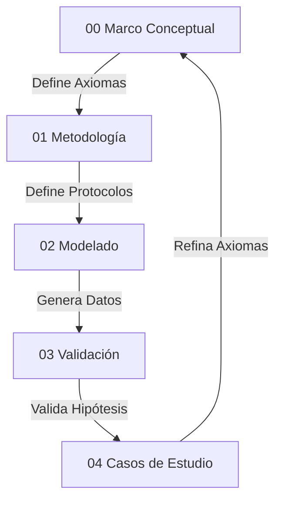

# 00_09 Mapa de la Tesis: El Grafo de Dependencias

Esta tesis no es lineal, es un **grafo dirigido** donde cada nodo alimenta al siguiente.

*   **Capas 00/01:** El Kernel del sistema (Back-end).
*   **Capas 02/03:** La lógica de negocio y procesamiento.
*   **Capa 04:** La interfaz con la realidad (Front-end/UI).
