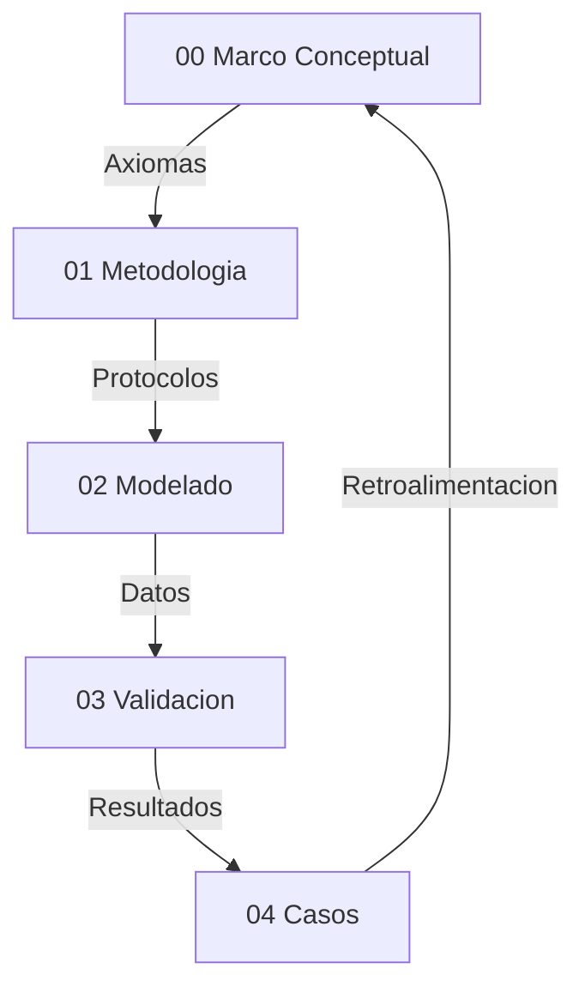

# 00 Marco Conceptual — Narrativa Unificada

## Proposito
Esta tesis define una ontologia operativa para hiperobjetos: entidades masivamente distribuidas cuya dinamica macro impone restricciones causales sobre lo micro. El criterio de realidad es computacional: si la capa macro es necesaria para reducir incertidumbre y mejorar la prediccion, entonces esa entidad es tratable como real dentro del marco.

## Postura Filosofica y Debate Fundacional
La tesis adopta un **realismo inferencial**: no exigimos observacion directa del hiperobjeto, sino convergencia de evidencia causal y poder explicativo. Esta postura surge de un debate realismo vs instrumentalismo: si los hiperobjetos fueran solo herramientas utiles, el marco perderia su ambicion ontologica. En cambio, el realismo inferencial permite sostener existencia operativa, siempre que haya trazabilidad y falsabilidad.

El debate **emergencia vs reduccionismo** queda resuelto en favor de un **emergentismo fuerte por irreducibilidad causal demostrada** (Humphreys, Batterman): la emergencia no se define por misterio metafísico, sino por la necesidad demostrable de un parámetro macro para explicar y estabilizar el comportamiento micro. Esta elección se protege contra reificación mediante criterios de validación estrictos (EDI, CR, C1–C5) y la prueba de ablación como intervención causal.

La **causalidad descendente** se formula en version debil: lo macro restringe, no introduce fuerzas nuevas. Esto evita contradicciones con el cierre causal y permite formalizar el efecto macro como restricciones y nudging computacional.

## Postura Ontológica: Realismo Estructural de Patrones
Esta tesis adopta un **realismo estructural de patrones** como compromiso ontológico. El marco no afirma la existencia de hiperobjetos como sustancias (objetos independientes con esencia propia) sino como **patrones reales** cuya estructura relacional porta información causalmente indispensable.

Un patrón es real, en sentido de Dennett (1991) y Ladyman & Ross (2007), si:
1. Contiene información que se pierde al intentar reducirlo a sus componentes.
2. Genera predicciones verificables que no se obtienen sin él.
3. Resiste intentos de eliminación bajo condiciones controladas.

El EDI operacionaliza las tres condiciones simultáneamente: (1) la ablación mide la pérdida informacional; (2) la mejora predictiva es el output del EDI; (3) los controles C1-C5 y las falsaciones proporcionan las condiciones controladas.

**Relación con Morton:** Timothy Morton (2013) propuso el concepto de hiperobjeto con propiedades fenomenológicas (viscosidad, no-localidad, fase temporal, interobjetividad). Esta tesis operacionaliza computacionalmente un subconjunto de esas propiedades y las somete a prueba empírica. La operacionalización no es completa: la interobjetividad no se mide; la no-localidad se modela como retícula pero sin topología heterogénea; la viscosidad se infiere del nudging pero no se prueba directamente por perturbación-recuperación. Lo que la tesis demuestra es la **constricción macro efectiva** — la propiedad ontológica mínima que un hiperobjeto debe tener para ser distinguible de un agregado. Es condición necesaria, no suficiente, del estatus ontológico pleno.

**Emergentismo fuerte por irreducibilidad causal:** Se adopta la versión de emergencia fuerte de Humphreys (2016) y Batterman (2002). La emergencia no se define por misterio metafísico sino por irreducibilidad funcional demostrada: eliminar el nivel macro destruye información causal que no es recuperable desde el nivel micro. La prueba es operativa (la ablación) y falsable (los controles). Esto distingue la emergencia fuerte del marco de la emergencia débil de Bedau (mera sorpresa computacional) y de la emergencia fuerte de O'Connor (poderes causales metafísicamente nuevos, que no son demostrables computacionalmente).

## Hipótesis Central (H1) Reformulada

Un sistema exhibe constricción macro efectiva — condición necesaria para el estatus de *patrón macro real* — si y solo si:

(a) La eliminación de la constricción macro (ablación: forcing_scale=0, macro_coupling=0) produce una degradación predictiva medible EDI > 0.30 que persiste bajo el protocolo C1-C5;

(b) Esta degradación no es compensable reconfigurando el nivel micro sin reintroducir información macro (demostrado por la incapacidad del ABM reducido de igualar al ABM completo);

(c) Controles de falsación confirman que el protocolo rechaza correctamente sistemas sin estructura macro genuina.

Un sistema que satisface H1 es un **patrón macro real** en sentido de Ladyman & Ross (2007): porta información causalmente indispensable que se destruye al intentar reducirlo. Su eficacia causal se demuestra intervencionistamente (Woodward, 2003): la ablación es una intervención cuyo efecto (degradación del EDI) establece la realidad causal de la constricción macro.

El estatus de **hiperobjeto fuerte** (sentido pleno de Morton) requiere adicionalmente: frontera espacial detectable (CR > 2.0 con topología heterogénea), persistencia transtemporal verificada, viscosidad demostrada por resistencia a perturbación, e interobjetividad. La presente investigación valida el nivel de patrón macro real; el nivel de hiperobjeto fuerte queda como programa de investigación futura.

Esta eficacia se formaliza mediante una condición principal y un indicador complementario:
1.  **Condición Principal — Autonomía de Atractor:** El sistema debe mantener una reducción de incertidumbre microscópica significativa (**EDI > 0.30**) bajo condiciones de **Acoplamiento Mínimo** (Zero-Nudging), demostrando la realidad ontológica del atractor macro. Esta es la condición necesaria y suficiente para H1, junto con el protocolo C1-C5.
2.  **Indicador Complementario — Información Efectiva (EI):** El sistema acoplado idealmente posee una **Información Efectiva (EI)** positiva ($EI_{macro} > EI_{micro\_agg}$), demostrando que el nivel macro es causalmente más informativo que la suma de sus partes. La EI opera como indicador de calidad informacional, no como condición de rechazo. En sistemas socio-técnicos con ruido no-gaussiano, la EI puede ser transitoriamente negativa sin invalidar la emergencia (Hoel, 2017, § Limitaciones). El EDI mide la **eficacia causal operativa**; la EI mide la **ganancia informacional teórica**. Ambos son complementarios, pero solo el EDI define H1.

---

## Presupuestos Filosoficos
- **P1 Realismo de Sistemas (Bunge):** los sistemas macro poseen propiedades sistémicas reales, no meros agregados descriptivos.
- **P2 Symploke (Bueno):** no todo esta conectado con todo, pero nada esta aislado; la realidad se evalúa como una red con limites funcionales.
- **P3 Materialismo Emergentista:** las propiedades macro emergen de interacciones y persisten como patrones causales.

## Axiomas Operativos del Modelado Hibrido
- **A1 Incompletitud del nivel unico:** ABM u ODE por separado suelen ser insuficientes para capturar la complejidad del hiperobjeto.
- **A2 Primacia del parametro de orden:** el macro estabiliza y restringe al micro.
- **A3 Invarianza estructural (C3):** el mecanismo macro-micro debe mostrar estabilidad ante condiciones iniciales distintas.
- **A4 Falsabilidad por saturación:** si EDI < 0.30 (con asimilación) o EDI < 0.05 (en autonomía pura/zero-nudging), la capa macro se descarta. Este umbral representa la "Ventaja de Hoel": el punto donde la descripción macro es causalmente más informativa que la micro, superando el ruido estocástico del nivel basal.
- **A5 Clausura computacional:** solo afirmaciones expresables como reglas algoritmicas son evaluadas.
- **A6 Principio de sub-grid:** el forzamiento externo (forcing_scale) se limita a [0, 1.0); la señal macro es procesada por la dinámica micro, no amplificada. fs ≥ 1.0 indica dominancia exógena incompatible con emergencia.

## Interpretacion de Resultados (No Forzar el Marco)
Este marco no fuerza validaciones. Un caso puede **divergir** como hiperobjeto y aun asi aportar conocimiento: señala limites de escala, problemas de datos o dominios con reflexividad alta. En lugar de ajustar resultados para que “encajen”, se reportan las divergencias como parte del criterio de demarcacion. La mejora del marco se interpreta asi:
- Si EDI/CR no aparecen o son inestables, se revisa el pipeline de medicion y la calidad de datos.
- Si hay alta variabilidad entre fases (sintetica vs real), se examinan supuestos de modelado.
- Si el dominio es reflexivo, se acepta que la validacion puede ser prospectiva y no empirica.

## Delimitacion del Objeto: Viscosidad y No-localidad
Siguiendo a Timothy Morton, los hiperobjetos poseen propiedades que desafían el modelado clásico:
1. **Viscosidad:** El hiperobjeto parece "pegarse" a cualquier agente que intente medirlo. En nuestra tesis, esto se traduce en el **Acoplamiento Activo (Nudging)**: no podemos simular el clima sin ser parte de su flujo de información.
2. **No-localidad:** El objeto está distribuido espacialmente. El ABM captura esta dispersión en la grilla, mientras que la ODE captura la unidad no-local que los organiza.
3. **Fase-temporal:** El objeto existe en escalas de tiempo que exceden la observación humana directa. Nuestro modelo híbrido intenta abordar esto mediante la integración de series históricas de larga duración.

Esta base conceptual justifica por qué un modelo puramente local (ABM) suele presentar limitaciones ante un hiperobjeto: carece de la representación de la **"viscosidad macro"** que una ecuación diferencial proporciona.

## Correspondencia Propiedades de Morton ↔ Aparato Técnico

| Propiedad (Morton, 2013) | Operacionalización actual | Métrica | Cobertura | Extensión necesaria |
|---|---|---|---|---|
| **Viscosidad** (el objeto se adhiere al observador) | Nudging: el modelo no puede desacoplarse completamente del sistema | macro_coupling, assimilation_strength | Parcial | Test de perturbación-recuperación: medir tiempo de retorno al atractor tras perturbación exógena |
| **No-localidad** (el objeto está distribuido) | Retícula ABM con forzamiento uniforme; dominance_share | dominance_share ≈ 0.0025 (uniforme) | Débil | Topología heterogénea (small-world, scale-free) con forzamiento no uniforme para detectar gradientes espaciales |
| **Fase temporal** (existe en escalas que exceden la observación directa) | Series temporales de larga duración integradas vía ODE | Persistencia temporal en validador | Parcial | Datos de >50 años; detección de cambios de régimen (bifurcaciones) |
| **Interobjetividad** (afecta múltiples dominios simultáneamente) | No operacionalizada | N/A | Ninguna | Análisis inter-caso: ¿los hiperobjetos climáticos afectan los económicos? Requiere modelado multi-dominio |
| **Constricción macro efectiva** (condición mínima) | Ablación: ABM completo vs reducido | EDI > 0.30 + C1-C5 | Completa | Ya operacionalizada y validada |

La tesis demuestra la constricción macro efectiva de forma completa y robusta. Las demás propiedades de Morton están parcialmente operacionalizadas o pendientes. Esto se declara como **horizonte de investigación**, no como deficiencia del marco actual.

## Glosario Operativo (Reducido)
- **Hiperobjeto:** entidad distribuida con no-localidad y viscosidad, validada por C1-C5.
- **EDI (Effective Dependency Index):** Reducción de error al integrar el nivel macro. Exige un umbral > 0.30 para validar la integración y > 0.05 para validar la autonomía estructural (atractor).
- **CR (Cohesion Ratio):** Ratio de cohesión interna/externa. Un CR > 2.0 indica frontera nítida. Es indicador complementario de topología, no condición necesaria de H1. La condición operativa de Symploké en el validador es `internal ≥ external - 1e-3`.
- **Nudging:** acople macro-micro para asimilacion de datos.
- **Aliasing temporal:** falla por resolucion temporal insuficiente.
- **Reflexividad:** el sistema cambia al ser observado (limite en finanzas y opinion).

## Dialectica y Limites
- **Reduccionismo:** no se equipara el sistema a un vector, se mide su dinamica causal.
- **Tautologia:** el caso Finanzas muestra que el modelo puede fallar, por tanto no es circular.
- **Emergencia:** el parametro macro no es resumen, actua como restriccion activa.
- **Edge cases:** alta frecuencia y sistemas reflexivos requieren validacion prospectiva.

## Riesgos y Mitigacion
- **Reificacion:** describir dinamicas, no “cosas”; todo debe pasar por métricas.
- **Sobreajuste:** EDI demasiado alto es sospechoso; se exige robustez y reporte de fallos.
- **Falta de datos:** fase sintetica antes de datos reales.

## Mapa de la Tesis

## Dependencias Teoricas (Resumen)
Realismo estructural, teoria de sistemas, termodinamica no lineal, estadistica bayesiana y filosofia analitica como marco de prueba y refutacion.

## Bibliografia Nuclear (22 fuentes)
1. Morton (2013) — Hyperobjects.
2. Harman (2018) — OOO.
3. Latour (2017) — Facing Gaia.
4. Bennett (2010) — Vibrant Matter.
5. Bunge (1979) — Ontology II.
6. Bueno (1978) — Ensayos materialistas.
7. Popper (1959) — Logic of Scientific Discovery.
8. Lakatos (1978) — Research Programmes.
9. Luhmann (1995) — Social Systems.
10. Haken (1983) — Synergetics.
11. Shannon (1948) — Information Theory.
12. Holland (1995) — CAS.
13. Schelling (1978) — Micro/Macro.
14. Strogatz (2014) — Nonlinear Dynamics.
15. Soros (1987) — Reflexividad.
16. Taleb (2012) — Antifragile.
17. Evensen (2009) — Data Assimilation.
18. Ladyman, J. & Ross, D. (2007) — *Every Thing Must Go: Metaphysics Naturalized.* [Patrones reales, realismo estructural]
19. Woodward, J. (2003) — *Making Things Happen.* [Causalidad intervencionista]
20. Dennett, D. (1991) — "Real Patterns." *Journal of Philosophy.* [Definición original de patrón real]
21. Batterman, R. (2002) — *The Devil in the Details.* [Irreducibilidad asintótica, emergencia]
22. Humphreys, P. (2016) — *Emergence: A Philosophical Account.* [Emergencia por fusión]

## Apendice de Autoria IA
Trabajo en co-autoria humano-IA: el humano define objetivos y valida empiricamente; la IA apoya implementacion y documentacion.

## Sintesis
El marco define criterios computacionales para distinguir hiperobjetos estables de agregados caoticos. Su valor esta en lo que valida y en lo que rechaza, porque esa frontera es la que protege a la tesis de la especulacion.
