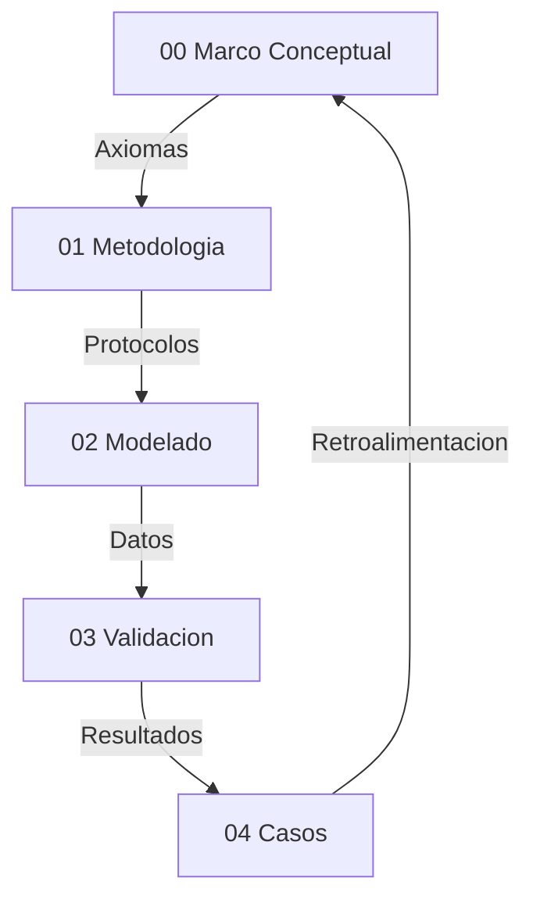

# 00 Marco Conceptual — Narrativa Unificada

## Proposito
Esta tesis define una ontologia operativa para hiperobjetos: entidades masivamente distribuidas cuya dinamica macro impone restricciones causales sobre lo micro. El criterio de realidad es computacional: si el modelo macro es necesario para reducir incertidumbre y mejorar la prediccion, la entidad es tratable como real dentro del marco.

## Presupuestos Filosoficos
- **P1 Realismo de Sistemas (Bunge):** los sistemas macro son reales, no solo agregados.
- **P2 Symploke (Bueno):** no todo esta conectado con todo, pero nada esta aislado.
- **P3 Materialismo Emergentista:** las propiedades macro emergen de interacciones, no de individuos aislados.

## Axiomas Operativos del Modelado Hibrido
- **A1 Incompletitud del nivel unico:** ABM u ODE por separado son insuficientes.
- **A2 Primacia del parametro de orden:** el macro estabiliza y restringe al micro.
- **A3 Invarianza estructural (C3):** el mecanismo macro-micro debe persistir ante condiciones iniciales distintas.
- **A4 Falsabilidad por satura:** si EDI < 0.30, la capa macro se descarta.
- **A5 Clausura computacional:** solo afirmaciones expresables como reglas algoritmicas son validas.

## Glosario Operativo (Reducido)
- **Hiperobjeto:** entidad distribuida con no-localidad y viscosidad, validada por C1-C5.
- **EDI:** reduccion de error al integrar el nivel macro (umbral 0.30).
- **CR:** ratio de cohesion interna/externa (umbral 2.0).
- **Nudging:** acople macro-micro para asimilacion de datos.
- **Aliasing temporal:** falla por resolucion temporal insuficiente.
- **Reflexividad:** el sistema cambia al ser observado (limite en finanzas y opinion).

## Dialectica y Limites
- **Reduccionismo:** no se equipara el sistema a un vector, se mide su dinamica causal.
- **Tautologia:** el caso Finanzas muestra que el modelo puede fallar.
- **Emergencia:** el parametro macro no es resumen, actua como restriccion activa.
- **Edge cases:** alta frecuencia y sistemas reflexivos requieren validacion prospectiva.

## Riesgos y Mitigacion
- **Reificacion:** describir dinamicas, no “cosas”.
- **Sobreajuste:** EDI demasiado alto es sospechoso; se exige C2 y C5.
- **Falta de datos:** fase sintetica antes de datos reales.

## Mapa de la Tesis

## Dependencias Teoricas (Resumen)
Realismo estructural, teoria de sistemas, termodinamica no lineal, estadistica bayesiana y filosofia analitica como marco de prueba y refutacion.

## Bibliografia Nuclear (17 fuentes)
1. Morton (2013) — Hyperobjects.
2. Harman (2018) — OOO.
3. Latour (2017) — Facing Gaia.
4. Bennett (2010) — Vibrant Matter.
5. Bunge (1979) — Ontology II.
6. Bueno (1978) — Ensayos materialistas.
7. Popper (1959) — Logic of Scientific Discovery.
8. Lakatos (1978) — Research Programmes.
9. Luhmann (1995) — Social Systems.
10. Haken (1983) — Synergetics.
11. Shannon (1948) — Information Theory.
12. Holland (1995) — CAS.
13. Schelling (1978) — Micro/Macro.
14. Strogatz (2014) — Nonlinear Dynamics.
15. Soros (1987) — Reflexividad.
16. Taleb (2012) — Antifragile.
17. Evensen (2009) — Data Assimilation.

## Apendice de Autoria IA
Trabajo en co-autoria humano-IA: el humano define objetivos y valida empiricamente; la IA apoya implementacion y documentacion.

## Sintesis
El marco define criterios computacionales para distinguir hiperobjetos estables de agregados caoticos. El valor del sistema esta tanto en lo que valida como en lo que rechaza.
