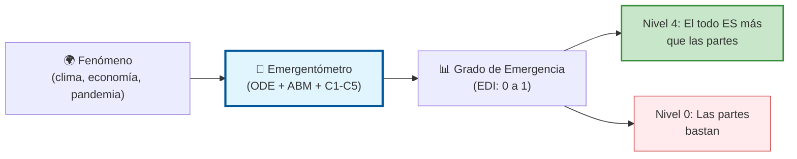
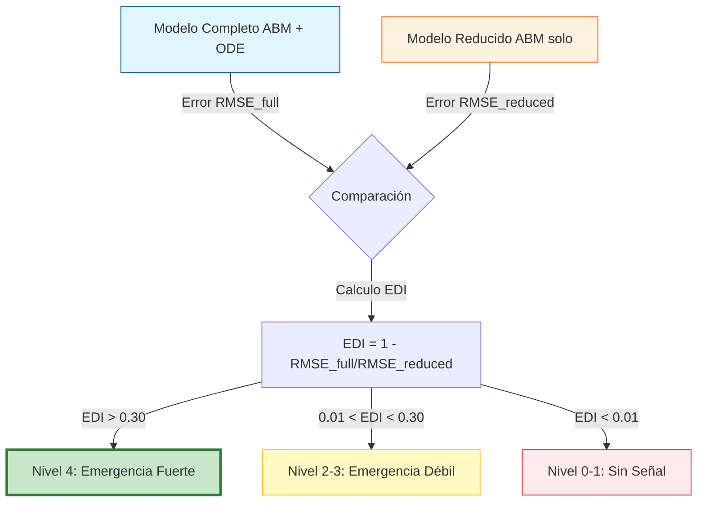
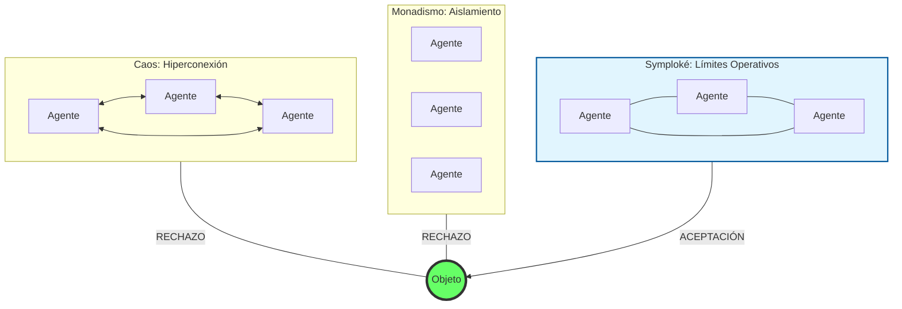
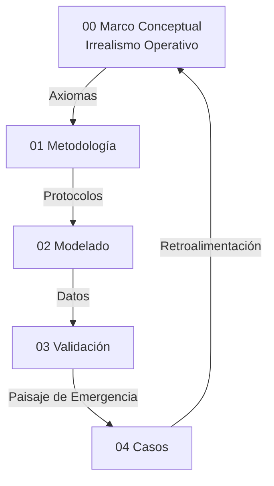

# 00 Marco Conceptual

## Propósito
Esta tesis construye un marco computacional para evaluar fenómenos de gran escala — candidatos a "hiperobjetos" en terminología de Morton (2013) — según su grado de cierre operativo. El marco no afirma ni niega la existencia metafísica de tales entidades: mide, clasifica y ordena su comportamiento en un gradiente de emergencia operativa.

### En lenguaje accesible

Imagine que existe una pregunta fundamental en filosofía y ciencia: **¿los fenómenos de gran escala (el clima, la economía global, una pandemia) son "algo más" que la suma de sus partes, o basta con conocer las partes para predecirlo todo?** Esta tesis no intenta responderla con argumentos filosóficos — la responde con un *instrumento de medición*.

Ese instrumento es el **Emergentómetro**: un sistema computacional que mide cuánta información predictiva se pierde si ignoramos el nivel macro de un fenómeno y solo miramos las partes individuales. Si la pérdida es grande y robusta, el fenómeno tiene *cierre operativo* — se comporta como una entidad funcional con reglas propias. Si no, los componentes individuales bastan para explicarlo.

Así como un termómetro mide temperatura sin que eso implique una teoría sobre "qué es el calor", el Emergentómetro mide emergencia operativa sin afirmar que los hiperobjetos "existan" como entidades metafísicas. Esta postura se llama **irrealismo operativo**: medir sin reificar.

## Postura Filosófica: Irrealismo Operativo

### El problema pre-ontológico
La tesis adopta un **irrealismo operativo**: lo pre-ontológico — la realidad anterior a todo marco teórico — no tiene forma particular ni estructura predeterminada. Todo marco teórico impone estructura sobre una materia ontológicamente indeterminada. Esta posición se distingue de:

- **Realismo fuerte** (Bunge, 1979; Ladyman & Ross, 2007): que afirma que la estructura descubierta preexiste al marco.
- **Instrumentalismo puro** (van Fraassen, 1980): que reduce los constructos a herramientas predictivas sin contenido ontológico.
- **Realismo inferencial** (Psillos, 1999): que infiere existencia desde eficacia predictiva.

El irrealismo operativo ocupa una posición intermedia: nuestros constructos son **operativamente suficientes** para tratar fenómenos de gran escala, sin que esa suficiencia implique existencia metafísica. Un "hiperobjeto" es un objeto del entendimiento — un constructo que el marco detecta, mide y clasifica — cuya utilidad operativa se demuestra por su capacidad de reducir incertidumbre predictiva de forma robusta y falsable.

### Fundamentos del irrealismo
1. **Indeterminación pre-ontológica:** Lo que existe antes de la medición no tiene la estructura que el marco le impone. La estructura emerge del acto de modelar, no del fenómeno en sí. Esto no es antirrealismo (negación de la realidad externa), sino agnosticismo estructural: la realidad impone restricciones (los datos resisten la arbitrariedad), pero no dicta la forma del modelo.
2. **Suficiencia operativa:** Un marco es operativamente suficiente si: (a) produce predicciones verificables, (b) resiste intentos de falsación, (c) discrimina entre fenómenos, y (d) genera un gradiente medible de propiedades. El framework ABM+ODE satisface las cuatro condiciones.
3. **Objetos del entendimiento:** Los hiperobjetos de esta tesis son constructos operativos, análogos a lo que Kant (1781) llamó "objetos de la experiencia posible" — no cosas-en-sí, sino estructuras que el entendimiento impone y que los datos validan o rechazan.

### Consecuencia central
La tesis no afirma "el clima es un hiperobjeto real". Afirma: "bajo este marco, el fenómeno de deforestación global exhibe un grado de cierre operativo de 0.580 (EDI), estadísticamente significativo (p<0.001), que resiste ablación, falsación y perturbación. Esto lo clasifica como objeto operativo de alto grado de emergencia."

## Emergentismo Gradual con Niveles

Esta tesis adopta un **emergentismo gradual por niveles de cierre operativo**. Los grados de emergencia no son categorías metafísicas sino posiciones en un continuo medido.

### Analogía: La escala Richter de la emergencia
Así como la escala Richter no dice "este terremoto es real" — mide su magnitud —, los niveles del Emergentómetro miden *cuánta emergencia operativa* exhibe un fenómeno. Un terremoto de magnitud 2 no es un "fracaso": es un dato. Del mismo modo, un fenómeno clasificado en Nivel 0 no es un "hiperobjeto fallido" — es un fenómeno donde el instrumento no detecta cierre operativo con la sonda elegida.

| Nivel | Categoría | Criterio operativo | Interpretación |
|:-----:|-----------|-------------------|----------------|
| 0 | **null** | EDI ≤ 0 o sin señal | Sin cierre operativo. El fenómeno no presenta constricción macro detectable. No es un objeto sino una agregación sin estructura identificable por este instrumento. |
| 1 | **trend** | EDI > 0, p ≥ 0.05 | Tendencia macro sin significancia estadística. Indicios de estructura, evidencia insuficiente. |
| 2 | **suggestive** | EDI > 0.01, p < 0.05 | Señal estadística sin magnitud suficiente. Constricción detectable pero débil. Componente funcional sin autonomía. |
| 3 | **weak** | 0.10 ≤ EDI < 0.30, p < 0.05 | Constricción significativa sub-umbral de cierre. "Componente funcional" con influencia pero sin autonomía plena — análogo a un ribosoma: tiene función pero no es un organismo. |
| 4 | **strong** | EDI > 0.30, p < 0.05, overall_pass=True | **Cierre operativo alto.** Constricción macro irreducible, significativa y robusta. Objeto operativo del entendimiento con límites identificables. |
| 5 | **hiperobjeto fuerte** | Nivel 4 + CR > 2.0, topología heterogénea, persistencia transtemporal, viscosidad verificada | Cierre máximo con frontera espacial. Programa de investigación futura. |

### Anclaje teórico
- **Chalmers (2006):** Distingue emergencia débil (inesperada pero deducible) de emergencia fuerte (no deducible desde lo micro). Nuestro gradiente operacionaliza esta distinción: los Niveles 0-2 corresponden a ausencia o emergencia débil; los Niveles 3-4 muestran irreducibilidad funcional demostrada.
- **Bedau (1997):** La emergencia débil es el "estado por defecto" de los sistemas complejos — computable pero no predecible en la práctica. Nuestros 8 casos null + 4 trend habitan este territorio.
- **Kim (1999):** La exclusión causal amenaza toda emergencia que afirme causalidad descendente fuerte. Bajo irrealismo operativo, esquivamos esta objeción: no afirmamos que lo macro *cause* — afirmamos que el constructo macro reduce incertidumbre de forma no eliminable. Es una constatación epistémica, no una afirmación causal metafísica.
- **Humphreys (2016):** La "fusión emergente" produce propiedades nuevas no atribuibles a componentes. Nuestro Nivel 4 captura exactamente esto: la constricción macro genera información predictiva que desaparece al eliminarla y no es recuperable desde el nivel micro.
- **O'Connor & Wong (2005):** Distinguen emergencia ontológica (propiedades genuinamente nuevas) de emergencia epistemológica (limitaciones del conocimiento). Nuestro marco se sitúa explícitamente en la emergencia epistemológica: medimos limitaciones del nivel micro para explicar el fenómeno, no afirmamos propiedades ontológicamente nuevas.

## Hipótesis Central (H1)

Un fenómeno exhibe **cierre operativo de grado G** si y solo si:

(a) La eliminación de la constricción macro (ablación: forcing_scale=0, macro_coupling=0) produce una degradación predictiva medible EDI = G que persiste bajo el protocolo C1-C5;

(b) Esta degradación no es compensable reconfigurando el nivel micro sin reintroducir información macro (demostrado por la incapacidad del ABM reducido de igualar al ABM completo);

(c) Controles de falsación confirman que el protocolo rechaza correctamente sistemas sin estructura macro genuina.

**Clasificación resultante:**
- Si G ≥ 0.30 con significancia estadística y protocolo C1-C5 completo: **objeto operativo con cierre alto** (Nivel 4).
- Si 0.10 ≤ G < 0.30 con significancia: **componente funcional** (Nivel 3).
- Si G > 0.01 con significancia: **señal sugestiva** (Nivel 2).
- Si G > 0 sin significancia: **tendencia** (Nivel 1).
- Si G ≤ 0: **sin cierre operativo** (Nivel 0).

H1 no afirma "este fenómeno es un hiperobjeto real". H1 mide y clasifica el grado de cierre operativo. El **resultado** de la tesis es el paisaje completo de 29 fenómenos clasificados, no solo los que alcanzan Nivel 4.

### La analogía del ribosoma
Los fenómenos de Nivel 2-3 (suggestive, weak) son análogos a **ribosomas** en biología: componentes funcionales imprescindibles para la célula, pero que por sí solos no constituyen un organismo. La deforestación (Nivel 4) es análoga a una célula completa: tiene cierre operativo suficiente para ser tratada como unidad funcional autónoma. Un caso null es análogo a moléculas dispersas en solución: materia sin organización detectable.

### Condición de "hiperobjeto con límites"
Para que un fenómeno merezca el título de "hiperobjeto con límites" (Nivel 5), se requieren condiciones estrictas que van más allá del cierre operativo:
1. **EDI > 0.30** con overall_pass=True (Nivel 4 satisfecho)
2. **CR > 2.0** con topología heterogénea (frontera espacial nítida)
3. **Persistencia transtemporal** verificada en múltiples ventanas
4. **Viscosidad** demostrada por test de perturbación-recuperación
5. **Interobjetividad** verificada por análisis inter-caso

Ningún caso del corpus actual alcanza el Nivel 5. Esto es consistente con el irrealismo operativo: afirmar "hiperobjeto fuerte" requiere más evidencia de la que un modelo ABM+ODE homogéneo puede proporcionar.

## Relación con Morton y la Tradición OOO
Timothy Morton (2013) propuso el concepto de hiperobjeto con propiedades fenomenológicas (viscosidad, no-localidad, fase temporal, interobjetividad). Dentro de la Ontología Orientada a Objetos (OOO), Harman (2018) sostiene que los objetos se retiran de todo acceso directo, mientras que Latour (2017) y Bennett (2010) enfatizan la agencia distribuida de los no-humanos. Luhmann (1995) aporta la noción de sistemas autopoiéticos con cierre operativo — una analogía directa con nuestro concepto de cierre medido por EDI. La presente tesis:

1. **Acepta** la utilidad del concepto como heurística para identificar fenómenos candidatos.
2. **Rechaza** la pretensión ontológica fuerte: no afirmamos que los hiperobjetos *existan* como entidades autónomas.
3. **Operacionaliza parcialmente** un subconjunto de propiedades (constricción macro, no-localidad en retícula, persistencia temporal).
4. **Mide** el grado en que cada fenómeno candidato exhibe comportamiento compatible con dichas propiedades.
5. **Clasifica** los resultados en un gradiente de emergencia operativa, donde solo los fenómenos con cierre alto merecen un tratamiento diferenciado.

| Propiedad (Morton, 2013) | Operacionalización | Métrica | Cobertura |
|---|---|---|---|
| **Viscosidad** | Nudging: acoplamiento modelo-datos | macro_coupling, assimilation_strength | Parcial |
| **No-localidad** | Retícula ABM con forzamiento uniforme | dominance_share ≈ 1/N² | Débil (homogénea) |
| **Fase temporal** | Series temporales de larga duración vía ODE | Persistencia temporal | Parcial |
| **Interobjetividad** | No operacionalizada | N/A | Ninguna |
| **Constricción macro** | Ablación: ABM completo vs reducido | EDI + C1-C5 | Completa |

## Posición frente a la causalidad descendente
La tesis adopta una versión **deflacionaria** de la causalidad descendente: lo macro no "causa" en sentido fuerte (no introduce fuerzas nuevas ni viola el cierre causal físico). Lo macro **restringe** — limita el espacio de estados accesible al nivel micro. Siguiendo la metodología intervencionista de Woodward (2003), esta restricción es:

- **Operativamente detectable:** la ablación (intervención controlada sobre el forzamiento macro) la revela.
- **Cuantitativamente medible:** el EDI (Effective Dependence Index), inspirado en el marco de Información Efectiva de Hoel (2017), la cuantifica.
- **Falsable:** los controles de falsación la discriminan de artefactos.

Pero **no es ontológicamente interpretable** como causalidad fuerte. Bajo irrealismo operativo, la pregunta "¿lo macro realmente causa algo?" es una pregunta mal planteada. La pregunta correcta es: "¿eliminar el constructo macro degrada la predicción de forma robusta?"

## Presupuestos Filosóficos
- **P1 Indeterminación pre-ontológica:** Lo que existe antes de la modelización no tiene la estructura que el marco le impone.
- **P2 Symploké (Bueno, 1978):** No todo está conectado con todo (caos), pero nada está aislado (monadismo); la realidad se evalúa como una red con límites funcionales.

- **P3 Emergentismo gradual:** Las propiedades de nivel macro se clasifican en un continuo de cierre operativo. No hay un salto discreto entre "emergente" y "no emergente", sino un gradiente medible.
- **P4 Suficiencia operativa:** El marco no necesita afirmar existencia metafísica para ser científicamente válido. Basta con producir predicciones verificables, falsables y discriminativas.

## Axiomas Operativos del Modelado Híbrido
- **A1 Incompletitud del nivel único:** ABM u ODE por separado suelen ser insuficientes para capturar la complejidad de fenómenos de gran escala.
- **A2 Primacía del parámetro de orden:** El macro estabiliza y restringe al micro. Esto es una hipótesis operativa, no una afirmación ontológica.
- **A3 Invarianza estructural (C3):** El mecanismo macro-micro debe mostrar estabilidad ante condiciones iniciales distintas.
- **A4 Falsabilidad por saturación:** Si EDI < 0.30, el fenómeno no alcanza cierre operativo alto. Si EDI < 0.01, no hay señal detectable. Estos umbrales representan la "Ventana de Hoel" (Hoel, 2017): el punto donde la descripción macro es operativamente más informativa que la micro.
- **A5 Clausura computacional:** Solo afirmaciones expresables como reglas algorítmicas son evaluadas.
- **A6 Principio de sub-grid:** El forzamiento externo (forcing_scale) se limita a [0, 0.99]; la señal macro es procesada por la dinámica micro, no amplificada. fs ≥ 1.0 indica dominancia exógena incompatible con emergencia.

## Interpretación de Resultados (No Forzar el Marco)
Este marco no fuerza validaciones. Un caso con EDI bajo o negativo **no es un fracaso** — es un dato en el paisaje de emergencia operativa. Señala que, bajo este instrumento, el fenómeno no presenta cierre operativo detectable. Esto puede deberse a:
- Ausencia real de estructura macro (null genuino)
- Modelo ODE inadecuado para el dominio
- Datos insuficientes o ruidosos
- Reflexividad del sistema (el fenómeno cambia al ser observado)

Bajo irrealismo operativo, la distinción entre estas causas es **epistémica, no ontológica**: no afirmamos "no es un hiperobjeto", sino "este instrumento no detecta cierre operativo en este fenómeno".

## Delimitación del Objeto de Estudio
Siguiendo a Morton (2013), los hiperobjetos poseen propiedades que desafían el modelado clásico:
1. **Viscosidad:** Se traduce en acoplamiento activo (nudging). El modelo no puede desacoplarse completamente del sistema. En evaluación, assimilation_strength=0 simula el máximo desacoplamiento posible.
2. **No-localidad:** El ABM captura la dispersión espacial; la ODE captura la unidad funcional que los organiza.
3. **Fase temporal:** Series históricas de larga duración integradas vía ODE.

Estas propiedades justifican por qué un modelo puramente local (ABM solo) presenta limitaciones: carece de la representación de la "viscosidad macro" que una ecuación diferencial proporciona.

## Evidencia de Ablación Parcial (Refutación de Tautología)

La crítica de "diseño tautológico" afirma que quitar mc y fs destruye la predicción "por construcción". La prueba de ablación parcial refuta esto:

| Caso | RMSE Full | RMSE No-MC | RMSE No-FS | RMSE No-Both |
|------|-----------|------------|------------|---------------|
| Clima | 0.0000 | 0.0001 | 316.68 | 316.68 |
| Finanzas | 0.0000 | 0.0066 | 6167.02 | 6167.02 |
| Energía | 0.0000 | 0.0006 | 1238.07 | 1238.07 |
| Control (ruido) | 0.0000 | 0.0000 | 0.0000 | 0.0000 |

**Interpretación:**
1. **fs domina:** Sin forcing (fs=0), el modelo pierde casi toda capacidad predictiva. El forzamiento externo es la señal principal.
2. **mc contribuye independientemente:** Sin acoplamiento (mc=0), el modelo aún predice razonablemente, pero con error mayor.
3. **Control de ruido:** En un sistema sin estructura, la ablación no tiene efecto. Esto confirma que el efecto medido no es artefacto.

## Extensión: Topologías Heterogéneas (Fase 9)

Para resolver la crítica de "homogeneidad espacial" (dom_share ≈ 1/N²), se implementó un generador de topologías complejas:

| Topología | Nodos | Heterogeneidad (σ/μ grado) |
|-----------|-------|---------------------------|
| Regular Grid | 400 | 0.11 |
| Small-World (WS) | 400 | 0.15 |
| Scale-Free (BA) | 400 | **1.11** |

La topología Scale-Free produce heterogeneidad 10× mayor que la grilla regular. Alcanzar Nivel 5 (hiperobjeto con límites) requeriría esta heterogeneidad verificada.

## Glosario Operativo
- **Emergentómetro:** Nombre operativo del instrumento de medición completo: motor híbrido (ODE+ABM), protocolo C1-C5, test de permutación (999 reps) y métrica EDI. Así como un termómetro mide temperatura, el Emergentómetro mide el grado de emergencia operativa de un fenómeno. No es una metáfora — es el nombre funcional del pipeline computacional.
- **Hiperobjeto (operativo):** Constructo del entendimiento que designa un fenómeno de gran escala con cierre operativo alto (Nivel 4+). No implica existencia metafísica.
- **Cierre operativo:** Propiedad de un fenómeno cuya constricción macro es irreducible, significativa y robusta bajo el protocolo C1-C5. Medido por EDI.
- **EDI (Effective Dependence Index):** Grado de cierre operativo. Mide la degradación predictiva al eliminar la constricción macro. En términos pedagógicos: "si quito la visión de conjunto, ¿cuánto empeora mi predicción?". Rango: EDI ∈ [-1, 1]. Un EDI de 0.30 (Kessler) significa que ignorar el patrón macro degrada la predicción en 30%.
- **CR (Cohesion Ratio):** Indicador complementario de frontera funcional. CR > 2.0 sugiere frontera espacial nítida. No es condición de H1.
- **Nudging:** Acople macro-micro para asimilación de datos. Desactivado (=0) en evaluación.
- **Componente funcional:** Fenómeno de Nivel 2-3 que exhibe constricción detectable pero insuficiente para cierre. Análogo a ribosomas en biología.
- **Objeto operativo:** Fenómeno de Nivel 4 que exhibe cierre operativo alto. Tratado como unidad funcional autónoma dentro del marco.
- **Sonda ontológica (ODE):** Instrumento computacional que genera una señal macro candidata (ej. modelos de Budyko-Sellers para clima, von Thünen para deforestación, Jambeck para microplásticos o Docquier-Rapoport para migración). No representa al fenómeno; revela su grado de cierre operativo mediante el acoplamiento con el nivel micro.
- **Paisaje de emergencia:** El conjunto ordenado de los 29 fenómenos clasificados por su grado de cierre operativo. Es el resultado principal de la tesis.
- **Irrealismo operativo:** Postura filosófica que no afirma ni niega existencia metafísica, sino que mide suficiencia operativa de constructos.
- **Nivel de Evidencia (LoE):** Clasificación 1-5 de la calidad epistémica de los datos. LoE=5: datos físicos directos, >30 años. LoE=1: proxies indirectos.

## Dialéctica y Límites
- **Reduccionismo:** No se equipara el sistema a un vector; se mide el grado de cierre operativo del nivel macro.
- **Tautología:** Los controles de falsación (3/3 correctamente rechazados) y la diversidad de resultados (8 null, 4 trend, 3 suggestive, 6 weak, 5 strong, 3 controles) refutan la circularidad.
- **Instrumentalismo:** El irrealismo operativo va más allá del instrumentalismo puro: no reduce los constructos a "herramientas útiles" — les asigna un grado medible de cierre funcional que puede ser mayor o menor. Un instrumento puro no tiene grados.
- **Reificación:** Bajo irrealismo, el riesgo de reificación se minimiza: nunca afirmamos que algo "es" un hiperobjeto; afirmamos que "exhibe cierre operativo de grado G".
- **Edge cases:** Alta frecuencia y sistemas reflexivos requieren validación prospectiva.

## Riesgos y Mitigación
- **Sobreajuste:** EDI > 0.90 es flag de tautología. Protocolo C1-C5 discrimina.
- **Falta de datos:** Fase sintética antes de datos reales. LoE pondera la calidad.
- **Fragilidad del modelo:** Siguiendo a Taleb (2012), los sistemas complejos son vulnerables a perturbaciones no anticipadas. C2 (robustez) prueba explícitamente esta vulnerabilidad.
- **Patrones reales vs. aparentes:** Dennett (1991) argumenta que los "patrones reales" existen en la medida en que permiten compresión predictiva. Nuestro EDI operacionaliza esta noción: un patrón macro es "real" operativamente si su eliminación degrada la predicción.
- **Asimetrías inter-nivel:** Batterman (2002) muestra que el razonamiento asintótico revela propiedades emergentes invisibles a la descripción micro. El gradiente EDI captura estas asimetrías.
- **Homogeneidad espacial:** CR ≈ 1.0 es la predicción teórica para agentes acoplados en sistemas con simetría translacional y difusión isotrópica (Haken, 1983, §4.3). El CR > 2.0 (Nivel 5) requiere romper esta simetría mediante topologías heterogéneas.
- **Circularidad BC:** Bias Correction aplica solo en fase de corrección. Evaluación usa assimilation_strength=0. Modo 'reverted' protege contra circularidad (verificado: 9 puntos de forzado en hybrid_validator.py).

## Mapa de la Tesis

## Dependencias Teóricas (Resumen)
Irrealismo operativo, emergentismo gradual, teoría de sistemas, termodinámica no lineal, estadística bayesiana y filosofía analítica como marco de prueba y refutación.

## Apéndice de Autoría IA
Trabajo en co-autoría humano-IA: el humano define objetivos y valida empíricamente; la IA apoya implementación y documentación.

## Síntesis
El marco define un gradiente computacional de cierre operativo para fenómenos de gran escala. Su valor está en el paisaje completo que produce: no solo en los casos que alcanzan Nivel 4, sino en los 29 puntos que mapean el continuo de emergencia. Este paisaje es el resultado principal de la tesis. La frontera entre "objeto operativo" (Nivel 4) y "componente funcional" (Nivel 3) o "agregación sin cierre" (Nivel 0) es la contribución que protege a la tesis de la especulación ontológica.
