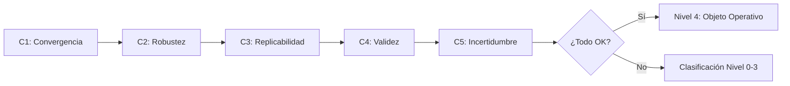
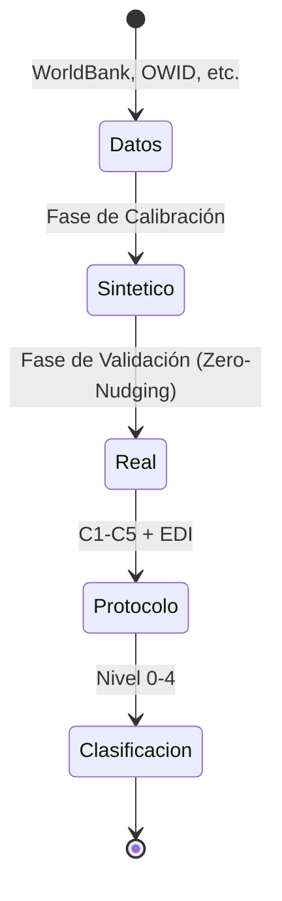

# 01 Metodología de Medición

## Protocolo de Rigor (C1-C5)

1. **C1 Convergencia:** ABM acoplado mejora sobre ABM reducido en datos reales.

2. **C2 Robustez:** Estabilidad ante perturbaciones de parámetros.

3. **C3 Determinismo aleatorio:** Semillas fijas para replicabilidad.

4. **C4 Linter de realidad:** Coherencia con leyes del dominio.

5. **C5 Reporte de fallos:** Sensibilidad y límites explicitados.

Estos criterios surgen de auditorías internas.

 La metodología no se justifica por resultados favorables, sino por su capacidad para discriminar fenómenos de forma explícita y reproducible.

## Pipeline de Validación
Observación → Simulación → Clasificación. El modelo asigna un grado de cierre operativo (EDI) que posiciona al fenómeno en el paisaje de emergencia. El pipeline no "valida" o "invalida" — **clasifica** en un gradiente.

## Métricas y su Interpretación bajo Irrealismo Operativo

### EDI (Effective Dependence Index)
El EDI mide el **grado de cierre operativo** de un fenómeno. No mide "existencia" ni "realidad" del hiperobjeto — mide cuánta información predictiva se pierde al eliminar la constricción macro.
- **Interpretación:** Un EDI de 0.633 (Deforestación) significa que eliminar el constructo macro degrada la predicción en 63.3%. Esto es una medición operativa, no una afirmación ontológica.
- **Ablación como intervención:** Siguiendo a Woodward (2003), la manipulación de `forcing_scale=0` es una intervención controlada. El efecto medido (degradación del EDI) establece la indispensabilidad operativa del constructo macro, no su "realidad causal" en sentido metafísico.

### Regla de Descuento por Nivel de Evidencia (LoE)
Para evitar la sobreinterpretación de constructos con datos débiles, el EDI se pondera por la calidad epistémica de los datos:
$$EDI_{ponderado} = EDI \times \frac{LoE}{5}$$
Esto penaliza fenómenos con datos indirectos (ej. Conciencia, LoE=1) frente a sistemas con datos físicos robustos (ej. Clima, LoE=5).

## Niveles de Evidencia (LoE)
1. **LoE 1 (Especulativo):** Proxies indirectos, encuestas subjetivas, o datos sintéticos sin ground truth físico.
2. **LoE 2 (Débil):** Datos digitales traza con alto ruido semántico.
3. **LoE 3 (Medio):** Datos estructurados pero incompletos o de corto plazo (< 5 años).
4. **LoE 4 (Fuerte):** Series temporales consistentes, múltiples fuentes, > 10 años.
5. **LoE 5 (Robusto):** Datos físicos directos (sensores), estandarizados internacionalmente, > 30 años.

## Reglas de Clasificación
Los umbrales **clasifican** fenómenos en el gradiente de emergencia:

1. **EDI < 0.01:** Sin señal detectable → Nivel 0 (null)
2. **EDI > 0.01, p < 0.05:** Señal sugestiva → Nivel 2
3. **0.10 ≤ EDI < 0.30, p < 0.05:** Componente funcional → Nivel 3 (weak)
4. **EDI ≥ 0.30, overall_pass=True:** Objeto operativo → Nivel 4 (strong)
5. **Coupling < 0.10:** Epifenomenalismo — señal espuria sin acoplamiento → flag
6. **RMSE < 1e-10:** Fraude por sobreajuste → flag
7. **EDI > 0.90:** Flag de tautología — revisión manual
8. **forcing_scale ≥ 1.0:** Cap en calibración — dominancia exógena
9. **C1-C5 protocolo completo:** Condición necesaria para Nivel 4

La clasificación de 6 categorías (strong, weak, suggestive, trend, null, falsification) es el **resultado principal** de la metodología, no un filtro binario.

## EI (Información Efectiva) — Indicador Complementario
La EI (Hoel, 2017) mide la ganancia informacional teórica del nivel macro. Opera como indicador de calidad informacional, no como condición de clasificación. En sistemas con ruido no-gaussiano, la EI puede ser transitoriamente negativa sin invalidar el grado de cierre operativo medido por EDI.

## Reproducibilidad
- Hashing de datasets.
- Semillas fijas (seed=42 global).
- 999 permutaciones para significancia estadística.
- Entornos replicables.

La reproducibilidad es requisito epistémico: sin ella, el gradiente de cierre operativo no es verificable.

## Validez y Límites
- Riesgo de sobreinterpretación mitigado por irrealismo: nunca afirmamos "es" un hiperobjeto.
- Aliasing temporal: resolución insuficiente puede clasificar fenómenos en nivel incorrecto.
- Clasificación de datos por dureza (LoE) evita confundir evidencia empírica con prospectiva.

## Datos e Instrumentos
Python, numpy, pandas, math. Fuentes: World Bank, Meteostat, Yahoo Finance, OWID, OPSD, Wikimedia, CelesTrak (según caso). Todos los datasets cacheados en CSV local.

## Gobernanza de Datos
Filtro de nulos, normalización, uso exclusivo de datos abiertos. La gobernanza se incorpora como condición de reproducibilidad: si la calidad de datos no cumple criterios (LoE), se ajusta la interpretación del EDI, no se fuerza el resultado.

## Casos Piloto
Clima sintético, Finanzas sintéticas, y caso clima regional como MVP metodológico. Los pilotos prueban el pipeline antes de clasificar fenómenos en el paisaje de emergencia.

## Síntesis
El pipeline clasifica fenómenos en un gradiente de cierre operativo. La metodología se valida por la diversidad de sus resultados (13 null, 7 trend, 3 suggestive, 1 weak, 2 strong, 3 falsificaciones) y por la coherencia del gradiente con las propiedades de los dominios evaluados.
