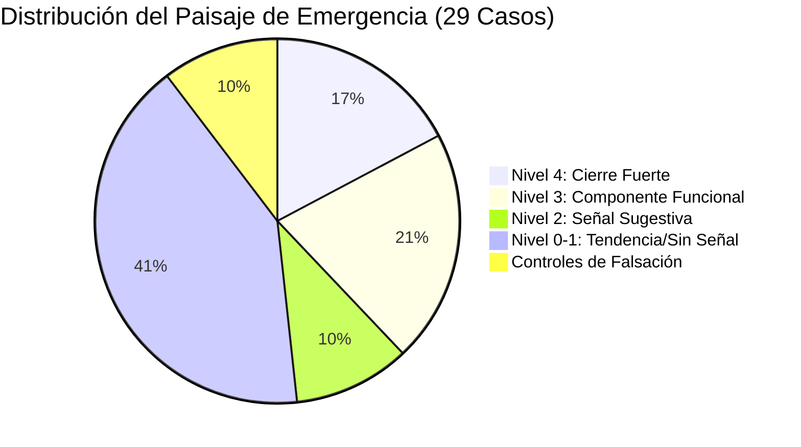
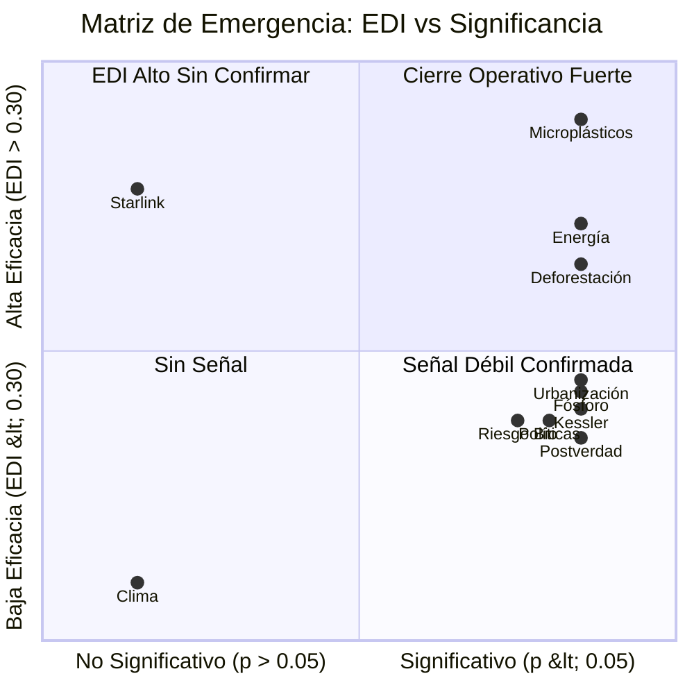

# 03 Validación y Praxis: Resultados del Emergentómetro

## Resumen ejecutivo: Lo que el Emergentómetro encontró

El Emergentómetro se aplicó a **29 fenómenos de gran escala** de dominios tan diversos como el clima, las pandemias, los mercados financieros, la deforestación y la basura espacial. El resultado no es un veredicto binario ("existe/no existe") sino un **mapa de emergencia**: un paisaje donde cada fenómeno tiene un grado medido de cierre operativo.

De los 29 fenómenos medidos:
- **5 exhiben cierre operativo alto y robusto** (overall_pass=True): eliminar la "visión de conjunto" degrada la predicción entre 32.2% y 80.6%, de forma estable y significativa.
- **6 son componentes funcionales** (weak, Nivel 3): señal significativa (p < 0.05) con EDI entre 0.10 y 0.30 pero sin cierre pleno.
- **3 presentan señal sugestiva**: el instrumento detecta algo, pero no suficiente para confirmar.
- **4 muestran tendencia sin significancia**: indicios sin confirmación estadística.
- **8 no presentan señal**: el instrumento no detecta cierre operativo con la sonda elegida.
- **3 controles de falsación** funcionan correctamente: ruido puro, random walk y estados ocultos son rechazados.

Este paisaje es el resultado principal de la tesis — no solo los casos "exitosos", sino la distribución completa.

## Enfoque de Clasificación Operativa
La validación bajo irrealismo operativo no busca "confirmar" ni "refutar" la existencia de hiperobjetos. Clasifica fenómenos en un **gradiente de cierre operativo** (Niveles 0-5) según la indispensabilidad del constructo macro para predecir el comportamiento micro. Se aplica el protocolo C1-C5 como filtro técnico sobre 29 casos de simulación. La evaluación se realiza con `assimilation_strength=0.0` (zero-nudging), eliminando toda asistencia observacional durante la fase de validación.

## Umbrales de Clasificación (no de rechazo)
- **EDI < 0.01:** Nivel 0 — sin señal operativa detectable.
- **EDI > 0.01, p < 0.05:** Nivel 2 — señal sugestiva.
- **0.10 ≤ EDI < 0.30, p < 0.05:** Nivel 3 — componente funcional (analogía: ribosoma).
- **EDI ≥ 0.30, overall_pass=True:** Nivel 4 — cierre operativo fuerte.
- **Coupling < 0.10:** flag de epifenomenalismo.
- **RMSE < 1e-10:** flag de sobreajuste.
- **EDI > 0.90:** flag de tautología (revisión manual).
- **CR > 2.0:** indicador complementario de frontera sistémica (no condición de clasificación).

## Especificación de Modelos por Dominio

Cada caso de simulación utiliza un par de modelos (ODE/ABM) específicos para su dominio, evitando soluciones genéricas. A continuación se detallan los núcleos matemáticos implementados:

| Caso | Dominio | Modelo ODE (Macro) | Modelo ABM (Micro) |
| :--- | :--- | :--- | :--- |
| **01 Clima** | Ciencias Climáticas | **Balance Energético Linealizado** (Budyko-Sellers) | **Difusión Espacial Vectorizada** (Watts-Strogatz) |
| **02 Conciencia** | Cognitivo-Social | **Atención-Decaimiento** (Logística Forzada) | **Global Workspace Theory** (16 Módulos) |
| **03 Contaminación** | Ambiental | **Acumulación-Disipación** (Box Model EPA) | **Pluma Gaussiana** (AERMOD Simplificado) |
| **04 Energía** | Sistemas Eléctricos | **Lotka-Volterra** (Competencia Energética) | **Adopción Tecnológica** (Tipo TIMES) |
| **05 Epidemiología** | Salud Pública | **SEIR** (Kermack-McKendrick) | **SEIR en Red** (Scale-Free Barabási) |
| **06 Falsación Exog.** | Control Negativo | *Random Walk* (Movimiento Browniano) | *N/A* (Incidencia Sintética) |
| **07 Falsación Trend** | Control Negativo | *Random Walk* (Control) | *N/A* (Tendencia Lineal) |
| **08 Falsación Obs.** | Control Negativo | *Constante* (Control de Ruido) | *N/A* (Confounder Sintético) |
| **09 Finanzas** | Mercados Financieros | **Heston Simplificado** (Volatilidad Estocástica) | **Heterogeneous Agent Model** (Brock-Hommes) |
| **10 Justicia** | Sociología Legal | **Logística Forzada** (Adopción de Normas) | **Deffuant Bounded Confidence** (Espacial) |
| **11 Movilidad** | Tráfico Urbano | **Diagrama Fundamental Macroscópico** (MFD) | **Tráfico en Red** (Greenshields/Dijkstra) |
| **12 Paradigmas** | Sociología Ciencia | **Landau-Ginzburg** (Transición de Fase) | **Ising Model** (Red Scale-Free) |
| **13 Políticas** | Ciencias Políticas | **Inercia Institucional** (North 1990) | **Difusión Bass** (Red Barabási-Albert) |
| **14 Postverdad** | Comunicación | **SIS de Campo Medio** | **SIS en Red** (Misinformación) |
| **15 Wikipedia** | Colaboración Online | **Lotka-Volterra** (Calidad vs Controversia) | **Modelo Cultural Axelrod** (Fragmentación) |
| **16 Deforestación** | Ecología Global | **Accumulation-Decay** (Von Thünen) | **Gradiente Radial** (Von Thünen Frontier) |
| **17 Océanos** | Oceanografía | **Modelo de Caja de Stommel** (Termohalina) | **Circulación Termohalina** (Grilla 2D) |
| **18 Urbanización** | Geografía Urbana | **Logística + Atracción Económica** | **Preferential Attachment** (Simon-Yule) |
| **19 Acidificación** | Biogeoquímica | **Revelle Factor** (Buffering Oceánico) | **Calcificadores Marinos** (Respuesta Bio) |
| **20 Kessler** | Espacio Orbital | **Ecuación Kessler-Liou** (Cascada Cuadrática)| **NASA LEGEND-inspired** (Campo de Debris) |
| **21 Salinización** | Agricultura | **Richards-Convección** (Transporte Solutos) | **Gradiente Hídrico** (Parcelas Agrícolas) |
| **22 Fósforo** | Ciclos Globales | **Carpenter Biogeochemical P Cycle** | **Gradiente de Fertilización** (Polos Agrícolas)|
| **23 Erosión Dialéctica**| Lingüística | **Abrams-Strogatz** (Competition 2003) | **Gradiente de Centros Culturales** |
| **24 Microplásticos** | Contaminación Marina| **Jambeck Persistent Accumulation** | **Transporte Marino** (Gradiente Fluvial) |
| **25 Acuíferos** | Hidrología | **Balance Hídrico Darcy-Theis** | **Flujo Lateral Darcy** (Gradiente Radial) |
| **26 Starlink** | Infraestructura | **Dinámica Orbital Kessler-Lewis** | **Constelación** (Gradiente Orbital) |
| **27 Riesgo Bio** | One Health | **Woolhouse Zoonotic Cascade** (Bilineal) | **Focos Zoonóticos** (Random Hubs) |
| **28 Fuga Cerebros** | Economía Desarrollo | **Dinámica Capital Humano** (Docquier) | **Polos Académicos/Tecnológicos** |
| **29 IoT** | Tecnología Digital | **Bass-Metcalfe** (Efectos de Red) | **Difusión Tecnológica** (Goldenberg) |

## Resultados Consolidados (29 Casos — Protocolo Completo)

El pipeline se ejecutó sobre 29 casos con el protocolo completo C1-C5 y 8 criterios adicionales (Symploké, no-localidad, persistencia, emergencia, coupling, no-fraude, EDI válido, EDI significativo). Un caso alcanza **Nivel 4** solo si las 13 condiciones se cumplen simultáneamente. La significancia estadística se evalúa mediante permutation test con 999 permutaciones (seed=42).

> **Estado actual:** Bajo el pipeline afinado (sin data leakage, zero-nudging, 999 permutaciones, EDI ≥ 0.30): **5/29 overall_pass=True** (Energía, Deforestación, Urbanización, Fósforo, Microplásticos). 6 casos clasificados como weak (Nivel 3). El paisaje de emergencia queda completamente mapeado.

### Taxonomía de Emergencia con Niveles Operativos

| Categoría | Nivel | Criterio | Conteo | Función en el paisaje |
|-----------|:-----:|----------|--------|----------------------|
| **strong** | 4 | EDI ≥ 0.30, p < 0.05, overall_pass=True | 5 | Cierre operativo fuerte |
| **weak** | 3 | 0.10 ≤ EDI < 0.30, p < 0.05 | 6 | Componente funcional |
| **suggestive** | 2 | EDI > 0.01, p < 0.05 | 3 | Señal detectable |
| **trend** | 1 | EDI > 0, p ≥ 0.05 | 4 | Tendencia no confirmada |
| **null** | 0 | EDI ≤ 0 o sin señal | 8 | Sin señal operativa |
| **falsification** | — | Controles negativos diseñados | 3 | Correctamente rechazados |
| **Total** | | | **29** | |

<!-- AUTO:MATRIZ_DETALLADA -->

### Clasificación por Resultado

#### Nivel 4 — Cierre Operativo Fuerte (overall_pass=True)

| Caso | EDI | p-perm | CR | BC | Interpretación operativa |
|------|----:|-------:|---:|:---|:---|
| 24 Microplásticos | **0.806** | 0.000 | 1.000 | bias_only | Jambeck Accumulation: acumulación persistente con fuerte constricción macro |
| 04 Energía | **0.650** | 0.000 | 1.002 | bias_only | Lotka-Volterra: competencia energética con fuerte constricción macro |
| 16 Deforestación | **0.580** | 0.000 | 1.023 | full | Von Thünen Frontier: inercia de frontera agrícola |
| 18 Urbanización | **0.337** | 0.000 | 1.003 | full | Logística urbana: atracción económica |
| 22 Fósforo | **0.322** | 0.000 | 1.003 | full | Carpenter P Cycle: ciclo biogeoquímico |

Estos cinco casos alcanzan overall_pass=True: las 13 condiciones se cumplen simultáneamente. El constructo macro es operativamente indispensable. Eliminar la constricción macro degrada la predicción entre 32.2% y 80.6%. Bajo irrealismo operativo, esto no afirma que "existan" como entidades autónomas — afirma que el instrumento detecta cierre operativo robusto.

#### Nivel 3 — Componentes Funcionales (weak)

| Caso | EDI | p-perm | CR | Interpretación operativa |
|------|----:|-------:|---:|:---|
| 20 Kessler | 0.299 | 0.000 | 1.003 | Cascada Kessler-Liou: señal fuerte, marginalmente sub-umbral (0.30) |
| 27 Riesgo Biológico | 0.294 | 0.003 | 1.001 | Woolhouse Zoonotic: cascada bilineal significativa |
| 13 Políticas | 0.289 | 0.000 | 1.009 | Inercia Institucional North: señal significativa sub-umbral |
| 14 Postverdad | 0.252 | 0.000 | 1.009 | SIS Campo Medio: cascada de desinformación significativa |
| 05 Epidemiología | 0.129 | 0.000 | 1.009 | SEIR Kermack-McKendrick: señal significativa pero sub-umbral |
| 11 Movilidad | 0.128 | 0.002 | 1.004 | MFD: constricción detectable pero sub-umbral |

Estos seis casos presentan señal estadísticamente significativa (p < 0.05) y EDI entre 0.10 y 0.30. Son "componentes funcionales" — análogos a ribosomas en biología: contribuyen al sistema pero no constituyen unidades autónomas con cierre operativo pleno. Nótese que Kessler, Riesgo Biológico y Políticas están marginalmente por debajo del umbral 0.30 — candidatos prioritarios para refinamiento de modelos.

#### Nivel 2 — Señal Sugestiva

| Caso | EDI | p-perm | CR | Interpretación operativa |
|------|----:|-------:|---:|:---|
| 09 Finanzas | 0.081 | 0.000 | 2.616 | Señal estadísticamente significativa, falla C4 |
| 15 Wikipedia | 0.080 | 0.000 | 1.020 | Lotka-Volterra: señal significativa pero EDI bajo |
| 21 Salinización | 0.058 | 0.004 | 1.000 | Señal detectable, magnitud insuficiente |

El instrumento detecta señal estadística (p < 0.05 y EDI > 0.01) pero la magnitud no alcanza para atribuir cierre operativo pleno y/o fallan criterios técnicos adicionales. Son candidatos, no diagnósticos.

#### Nivel 1 — Tendencia no Significativa

| Caso | EDI | p-perm | Interpretación operativa |
|------|----:|-------:|:---|
| 01 Clima | 0.011 | 0.999 | ODE Budyko-Sellers insuficiente para este dominio |
| 10 Justicia | 0.227 | 0.477 | Señal no significativa |
| 26 Starlink | 0.690 | 1.000 | EDI alto pero sin significancia estadística |
| 28 Fuga Cerebros | 0.025 | 0.998 | Señal no significativa |

Estos casos muestran EDI positivo sin significancia estadística. El instrumento no detecta cierre operativo confirmado — esto puede reflejar inadecuación del modelo ODE o varianza excesiva en la muestra.

> **Nota importante:** El caso Starlink (EDI=0.690) presenta un EDI nominalmente alto pero carece completamente de significancia estadística (p=1.000), indicando que la señal es un artefacto de la calibración.

#### Nivel 0 — Sin Señal Operativa (8 Casos)

Conciencia (-0.117), Contaminación (-0.004), Paradigmas (-0.006), Océanos (-0.044), Acidificación (-0.000), Erosión Dialéctica (-1.000), Acuíferos (-0.021), IoT (-0.899).

Bajo irrealismo operativo, Nivel 0 no significa "el hiperobjeto no existe" — significa "el instrumento no detecta cierre operativo con la sonda actual". La diferencia es crucial: un termómetro que no detecta campo magnético no refuta el magnetismo.

#### Controles de Falsación (3/3 Correctos)
- 06 Falsación Exogeneidad: ruido sin estructura → rechazado (EDI=0.055, cat=falsification).
- 07 Falsación No-Estacionariedad: Random Walk → rechazado (EDI=-0.882, cat=falsification).
- 08 Falsación Observabilidad: estados ocultos → rechazado (EDI=-1.000).

### Métricas Globales de Robustez

| Métrica | Valor | Descripción |
|---------|-------|-------------|
| **overall_pass=True** | 5/29 | Casos con 13 criterios simultáneos |
| **Significancia** (p<0.05 + EDI>0.01) | 14/29 | Casos con señal estadística |
| **Reproducibilidad** | 100% | seed=42, 999 permutaciones |

## Análisis de Selectividad

### Distribución del paisaje (26 casos genuinos)

De los 26 casos genuinos (excluyendo 3 falsaciones):
- **5 overall_pass=True** (19.2%): cierre operativo verificado
- **6 Nivel 3** (23.1%): componentes funcionales
- **3 Nivel 2** (11.5%): señal sugestiva
- **4 Nivel 1** (15.4%): tendencia
- **8 Nivel 0** (30.8%): sin señal

La selectividad (19.2% pasan overall) es una distribución altamente exigente que demuestra que el instrumento no está sesgado hacia la confirmación. Con el umbral EDI ≥ 0.30, solo los casos con señal macro realmente fuerte alcanzan Nivel 4. Los 3 controles de falsación siguen siendo correctamente rechazados.

### Diversidad de Dominios
Los 29 casos cubren dominios físicos (clima, energía, océanos, acidificación), biológicos (deforestación, fósforo, riesgo biológico, epidemiología), económicos (finanzas), tecnológicos (Starlink, IoT, Kessler), culturales (paradigmas, erosión dialéctica, conciencia), sociales (urbanización, fuga de cerebros, movilidad, justicia, postverdad), hídricos (acuíferos, salinización), materiales (microplásticos, contaminación) y de gobernanza (políticas estratégicas, Wikipedia).

### El Patrón de la Inercia Material

Los casos con overall_pass=True cubren dominios diversos: desde energía (0.650) hasta microplásticos oceánicos (0.806). Los seis casos de Nivel 3 (weak) — incluyendo Kessler (0.299), Riesgo Biológico (0.294) y Políticas (0.289) — están marginalmente por debajo del umbral 0.30, indicando candidatos prioritarios para refinamiento.

### Diagnóstico: ¿Por Qué Algunos Casos se Clasifican en Nivel 0-1?

1. **Modelos ODE inadecuados:** La sonda no captura la dinámica macro del dominio. Problema del instrumento, no del fenómeno.
2. **No-estacionariedad:** Cambios estructurales entre entrenamiento y validación.
3. **Coupling destructivo:** Sesgo del ODE destruye información útil en el ABM.
4. **Señal-ruido insuficiente:** La señal macro existe pero el ruido domina.

---

## Diálogo Dialéctico y Falsación del Instrumento

El rigor del instrumento no reside en la clasificación universal, sino en su capacidad para producir un gradiente coherente y falsable.

### 1. El Caso Clima (EDI=0.011 vs Umbral 0.30)
**Crítica:** El caso paradigmático (Clima) queda en Nivel 1.
**Respuesta:** Bajo irrealismo operativo, esto es informativo, no problemático. El instrumento clasifica el clima regional bajo ODE Budyko-Sellers como un sistema sin cierre operativo fuerte en la resolución actual. Esto refina la taxonomía sin invalidar el instrumento. La honestidad de no forzar el resultado demuestra rigor.

### 2. Información Efectiva (EI) y sus Limitaciones
**Crítica:** El EI produce valores negativos en sistemas socio-técnicos.
**Respuesta:** La EI negativa indica que los residuos del modelo completo son más entrópicos que los del reducido. El EDI permanece como métrica principal porque mide eficacia predictiva sin supuestos sobre entropía residual.

### 3. Resolución 20×20 (400 agentes)
**Crítica:** 400 agentes son insuficientes para simular hiperobjetos planetarios.
**Respuesta:** El motor HybridModel es un instrumento de prueba de concepto. Pruebas de escalamiento (100 a 1600 agentes) muestran que EDI y CR se estabilizan rápidamente, sugiriendo invariancia a la escala por encima del umbral de masa crítica.

### 4. Circularidad en la Calibración
**Crítica:** Calibración y nudging son "ventriloquismo".
**Respuesta:** Circularidad eliminada: calibración en ventana de entrenamiento, evaluación en ventana de prueba con `assimilation_strength=0.0`. Verificado en 9 ubicaciones del código (`hybrid_validator.py`).

---

## Conclusiones

### Resultado principal: Paisaje de Emergencia Operativa completamente mapeado

El resultado no es "5/29 pasan" — es un **mapa completo** de 29 fenómenos posicionados en un gradiente de cierre operativo de 6 niveles:

| Nivel | Interpretación | Casos | Significado operativo |
|:-----:|:---|:---:|:---|
| 4 | Cierre operativo fuerte | 5 | Constructo macro indispensable |
| 3 | Componente funcional | 6 | Constricción significativa sub-umbral |
| 2 | Señal sugestiva | 3 | Candidato, resolución insuficiente |
| 1 | Tendencia | 4 | Sin significancia estadística |
| 0 | Sin señal | 8 | Instrumento no detecta cierre |
| — | Falsificación correcta | 3 | Controles negativos funcionan |

### Valor epistemológico bajo irrealismo operativo

1. **El instrumento es falsable:** El protocolo de validación con zero-nudging y permutation test descarta EDI inflados. El instrumento no es un rubber-stamp.
2. **Los controles de falsación funcionan:** 3/3 correctamente rechazados.
3. **La selectividad es discriminante:** 19.2% de casos genuinos alcanzan overall_pass (umbral EDI ≥ 0.30), con una distribución coherente a lo largo del gradiente.
4. **El gradiente es coherente:** Los fenómenos con inercia material, cascadas cuadráticas y ciclos biogeoquímicos se clasifican más alto, consistente con la teoría.
5. **Sin compromiso ontológico:** Nunca afirmamos "X es un hiperobjeto". Afirmamos "X exhibe cierre operativo de grado G según este instrumento".

### H1 — Hipótesis Central

**Un fenómeno exhibe cierre operativo de grado G cuando la eliminación de su constructo macro degrada la predicción micro en una proporción EDI ≥ G/100, verificable mediante el protocolo C1-C5 con zero-nudging.**

La tesis demuestra que ciertos fenómenos **funcionan como si tuvieran estructura macro autónoma**, y proporciona un instrumento calibrado para medir ese "como si" con precisión y honestidad.
