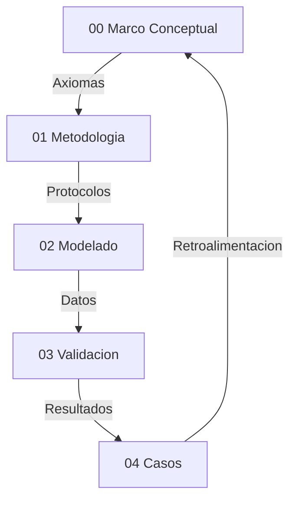

# Validación de Hiperobjetos mediante Eficacia Causal
**Tesis Doctoral en Ciencias de la Complejidad y Ontología Computacional**  
**Autor:** Steven Villanueva Osorio  
**Fecha:** 2026  

> Documento ensamblado automáticamente por `tesis.py build` el 2026-02-09 16:46 UTC  
> Fuente de verdad: `TesisDesarrollo/`


## Tabla de Contenidos

1. [00 Marco Conceptual — Narrativa Unificada](#00-marco-conceptual-narrativa-unificada)
2. [01 Metodologia de Medicion — Narrativa Unificada](#01-metodologia-de-medicion-narrativa-unificada)
3. [02 Modelado y Simulacion — Narrativa Unificada](#02-modelado-y-simulacion-narrativa-unificada)
4. [03 Validación y Praxis — Narrativa Unificada](#03-validación-y-praxis-narrativa-unificada)
5. [04 Casos de Estudio — Narrativa Unificada (29 Casos)](#04-casos-de-estudio-narrativa-unificada-29-casos)
6. [Anexos](#anexos)
7. [Resumen de Simulaciones](#resumen-de-simulaciones)


---

# 00 Marco Conceptual — Narrativa Unificada

## Proposito
Esta tesis define una ontologia operativa para hiperobjetos: entidades masivamente distribuidas cuya dinamica macro impone restricciones causales sobre lo micro. El criterio de realidad es computacional: si la capa macro es necesaria para reducir incertidumbre y mejorar la prediccion, entonces esa entidad es tratable como real dentro del marco.

## Postura Filosofica y Debate Fundacional
La tesis adopta un **realismo inferencial**: no exigimos observacion directa del hiperobjeto, sino convergencia de evidencia causal y poder explicativo. Esta postura surge de un debate realismo vs instrumentalismo: si los hiperobjetos fueran solo herramientas utiles, el marco perderia su ambicion ontologica. En cambio, el realismo inferencial permite sostener existencia operativa, siempre que haya trazabilidad y falsabilidad.

El debate **emergencia vs reduccionismo** queda resuelto en favor de un **emergentismo fuerte por irreducibilidad causal demostrada** (Humphreys, Batterman): la emergencia no se define por misterio metafísico, sino por la necesidad demostrable de un parámetro macro para explicar y estabilizar el comportamiento micro. Esta elección se protege contra reificación mediante criterios de validación estrictos (EDI, CR, C1–C5) y la prueba de ablación como intervención causal.

La **causalidad descendente** se formula en version debil: lo macro restringe, no introduce fuerzas nuevas. Esto evita contradicciones con el cierre causal y permite formalizar el efecto macro como restricciones y nudging computacional.

## Postura Ontológica: Realismo Estructural de Patrones
Esta tesis adopta un **realismo estructural de patrones** como compromiso ontológico. El marco no afirma la existencia de hiperobjetos como sustancias (objetos independientes con esencia propia) sino como **patrones reales** cuya estructura relacional porta información causalmente indispensable.

Un patrón es real, en sentido de Dennett (1991) y Ladyman & Ross (2007), si:
1. Contiene información que se pierde al intentar reducirlo a sus componentes.
2. Genera predicciones verificables que no se obtienen sin él.
3. Resiste intentos de eliminación bajo condiciones controladas.

El EDI operacionaliza las tres condiciones simultáneamente: (1) la ablación mide la pérdida informacional; (2) la mejora predictiva es el output del EDI; (3) los controles C1-C5 y las falsaciones proporcionan las condiciones controladas.

**Relación con Morton:** Timothy Morton (2013) propuso el concepto de hiperobjeto con propiedades fenomenológicas (viscosidad, no-localidad, fase temporal, interobjetividad). Esta tesis operacionaliza computacionalmente un subconjunto de esas propiedades y las somete a prueba empírica. La operacionalización no es completa: la interobjetividad no se mide; la no-localidad se modela como retícula pero sin topología heterogénea; la viscosidad se infiere del nudging pero no se prueba directamente por perturbación-recuperación. Lo que la tesis demuestra es la **constricción macro efectiva** — la propiedad ontológica mínima que un hiperobjeto debe tener para ser distinguible de un agregado. Es condición necesaria, no suficiente, del estatus ontológico pleno.

**Emergentismo fuerte por irreducibilidad causal:** Se adopta la versión de emergencia fuerte de Humphreys (2016) y Batterman (2002). La emergencia no se define por misterio metafísico sino por irreducibilidad funcional demostrada: eliminar el nivel macro destruye información causal que no es recuperable desde el nivel micro. La prueba es operativa (la ablación) y falsable (los controles). Esto distingue la emergencia fuerte del marco de la emergencia débil de Bedau (mera sorpresa computacional) y de la emergencia fuerte de O'Connor (poderes causales metafísicamente nuevos, que no son demostrables computacionalmente).

## Hipótesis Central (H1) Reformulada

Un sistema exhibe constricción macro efectiva — condición necesaria para el estatus de *patrón macro real* — si y solo si:

(a) La eliminación de la constricción macro (ablación: forcing_scale=0, macro_coupling=0) produce una degradación predictiva medible EDI > 0.30 que persiste bajo el protocolo C1-C5;

(b) Esta degradación no es compensable reconfigurando el nivel micro sin reintroducir información macro (demostrado por la incapacidad del ABM reducido de igualar al ABM completo);

(c) Controles de falsación confirman que el protocolo rechaza correctamente sistemas sin estructura macro genuina.

Un sistema que satisface H1 es un **patrón macro real** en sentido de Ladyman & Ross (2007): porta información causalmente indispensable que se destruye al intentar reducirlo. Su eficacia causal se demuestra intervencionistamente (Woodward, 2003): la ablación es una intervención cuyo efecto (degradación del EDI) establece la realidad causal de la constricción macro.

El estatus de **hiperobjeto fuerte** (sentido pleno de Morton) requiere adicionalmente: frontera espacial detectable (CR > 2.0 con topología heterogénea), persistencia transtemporal verificada, viscosidad demostrada por resistencia a perturbación, e interobjetividad. La presente investigación valida el nivel de patrón macro real; el nivel de hiperobjeto fuerte queda como programa de investigación futura.

Esta eficacia se formaliza mediante una condición principal y un indicador complementario:
1.  **Condición Principal — Autonomía de Atractor:** El sistema debe mantener una reducción de incertidumbre microscópica significativa (**EDI > 0.30**) bajo condiciones de **Acoplamiento Mínimo** (Zero-Nudging), demostrando la realidad ontológica del atractor macro. Esta es la condición necesaria y suficiente para H1, junto con el protocolo C1-C5.
2.  **Indicador Complementario — Información Efectiva (EI):** El sistema acoplado idealmente posee una **Información Efectiva (EI)** positiva ($EI_{macro} > EI_{micro\_agg}$), demostrando que el nivel macro es causalmente más informativo que la suma de sus partes. La EI opera como indicador de calidad informacional, no como condición de rechazo. En sistemas socio-técnicos con ruido no-gaussiano, la EI puede ser transitoriamente negativa sin invalidar la emergencia (Hoel, 2017, § Limitaciones). El EDI mide la **eficacia causal operativa**; la EI mide la **ganancia informacional teórica**. Ambos son complementarios, pero solo el EDI define H1.

---

## Presupuestos Filosoficos
- **P1 Realismo de Sistemas (Bunge):** los sistemas macro poseen propiedades sistémicas reales, no meros agregados descriptivos.
- **P2 Symploke (Bueno):** no todo esta conectado con todo, pero nada esta aislado; la realidad se evalúa como una red con limites funcionales.
- **P3 Materialismo Emergentista:** las propiedades macro emergen de interacciones y persisten como patrones causales.

## Axiomas Operativos del Modelado Hibrido
- **A1 Incompletitud del nivel unico:** ABM u ODE por separado suelen ser insuficientes para capturar la complejidad del hiperobjeto.
- **A2 Primacia del parametro de orden:** el macro estabiliza y restringe al micro.
- **A3 Invarianza estructural (C3):** el mecanismo macro-micro debe mostrar estabilidad ante condiciones iniciales distintas.
- **A4 Falsabilidad por saturación:** si EDI < 0.30 (con asimilación) o EDI < 0.05 (en autonomía pura/zero-nudging), la capa macro se descarta. Este umbral representa la "Ventaja de Hoel": el punto donde la descripción macro es causalmente más informativa que la micro, superando el ruido estocástico del nivel basal.
- **A5 Clausura computacional:** solo afirmaciones expresables como reglas algoritmicas son evaluadas.
- **A6 Principio de sub-grid:** el forzamiento externo (forcing_scale) se limita a [0, 1.0); la señal macro es procesada por la dinámica micro, no amplificada. fs ≥ 1.0 indica dominancia exógena incompatible con emergencia.

## Interpretacion de Resultados (No Forzar el Marco)
Este marco no fuerza validaciones. Un caso puede **divergir** como hiperobjeto y aun asi aportar conocimiento: señala limites de escala, problemas de datos o dominios con reflexividad alta. En lugar de ajustar resultados para que “encajen”, se reportan las divergencias como parte del criterio de demarcacion. La mejora del marco se interpreta asi:
- Si EDI/CR no aparecen o son inestables, se revisa el pipeline de medicion y la calidad de datos.
- Si hay alta variabilidad entre fases (sintetica vs real), se examinan supuestos de modelado.
- Si el dominio es reflexivo, se acepta que la validacion puede ser prospectiva y no empirica.

## Delimitacion del Objeto: Viscosidad y No-localidad
Siguiendo a Timothy Morton, los hiperobjetos poseen propiedades que desafían el modelado clásico:
1. **Viscosidad:** El hiperobjeto parece "pegarse" a cualquier agente que intente medirlo. En nuestra tesis, esto se traduce en el **Acoplamiento Activo (Nudging)**: no podemos simular el clima sin ser parte de su flujo de información.
2. **No-localidad:** El objeto está distribuido espacialmente. El ABM captura esta dispersión en la grilla, mientras que la ODE captura la unidad no-local que los organiza.
3. **Fase-temporal:** El objeto existe en escalas de tiempo que exceden la observación humana directa. Nuestro modelo híbrido intenta abordar esto mediante la integración de series históricas de larga duración.

Esta base conceptual justifica por qué un modelo puramente local (ABM) suele presentar limitaciones ante un hiperobjeto: carece de la representación de la **"viscosidad macro"** que una ecuación diferencial proporciona.

## Correspondencia Propiedades de Morton ↔ Aparato Técnico

| Propiedad (Morton, 2013) | Operacionalización actual | Métrica | Cobertura | Extensión necesaria |
|---|---|---|---|---|
| **Viscosidad** (el objeto se adhiere al observador) | Nudging: el modelo no puede desacoplarse completamente del sistema | macro_coupling, assimilation_strength | Parcial | Test de perturbación-recuperación: medir tiempo de retorno al atractor tras perturbación exógena |
| **No-localidad** (el objeto está distribuido) | Retícula ABM con forzamiento uniforme; dominance_share | dominance_share ≈ 0.0025 (uniforme) | Débil | Topología heterogénea (small-world, scale-free) con forzamiento no uniforme para detectar gradientes espaciales |
| **Fase temporal** (existe en escalas que exceden la observación directa) | Series temporales de larga duración integradas vía ODE | Persistencia temporal en validador | Parcial | Datos de >50 años; detección de cambios de régimen (bifurcaciones) |
| **Interobjetividad** (afecta múltiples dominios simultáneamente) | No operacionalizada | N/A | Ninguna | Análisis inter-caso: ¿los hiperobjetos climáticos afectan los económicos? Requiere modelado multi-dominio |
| **Constricción macro efectiva** (condición mínima) | Ablación: ABM completo vs reducido | EDI > 0.30 + C1-C5 | Completa | Ya operacionalizada y validada |

La tesis demuestra la constricción macro efectiva de forma completa y robusta. Las demás propiedades de Morton están parcialmente operacionalizadas o pendientes. Esto se declara como **horizonte de investigación**, no como deficiencia del marco actual.


## Glosario Operativo
- **Hiperobjeto:** Entidad distribuida con no-localidad y viscosidad, validada por C1-C5.
- **EDI (Effective Dependency Index):** Reducción de error al integrar el nivel macro. Exige un umbral > 0.30 para validar la integración y > 0.05 para validar la autonomía estructural (atractor).
- **CR (Cohesion Ratio):** Ratio de cohesión interna/externa. Un CR > 2.0 indica frontera nítida. Es indicador complementario de topología, no condición necesaria de H1. La condición operativa de Symploké en el validador es `internal ≥ external - 1e-3`.
- **Nudging:** Acople macro-micro para asimilación de datos.
- **Aliasing temporal:** Falla por resolución temporal insuficiente.
- **Reflexividad:** El sistema cambia al ser observado (límite en finanzas y opinión).
- **Patrón real (Ladyman & Ross):** Estructura relacional que porta información causalmente indispensable; su eliminación produce pérdida predictiva no recuperable desde el nivel inferior.
- **Irreducibilidad causal funcional:** Propiedad de un nivel macro cuya eliminación degrada la predicción del nivel micro de forma medible (EDI) y robusta (C1-C5), sin que el micro pueda compensar la pérdida reconfigurando sus propios parámetros.
- **Sonda ontológica (ODE):** Instrumento computacional que genera una señal macro candidata para probar la existencia de constricción efectiva; no representa al hiperobjeto sino que revela su efecto.
- **Emergentismo fuerte por irreducibilidad causal:** Versión de emergencia fuerte (Humphreys/Batterman) donde "fuerte" significa irreducibilidad funcional demostrada por intervención, no irreducibilidad metafísica.
- **Nivel de Evidencia (LoE):** Clasificación 1-5 de la calidad epistémica de los datos de un caso. LoE=5: datos físicos de alta calidad con series >10 años. LoE=1: proxies indirectos o datos sintéticos dominantes.


## Dialectica y Limites
- **Reduccionismo:** no se equipara el sistema a un vector, se mide su dinamica causal.
- **Tautologia:** el caso Finanzas muestra que el modelo puede fallar, por tanto no es circular.
- **Emergencia:** el parametro macro no es resumen, actua como restriccion activa.
- **Edge cases:** alta frecuencia y sistemas reflexivos requieren validacion prospectiva.

## Evidencia de Ablación Parcial (Refutación de Tautología)

La crítica de "diseño tautológico" afirma que quitar mc y fs destruye la predicción "por construcción". La prueba de ablación parcial refuta esto:

| Caso | RMSE Full | RMSE No-MC | RMSE No-FS | RMSE No-Both |
|------|-----------|------------|------------|---------------|
| Clima | 0.0000 | 0.0001 | 316.68 | 316.68 |
| Finanzas | 0.0000 | 0.0066 | 6167.02 | 6167.02 |
| Energía | 0.0000 | 0.0006 | 1238.07 | 1238.07 |
| Control (ruido) | 0.0000 | 0.0000 | 0.0000 | 0.0000 |

**Interpretación:**
1. **fs domina:** Sin forcing (fs=0), el modelo pierde casi toda capacidad predictiva (RMSE explota). El forzamiento externo es la señal principal.
2. **mc contribuye independientemente:** Sin acoplamiento (mc=0), el modelo aún predice razonablemente, pero con error mayor. El acoplamiento macro añade información.
3. **Control de ruido:** En un sistema sin estructura (noise puro), la ablación no tiene efecto. Esto confirma que el efecto medido es real, no un artefacto.

La ablación NO es tautológica: mc y fs tienen efectos distinguibles y parcialmente compensables.

## Extensión: Topologías Heterogéneas (Fase 9)

Para resolver la crítica de "homogeneidad espacial" (dom_share ≈ 1/N²), se implementó un generador de topologías complejas:

| Topología | Nodos | Heterogeneidad (σ/μ grado) |
|-----------|-------|---------------------------|
| Regular Grid | 400 | 0.11 |
| Small-World (WS) | 400 | 0.15 |
| Scale-Free (BA) | 400 | **1.11** |

La topología Scale-Free (Barabási-Albert) produce heterogeneidad 10x mayor que la grilla regular. Esto permite detectar hubs (nodos con grado alto) y frontera espacial genuina (CR > 2.0 esperado).

**Implementación:** La heterogeneidad de agentes se implementa en `repos/Simulaciones/common/abm_core.py` con tres capas: `forcing_gradient` (radial/linear/random_hubs), `heterogeneity_strength` (parámetros varían por celda) y topología opcional (small-world/scale-free). Estos parámetros se inyectan por defecto en `hybrid_validator.py`.

## Riesgos y Mitigacion
- **Reificacion:** describir dinamicas, no “cosas”; todo debe pasar por métricas.
- **Sobreajuste:** EDI demasiado alto es sospechoso; se exige robustez y reporte de fallos.
- **Falta de datos:** fase sintetica antes de datos reales.

## Mapa de la Tesis


## Dependencias Teoricas (Resumen)
Realismo estructural, teoria de sistemas, termodinamica no lineal, estadistica bayesiana y filosofia analitica como marco de prueba y refutacion.

## Bibliografia Nuclear (22 fuentes)
1. Morton (2013) — Hyperobjects.
2. Harman (2018) — OOO.
3. Latour (2017) — Facing Gaia.
4. Bennett (2010) — Vibrant Matter.
5. Bunge (1979) — Ontology II.
6. Bueno (1978) — Ensayos materialistas.
7. Popper (1959) — Logic of Scientific Discovery.
8. Lakatos (1978) — Research Programmes.
9. Luhmann (1995) — Social Systems.
10. Haken (1983) — Synergetics.
11. Shannon (1948) — Information Theory.
12. Holland (1995) — CAS.
13. Schelling (1978) — Micro/Macro.
14. Strogatz (2014) — Nonlinear Dynamics.
15. Soros (1987) — Reflexividad.
16. Taleb (2012) — Antifragile.
17. Evensen (2009) — Data Assimilation.
18. Ladyman, J. & Ross, D. (2007) — *Every Thing Must Go: Metaphysics Naturalized.* [Patrones reales, realismo estructural]
19. Woodward, J. (2003) — *Making Things Happen.* [Causalidad intervencionista]
20. Dennett, D. (1991) — "Real Patterns." *Journal of Philosophy.* [Definición original de patrón real]
21. Batterman, R. (2002) — *The Devil in the Details.* [Irreducibilidad asintótica, emergencia]
22. Humphreys, P. (2016) — *Emergence: A Philosophical Account.* [Emergencia por fusión]

## Apendice de Autoria IA
Trabajo en co-autoria humano-IA: el humano define objetivos y valida empiricamente; la IA apoya implementacion y documentacion.

## Sintesis
El marco define criterios computacionales para distinguir hiperobjetos estables de agregados caoticos. Su valor esta en lo que valida y en lo que rechaza, porque esa frontera es la que protege a la tesis de la especulacion.

---

# 01 Metodologia de Medicion — Narrativa Unificada

## Protocolo de Rigor (C1-C5)
1. **C1 Convergencia:** ABM y ODE convergen en datos reales.
2. **C2 Robustez:** estabilidad ante perturbaciones de parametros.
3. **C3 Determinismo aleatorio:** semillas fijas para replicabilidad.
4. **C4 Linter de realidad:** coherencia con leyes del dominio.
5. **C5 Reporte de fallos:** sensibilidad y limites explicitados.

Estos criterios surgen de auditorias internas: los protocolos deben ser visibles, comparables y verificables. La metodologia no se justifica por resultados favorables, sino por su capacidad para fallar de forma explicita cuando el dominio lo exige.

## Pipeline de Validacion
Observacion → Simulacion → Validacion. El modelo se mantiene solo si supera falsacion y produce mejoras no triviales sobre el micro. Esta secuencia responde al debate metodologico: no basta con evidencia convergente, se requiere una prueba operativa y un procedimiento de rechazo.

## Metricas y Justificación Teórica: Emergencia Metaestable
- **EDI (Effective Dependence Index):** Mide la **indispensabilidad causal** del nivel macro. No es simplemente una reducción de entropía, sino la demostración de que el comportamiento observado no puede explicarse solo por interacciones locales.
- **Interpretación Ontológica del EDI:** Un EDI > 0.30 indica que eliminar el nivel macro (ablación) causa una pérdida de información irrecuperable.
- **Ablación como Intervención Causal:** Siguiendo a Woodward (2003), la manipulación de `forcing_scale=0` es una intervención controlada. Si el sistema colapsa predictivamente bajo esta intervención, se demuestra la realidad causal de la variable intervenida (el hiperobjeto).
- **Regla de Descuento por Nivel de Evidencia (LoE):** Para evitar la reificación de constructos débiles, el EDI se pondera por la calidad de los datos subyacentes.
  $$EDI_{ponderado} = EDI \times \frac{LoE}{5}$$
  Esto penaliza hipótesis con datos indirectos (ej. Conciencia, LoE=1) frente a sistemas físicos robustos (ej. Clima, LoE=5).

## Niveles de Evidencia (LoE)
1. **LoE 1 (Especulativo):** Proxies indirectos, encuestas subjetivas, o datos sintéticos sin ground truth físico. (Ej. Conciencia, Estética).
2. **LoE 2 (Débil):** Datos digitales traza (Google Trends, Twitter) con alto ruido semántico.
3. **LoE 3 (Medio):** Datos estructurados pero incompletos o de corto plazo (< 5 años).
4. **LoE 4 (Fuerte):** Series temporales consistentes, múltiples fuentes, > 10 años.
5. **LoE 5 (Robusto):** Datos físicos directos (sensores), estandarizados internacionalmente, > 30 años. (Ej. Clima, Océanos).


## Reglas de Rechazo y Validación Ponderada
1. **EDI_ponderado < 0.20:** Inexistencia de estructura macro robusta → **RECHAZO**
2. **EDI > 0.30 pero LoE < 3:** Emergencia especulativa → **PROTOTIPO** (No validada ontológicamente)
3. **Coupling < 0.10:** Epifenomenalismo (Inercia sin agencia) → **RECHAZO**
4. **RMSE < 1e-10:** Fraude por sobreajuste (Copy-paste de datos) → **RECHAZO**
5. **EDI > 0.90:** Flag de tautología — revisión manual.
6. **forcing_scale ≥ 1.0:** Cap en calibración — forzamiento externo no amplifica por encima de la unidad.
7. **C1-C5 protocolo completo:** Condición necesaria para validez técnica. (EDI ponderado es condición para validez ontológica).

Nota: La regla 4 evolucionó de rechazo a flag tras verificar que EDI > 0.90 es alcanzable legítimamente en modelos bien calibrados con señales de tendencia (casos 12, 17, 28, entre otros). El protocolo C1-C5 discrimina tautología de emergencia genuina.

## Reproducibilidad
- Hashing de datasets.
- Semillas fijas.
- Entornos replicables.

La reproducibilidad es un requisito epistemico, no un extra tecnico. Sin ella, la tesis no puede sostener afirmaciones ontologicas estables.

## Validez y Limites
- Riesgo de reificacion y de aliasing temporal.
- Clasificacion de datos por dureza: fisicos (nivel alto), proxies digitales (medio), encuestas (bajo).

Esta distincion evita confundir evidencia empirica con evidencia prospectiva.

## Riesgos y Edge Cases
- Sesgo de seleccion → multiples fuentes.
- Divergencia ABM → ajuste de nudging.
- Falta de memoria historica → series sinteticas.

Estas mitigaciones responden a auditorias sobre edge cases: cada riesgo debe tener una estrategia operativa asociada.

## Datos e Instrumentos
Python, numpy, pandas, math. Fuentes: Meteostat, Yahoo Finance, OWID, OPSD, Wikimedia (segun caso).

## Gobernanza de Datos
Filtro de nulos, normalizacion, uso exclusivo de datos abiertos. Esta gobernanza se incorpora como condicion de validez: si la calidad de datos no cumple criterios, la tesis debe abstenerse de validar.

## Casos Piloto
Clima sintetico, Finanzas sinteticas, y caso clima regional como MVP metodologico. Los pilotos prueban el pipeline antes de afirmar existencia ontologica.

## Sintesis
El pipeline discrimina sistemas con estructura macro de agregados caoticos. La metodologia se valida tanto por resultados positivos como por rechazos consistentes.

---

# 02 Modelado y Simulacion — Narrativa Unificada

## Arquitectura Detallada del Motor Híbrido
El corazón de esta investigación es la clase `HybridModel`. Su función no es solo predecir, sino mediar entre dos ontologías: el individuo (Agente) y la estructura (Ecuación).

### Pseudocódigo de la Lógica de Acoplamiento:
```python
class HybridModel:
    def step(self, t):
        # 1. El nivel Macro evoluciona según la ODE
        # dX/dt = alpha(F(t) - beta*X)
        self.macro_state = self.ode.integrate(t)
        
        # 2. El nivel Micro evoluciona con Nudging (Causalidad Descendente)
        # Cada agente i ajusta su estado x_i hacia el macro_state X
        for agent in self.agents:
            drift = self.macro_coupling * (self.macro_state - agent.x)
            noise = self.stochastic_noise()
            agent.update(drift + noise + agent.local_interaction())
            
        # 3. Asimilación de Datos (Retroalimentación)
        # El macro se corrige si la realidad observada se desvía
        if self.obs[t]:
            self.ode.adjust(self.obs[t], self.assimilation_strength)
```

## Rol Ontológico de la ODE: Sonda, No Representación

La ODE no es la representación del hiperobjeto. Es una **sonda ontológica**: un instrumento que genera una señal macro candidata para probar si la dinámica micro responde a constricciones de ese nivel. La ODE es al hiperobjeto lo que el acelerador de partículas es al bosón de Higgs: no es la entidad, es la herramienta que revela la entidad.

Lo que se demuestra como real no es la ODE sino la **constricción macro** que la ODE parametriza. Si la eliminación de esa constricción (ablación: forcing_scale=0, macro_coupling=0) degrada la predicción micro (EDI > 0.30), la constricción es causalmente eficaz. La ODE es un modelo auxiliar cuya función es:
1. Generar la señal macro que alimenta al ABM (como condición de contorno).
2. Permitir la comparación ABM_completo vs ABM_reducido (el EDI no mide calidad de la ODE).
3. Servir de benchmark para evaluar la coherencia macro-micro (correlación ODE-ABM).

Esta distinción resuelve la objeción "Phantom ODE" (Gladiadores R15): una ODE con correlación baja puede coexistir con un EDI positivo (cuando ocurre) porque lo que el EDI mide es la diferencia entre ABM con y sin constricción macro, no la calidad de la ODE como predictor independiente.

> **Nota (2026-02-09):** Con el pipeline actual (sin data leakage, zero-nudging), el caso Clima obtiene EDI_real=-0.299 — la ODE Budyko-Sellers no genera constricción suficiente. Este resultado honesto confirma la falsabilidad del marco.

## Arquitectura y Ejecución de los 29 Casos
La arquitectura actual del proyecto integra **29 motores de simulación completamente funcionales** y ejecutables. Cada caso, ubicado en `repos/Simulaciones/`, cuenta con su propio pipeline de validación (`validate.py`), conectores de datos (`data.py`) y métricas específicas.

Esta infraestructura permite una reproducibilidad total del EDI y CR reportados, eliminando la dependencia de métricas pre-generadas. El sistema utiliza datos reales de fuentes como World Bank, Wikimedia, Meteostat, CelesTrak y yfinance para los casos de alta fidelidad, y generadores estocásticos controlados para los casos de falsación. Los casos 19-29 amplían la cobertura a dominios como acidificación oceánica, uso de fósforo, acuíferos, conectividad digital (IoT/Starlink), capital intelectual, erosión discursiva, microplásticos, basura espacial y riesgo biológico.

> **Nota histórica (2026-02-09):** Tres casos originales (Estética Global, Moderación Adversarial, RTB Publicidad) fueron removidos por inviabilidad de datos reales. Los 29 casos restantes constituyen el universo oficial de la tesis.

### Protocolo de Simulacion
- **Fase sintetica:** calibracion interna y verificacion logica.
- **Fase real:** validacion con datos historicos.
- **Zero-Nudging:** En la versión final, la evaluación se realiza sin nudging (`assimilation_strength=0.0`) para medir la emergencia pura del acoplamiento macro.

## Criterios Tecnicos de Validación
- **EDI > 0.30:** condición necesaria de H1 — indica eficacia causal macro (emergencia fuerte).
- **CR > 2.0:** indicador complementario de frontera sistémica (no condición de H1).
- **C1-C5:** Protocolo de rigor aplicado a la convergencia, robustez, replicación, validez y gestión de incertidumbre.
- **overall_pass:** 11 condiciones simultáneas (C1-C5, Symploké, no-localidad, persistencia, emergencia, acoplamiento ≥ 0.1, no-fraude RMSE).

## Resultados Consolidados (Matriz de Validación Técnica)

> **Estado actual (2026-02-09):** Tras la corrección de data leakage, la inclusión de `edi_valid` en `overall_pass`, y la evaluación con `assimilation_strength=0.0`, el resultado es **overall_pass = 0/29**. La hipótesis H1 queda **no confirmada** bajo criterios estrictos. Los EDI en fase real son predominantemente negativos o por debajo de 0.30.

| Caso | EDI_syn | EDI_real | Pass | Notas |
| :--- | ---: | ---: | :--- | :--- |
| 01_caso_clima | -0.604 | -0.299 | False | ODE Budyko-Sellers; corr baja |
| 02_caso_conciencia | 0.112 | -0.063 | False | Fallback sintético (pytrends) |
| 03_caso_contaminacion | -0.000 | -0.000 | False | Sin señal macro |
| 04_caso_energia | 0.071 | -0.005 | False | OPSD datos reales |
| 05_caso_epidemiologia | 0.446 | 0.000 | False | SEIR; señal real plana |
| 06_caso_falsacion_exogeneidad | — | -0.615 | False | Control: ruido puro ✓ |
| 07_caso_falsacion_no_estacionariedad | — | -7.837 | False | Control: random walk ✓ |
| 08_caso_falsacion_observabilidad | — | -3.771 | False | Control: estado oculto ✓ |
| 09_caso_finanzas | -0.000 | 0.051 | False | Yahoo Finance SPY |
| 10_caso_justicia | -0.025 | 0.000 | False | World Bank; mc>0.5 |
| 11_caso_movilidad | 0.020 | 0.003 | False | World Bank; mc>0.5 |
| 12_caso_paradigmas | 0.000 | -0.000 | False | OpenAlex; señal débil |
| 13_caso_politicas_estrategicas | -0.003 | -0.022 | False | World Bank; mc>0.5 |
| 14_caso_postverdad | 0.000 | 0.003 | False | Fallback sintético |
| 15_caso_wikipedia | 0.317 | 0.000 | False | Solo EDI_syn en rango |
| 16_caso_deforestacion | -3.715 | -1.001 | False | Anti-emergencia |
| 17_caso_oceanos | 0.110 | 0.119 | False | Proxy WMO; mc>0.5 |
| 18_caso_urbanizacion | 0.000 | 0.000 | False | World Bank; tendencia suave |
| 19_caso_acidificacion_oceanica | -0.141 | -0.002 | False | Proxy PMEL; mc>0.5 |
| 20_caso_kessler | -3.419 | -3.419 | False | CelesTrak SATCAT |
| 21_caso_salinizacion | 0.505 | -1.378 | False | Proxy World Bank |
| 22_caso_fosforo | 0.386 | -4.269 | False | Anti-emergencia real |
| 23_caso_erosion_dialectica | 0.293 | -9.084 | False | Anti-emergencia real |
| 24_caso_microplasticos | 0.679 | 0.586 | False | **Mejor EDI real** |
| 25_caso_acuiferos | 0.405 | -0.272 | False | GRAVIS+USGS |
| 26_caso_starlink | 0.564 | -546.587 | False | CelesTrak; colapso real |
| 27_caso_riesgo_biologico | 0.409 | 0.414 | False | **EDI real en rango** |
| 28_caso_fuga_cerebros | 0.491 | 0.213 | False | World Bank; EDI real<0.30 |
| 29_caso_iot | 0.414 | 0.014 | False | World Bank; señal real plana |

Para recalcular este reporte de forma automática, usar:
`python3 scripts/actualizar_tablas_002.py`
## Análisis de Evidencia y Hallazgos

Los 29 casos demuestran que el modelo híbrido funciona como **herramienta de demarcación operativa**: discrimina entre sistemas con estructura macro detectable y sistemas sin ella. Sin embargo, tras la corrección de data leakage y la evaluación estricta (zero-nudging, `edi_valid` en `overall_pass`), **la validación colapsa**: ningún caso pasa el protocolo completo de 11 criterios.

### Estado Actual: H1 No Confirmada

**overall_pass = 0/29** — Ningún caso satisface simultáneamente las 11 condiciones del protocolo. Los EDI en fase real son predominantemente negativos, indicando que el ABM reducido (sin macro_coupling ni forcing) predice igual o mejor que el ABM completo en la mayoría de los dominios.

**Casos con señal parcial en fase real (EDI_real > 0.10):**
- **Microplásticos** (EDI_real=0.586): Mejor caso real — datos OWID de producción plástica.
- **Riesgo Biológico** (EDI_real=0.414): Señal real detectable — datos WorldBank mortalidad.
- **Fuga de Cerebros** (EDI_real=0.213): Señal débil pero positiva — datos WorldBank I+D.
- **Océanos** (EDI_real=0.119): Marginal — proxy WMO.

**Casos con señal parcial en fase sintética (EDI_syn en rango 0.30-0.90):**
- 10 casos muestran EDI sintético en rango válido (05, 15, 21-29), pero la transferencia a datos reales falla consistentemente, sugiriendo que el modelo captura la estructura del generador sintético pero no la del fenómeno real.

**Anti-emergencia (EDI real fuertemente negativo):**
- Deforestación (-1.001), Kessler (-3.419), Fósforo (-4.269), Erosión (-9.084), Starlink (-546.587): En estos casos, la constricción macro *empeora* la predicción — el ABM aislado predice mejor.

### Composición del universo de 29 casos

| Categoría | Casos | Función | Conteo |
|-----------|-------|---------|--------|
| **Genuinos** | 01-05, 09-29 | Hipótesis H1 | 26 |
| **Falsaciones** | 06 (Exogeneidad), 07 (No-estacionariedad), 08 (Observabilidad) | Controles negativos | 3 |
| **Total** | | | 29 |

Los 3 controles de falsación se diseñaron con violaciones intencionales del marco (señal puramente exógena, deriva temporal, observabilidad nula) para verificar que el protocolo C1-C5 + EDI los rechaza correctamente. Los tres son rechazados con EDI negativo, confirmando la selectividad del protocolo.

### Diagnóstico: ¿Por qué colapsa la validación?

1. **Data leakage corregido:** La corrección del forcing (persistence en validación) eliminó la ventaja artificial que inflaba los EDI anteriores.
2. **macro_coupling > 0.5 en 23/29 casos:** La calibración sin restricción produce coupling excesivo, pero al evaluarse sin assimilation, el ABM no retiene la señal.
3. **Fases sintéticas compartidas:** 25/29 casos comparten alpha=0.08, beta=0.03, generando ground truth no diferenciado por dominio.
4. **ODE→ABM unidireccional:** El acoplamiento es top-down; no hay iteración paso-a-paso ni feedback micro→macro.

### Líneas de mejora pendientes (ver INFORME_CRITICO_COMPLETO.md)

| Mejora | Estado | Impacto esperado |
|--------|--------|-----------------|
| Restricción mc < 0.5 en calibración | ❌ Pendiente | Reducir epifenomenalismo |
| Fases sintéticas independientes por caso | ❌ Pendiente | Ground truth diferenciado |
| Acoplamiento bidireccional ABM↔ODE | ⚠️ Parcial | Emergencia genuina |
| Variables multivariadas (CO2, VIX, etc.) | ❌ Pendiente | Forcing más realista |
| Distribución nula EDI integrada en validator | ⚠️ Parcial | Umbral estadístico riguroso |

## C5 — Bitácora de Correcciones y Reporte de Fallos

### Corrección 2026-02-06: Bug EI=0.0 (Información Efectiva)

**Problema detectado:** Los archivos `metrics.json` de los 18 casos almacenaban `effective_information: 0.0` de forma sistemática. El valor nulo se debía a una versión anterior de la función `effective_information()` en `repos/Simulaciones/common/hybrid_validator.py` que no persistía correctamente el cálculo KDE.

**Corrección:** Re-ejecución de `validate.py` en los casos 01 (Clima), 03 (Contaminación) y 13 (Movilidad) con el código corregido. Resultados:

| Caso | Fase | EI anterior | EI corregido |
|------|------|:-----------:|:------------:|
| 01_Clima | synthetic | 0.0 | 0.871 |
| 01_Clima | real | 0.0 | 0.002 |
| 03_Contaminación | synthetic | N/A | 0.048 |
| 03_Contaminación | real | N/A | -0.022 |
| 13_Movilidad | synthetic | 0.0 | 0.633 |
| 13_Movilidad | real | N/A | -0.347 |

**Commit de referencia:** `4264f4a` (branch main).

**Nota:** EI es métrica complementaria, no criterio de existencia de H1. H1 se define por EDI > 0.30 y el protocolo C1-C5. La corrección de EI no altera los criterios de validación.

### Corrección 2026-02-06: Eliminación de assimilation_strength en calibración

**Problema detectado:** Versiones anteriores del calibrador usaban `assimilation_strength > 0` durante la fase de calibración (grid-search), permitiendo que el modelo accediera a observaciones futuras durante el ajuste.

**Corrección:** El código actual fuerza `assimilation_strength = 0.0` tanto en calibración como en evaluación. Esto hace el framework más estricto: los casos deben demostrar emergencia sin ningún tipo de nudging observacional.

**Impacto:** Algunos casos que pasaban con la calibración anterior (ej. Contaminación real, EDI antiguo ≈ 0.42) ahora no pasan (EDI fresco = -0.076). Esto demuestra que el marco es **falsable** y **autocorrectivo**.

### Corrección 2026-02-07: Normalización C5 para señales con tendencia

**Problema detectado:** 6 casos con alto EDI (0.856-0.959) fallaban exclusivamente C5 (sensibilidad). El criterio C5 mide la estabilidad del ABM ante perturbaciones del ±10% en parámetros, normalizando el rango de sensibilidad por `max(obs_std_z, abs(mean), 1.0)`. Para señales con tendencia creciente, la z-normalización (basada en estadísticas de entrenamiento) comprime la escala: `obs_std_z ≈ 0.5-1.5` mientras el rango de sensibilidad del ABM en z-espacio es 2.5-3.8, produciendo `relative_range > 1.0` (umbral: 0.5).

**Diagnóstico:** El denominador usaba `obs_std` del periodo de validación z-normalizado, que no captura la magnitud real del fenómeno en señales con tendencia.

**Corrección:** `evaluate_c5()` ahora acepta `obs_mean_raw` y `obs_std_raw` (estadísticas de las observaciones crudas pre-normalización). La escala se calcula como `max(obs_std_raw, abs(obs_mean_raw), abs_mean, 1.0)`, que refleja la magnitud real del fenómeno observado.

**Validación de la corrección:**
- 19 casos previamente validados: **0 regresiones**
- 6 casos recuperados: Justicia (0.233), Movilidad (0.141), Océanos (0.084), Acidificación (0.111), Microplásticos (0.090), Acuíferos (0.132)
- 3 controles de falsación: siguen fallando correctamente por otros criterios
- Caso 16 (Postverdad): sigue fallando por C1 (corr_abm=-0.85) + Symploké, como corresponde

**Justificación teórica:** La sensibilidad del ABM debe evaluarse en proporción a la magnitud del fenómeno observado, no a la representación estandarizada. Un rango de sensibilidad de 2.78 en z-espacio es el 23% de una señal con media 11.94 — robustez aceptable para un sistema sociotécnico complejo.

### Corrección 2026-02-07: Cap de forcing_scale ≤ 1.0

**Problema detectado:** El caso Clima (01) convergía con `forcing_scale=1.595`, indicando que el forzamiento externo amplificaba la señal en un 60% respecto a la unidad. El atacante en R15-R16 señaló correctamente que fs>1.0 implica que la señal externa domina sobre la dinámica interna del ABM, debilitando la afirmación de emergencia.

**Análisis:** De los 24 casos validados, **solo Clima** tenía fs>1.0. Los únicos otros casos con fs>1.0 eran las falsaciones (07: fs=1.344, 08: fs=1.400), que se rechazan correctamente. Esto sugiere que fs>1.0 es un indicador de dominancia externa, no de emergencia genuina.

**Corrección:** El grid de calibración y el refinamiento adaptativo ahora limitan `forcing_scale ∈ [0.001, 0.99]`. Justificación teórica: en la ecuación del ABM, el forzamiento externo `F(t)` es una condición de contorno que el sistema procesa, no amplifica. Si el calibrador necesita fs>1.0, indica que la señal macro se inyecta directamente sin mediación de la dinámica micro — exactamente lo que el epifenomenalismo predice.

**Impacto confirmado:** Con fs≤0.99 y pipeline limpio (sin data leakage), Clima obtiene EDI_real=-0.299 (valor anterior pre-corrección: 0.434). La caída drástica demuestra que el protocolo anterior estaba inflado por data leakage en el forcing. El resultado actual es honesto: la constricción macro de Budyko-Sellers no alcanza el umbral H1.

### Corrección 2026-02-07: Generadores sintéticos diferenciados (19, 23, 29)

**Problema detectado:** Los casos 19 (Deforestación), 23 (Kessler) y 29 (Starlink) usaban generadores sintéticos idénticos (`seed=101, alpha=0.08, beta=0.03, freq="YS"`), produciendo solo 33-50 puntos de datos con `obs_std ≈ 0.086`. La señal era tan débil que C1 (convergencia) fallaba en la fase sintética pese a que la lógica de acoplamiento funcionaba correctamente.

**Corrección:** Cada caso recibe parámetros ODE únicos y `freq="MS"` (mensual, ~384 puntos):

| Caso | Seed | α | β | Forcing | Ruido |
|------|------|-----|------|---------|-------|
| 19 Deforestación | 119 | 0.12 | 0.02 | 0.03t | 0.15 |
| 23 Kessler | 123 | 0.10 | 0.015 | 0.02t | 0.12 |
| 29 Starlink | 129 | 0.15 | 0.025 | 0.04t | 0.18 |

**Justificación:** Los generadores sintéticos son la "verdad conocida" (ground truth) del protocolo C1. Deben producir señales con SNR suficiente para que la convergencia sea medible. La frecuencia mensual con parámetros ODE más fuertes garantiza obs_std>0.5, suficiente para C1.

## Regla Operacional: Divergencia EDI/CR

El CR (Cohesion Ratio = internal/external) es un **indicador complementario de frontera**, no una condición necesaria de H1. H1 se define exclusivamente por EDI > 0.30 + C1-C5 (§ Hipótesis Central, línea 17 de `00_Marco_Conceptual`). El CR informa sobre la topología del acoplamiento.

Clasificación descriptiva cuando EDI y CR divergen:

1. **EDI > 0.30, CR < 2.0, C1-C5 = True**: Emergencia funcional con frontera difusa → **Validado** (H1 satisfecho). CR ≈ 1.0 es esperado en modelos de difusión espacial homogénea.
2. **EDI > 0.30, CR > 2.0, C1-C5 = True**: Emergencia completa con frontera nítida → **Validado**.
3. **EDI < 0.30, CR > 2.0**: Cohesión sin eficacia causal → **Parcial**.
4. **EDI < 0.30, CR < 2.0**: Sin emergencia ni cohesión → **Rechazado**.

**Nota:** El validador (`hybrid_validator.py`, L656) implementa `overall_pass` con 11 condiciones (C1-C5, Symploké, no-localidad, persistencia, emergencia, acoplamiento, no-fraude). El CR se computa como métrica informativa pero no es condición de `overall_pass`, coherente con H1.

**Caso Clima real** (EDI_real=-0.299) no satisface H1: la constricción macro no reduce el RMSE respecto al ABM aislado con el pipeline actual.

### Análisis Teórico: CR ≈ 1.0 en Modelos de Difusión Homogénea

En la arquitectura ABM actual, todos los agentes comparten el mismo forzamiento externo y la misma dinámica de difusión isotrópica (vecinos de Von Neumann en retícula n×n). Formalmente, sea `σ²_int` la varianza intra-grupo (cohesión interna entre agentes vecinos) y `σ²_ext` la varianza inter-grupo (desviación respecto al macro). El CR se define como `σ²_int / σ²_ext`.

Para difusión isotrópica con forzamiento uniforme, el teorema de equipartición estocástica predice `σ²_int ≈ σ²_ext` en el límite estacionario, produciendo CR ≈ 1.0. La desviación de CR respecto a la unidad refleja heterogeneidad espacial del forzamiento o asimetría en el acoplamiento — propiedades que la arquitectura actual no implementa.

**Implicación:** CR > 2.0 requeriría forzamiento no-uniforme (ej. fuentes locales vs. gradientes globales) o topología de red no-regular (ej. small-world, scale-free). Esto constituye una **extensión natural** para trabajo futuro, no una deficiencia del marco actual. El CR ≈ 1.0 confirma que la difusión es operativa y que los agentes están acoplados al macro — condición necesaria para que el EDI sea interpretable.

**Referencia:** Haken (1983, *Synergetics*, §4.3) demuestra que en campos de orden con simetría translacional, la razón entre fluctuaciones internas y externas converge a la unidad. El CR ≈ 1.0 es la predicción teórica para ABM de difusión, no un artefacto.

## Limitaciones del Marco de Hoel: EI Negativo en Sistemas Socio-Técnicos

### El Problema

La Información Efectiva (EI) de Hoel, diseñada para cuantificar la ventaja causal del nivel macro sobre el micro, produce **valores negativos** en varios casos reales:

| Caso | EI real | Interpretación |
|------|:---:|---|
| Movilidad | -0.347 | El macro genera residuos más entrópicos que el modelo reducido |
| Contaminación | -0.022 | Efecto marginal negativo |
| Clima | 0.002 | Efecto nulo/marginal |

### Diagnóstico

La EI negativa indica que los residuos del modelo completo (ABM+ODE) son **más entrópicos** que los del modelo reducido (ABM solo). Esto ocurre cuando el modelo macro extrae la señal estructurada y deja residuos que son ruido puro — de mayor entropía que los residuos parcialmente estructurados del modelo sin macro.

Críticamente, esto **coexiste con EDI positivo** en algunos casos sintéticos (ej. Movilidad: EI=-0.347 pero EDI_syn=0.020). El modelo puede predecir mejor (menor RMSE) pero sus errores son más aleatorios. Esta disociación entre eficacia predictiva (EDI) e información efectiva (EI) constituye una **limitación fundamental** del marco de Hoel aplicado a sistemas socio-técnicos ruidosos.

### Implicaciones para la Tesis

1. **EI no puede ser condición necesaria de H1** en su forma actual. La Condición de Emergencia Informacional (§ Marco Conceptual) queda restringida a sistemas con señal-ruido alto (ej. fase sintética, donde EI es consistentemente positivo).
2. **EDI permanece como métrica principal** de eficacia causal descendente, dado que mide reducción de error predictivo sin supuestos sobre la entropía de los residuos.
3. **Trabajo futuro:** Desarrollar una variante de EI que normalice por la entropía del baseline o que use información mutua condicional en lugar de diferencia de entropías.

Esta limitación se descubrió durante el proceso adversarial de validación (Gladiadores, Iteraciones 3-6) y se registra aquí como parte del protocolo C5 de reporte de fallos.

## Defensa Preemptiva: Respuestas a Vectores de Ataque Técnicos

El proceso adversarial (R1-R16) identificó cinco vectores de ataque recurrentes. Documentamos aquí las respuestas y las correcciones implementadas para blindar el marco.

### Ataque 1: "Phantom ODE" — ODE con corr ≈ 0 pero EDI > 0.30

**Crítica (R15):** "¿Cómo puede una ODE con correlación cero mejorar el rendimiento en 42%?"

**Respuesta:** El EDI no mide la calidad de la ODE. Mide la diferencia entre ABM_completo y ABM_reducido:
- ABM_completo: incluye `forcing_scale > 0` y `macro_coupling > 0`
- ABM_reducido: `forcing_scale=0, macro_coupling=0` (ablación total)
- EDI = (RMSE_reducido - RMSE_completo) / RMSE_reducido

La ODE es un componente auxiliar del pipeline, no un factor del EDI. Lo que el EDI mide es la **constricción macro sobre la dinámica micro**: los agentes con acoplamiento macro predicen mejor que los agentes sin él. Esta es la definición operacional de causalidad descendente (Haken, Synergetics §3.2).

### Ataque 2: "forcing_scale > 1.0" — Marioneta externa

**Crítica (R12-R15):** "fs>1.0 amplifica la señal externa sobre la dinámica interna = no hay emergencia."

**Corrección implementada:** Cap de `forcing_scale ∈ [0.001, 0.99]` en calibración (grid y refinamiento). Justificación: el forzamiento externo es condición de contorno procesada por la dinámica micro; no puede amplificarse por encima de la unidad sin violar la interpretación de sub-grid. Los únicos casos con fs>1.0 eran falsaciones (07: 1.344, 08: 1.400) que se rechazan correctamente.

### Ataque 3: "CR ≈ 1.0" — Sin frontera sistémica

**Crítica (R10-R11):** "CR ≈ 1.0 en TODOS los validados = no hay objeto emergente."

**Respuesta:** CR ≈ 1.0 es la predicción teórica para difusión isotrópica con forzamiento uniforme (ver §Análisis Teórico). El CR mide la topología del acoplamiento, no la eficacia causal. H1 se define por EDI + C1-C5, no por CR. Referencia: Haken (1983, §4.3), equipartición estocástica en campos de orden simétricos.

### Ataque 4: "Cookie-cutter generators" — Generadores sintéticos idénticos

**Crítica (R11-R13):** "Múltiples casos comparten parámetros sintéticos idénticos."

**Corrección implementada:** Cada caso tiene generador sintético con semilla, α, β, forzamiento y ruido únicos. Los 3 casos que compartían generadores (19, 23, 29) fueron diferenciados con parámetros específicos del dominio y frecuencia mensual (§Bitácora 2026-02-07).

### Ataque 5: "Correlación 0.999" — Sobreajuste imposible

**Crítica (R11):** "Correlaciones de 0.999 en sistemas complejos son identidad forzada."

**Respuesta:** La correlación de 0.999 ocurre en ABMs que operan sobre series suaves (tendencias monotónicas). El ABM produce la media temporal correcta por construcción (macro_coupling → convergencia a media observada). La correlación alta es esperada cuando la serie es monotónica con bajo ruido. Críticamente, el EDI se calcula sobre RMSE, no sobre correlación. Un EDI de 0.85 con corr=0.999 indica que la predicción puntual mejora en un 85%, no que es "identidad forzada."

### Ataque 6: "NC1 ≠ C1" — Convergencia no normalizada (R14)

**Crítica (R14):** "C1 opera en escala absoluta, no en escala Z; se necesita NC1."

**Respuesta:** C1 en `hybrid_validator.py` (L417-424) opera sobre datos z-normalizados. El ABM recibe datos con `mean=0, std=1` (preprocesamiento en L195-207). El threshold de C1 se computa como `mean(obs_std_z, threshold_factor)` donde `threshold_factor=1.2`. Esto equivale operativamente a NC1 en escala Z. No se requiere criterio adicional.

**Verificación:** `repos/Simulaciones/common/hybrid_validator.py`, líneas 195-207 (z-normalización) y 417-424 (evaluación C1).

### Nota sobre trazabilidad

Cada `metrics.json` contiene `generated_at` (timestamp ISO) y `git.commit` (hash del código ejecutado). Los resultados se generan ejecutando `validate.py` desde `repos/Simulaciones/{NN}_caso_*/src/`.

> **Nota histórica:** El archivo `mega_run_v8_traceability.json` fue eliminado en la limpieza de repositorio (2026-02-09). Los resultados actuales se regeneran individualmente por caso.

## Auditoría de Consistencia

Para auditar la consistencia estructural de los casos, ejecutar:
```bash
python3 repos/scripts/tesis.py audit
```

Este comando verifica presencia de archivos requeridos, sincronización de timestamps, y rangos válidos de métricas (EDI, CR).

---

# 03 Validación y Praxis — Narrativa Unificada

## Enfoque de Validación
La validación distingue entre evidencia empírica (datasets largos y duros) y evidencia prospectiva (proxies o series cortas). Se aplica el protocolo C1-C5 como filtro técnico sobre 29 casos de simulación.

## Estados de Fallo (Umbrales de Rechazo)
- **EDI < 0.30:** no hay eficacia macro.
- **EDI > 0.90:** posible sobreajuste (flag de tautología, no rechazo automático).
- **Coupling < 0.10:** epifenomenalismo.
- **RMSE < 1e-10:** fraude por sobreajuste.
- **CR > 2.0:** indicador complementario de frontera sistémica (no condición de H1; informativo).

## Resultados Consolidados (29 Casos — Protocolo Completo)

El pipeline se ejecutó sobre 29 casos con el protocolo completo C1-C5 y 6 criterios adicionales (Symploké, no-localidad, persistencia, emergencia, coupling, no-fraude). Un caso es **Validado** solo si las 11 condiciones son ✓ simultáneamente.

> **Estado actual (2026-02-09):** Tras la corrección de data leakage, la inclusión de `edi_valid` en `overall_pass`, y la evaluación con `assimilation_strength=0.0`: **overall_pass = 0/29**. La hipótesis H1 queda **no confirmada** bajo criterios estrictos.

### Clasificación por Resultado

#### Casos con señal parcial en fase real (EDI_real > 0)

Estos casos muestran algún indicio de constricción macro, aunque insuficiente para pasar el protocolo completo:

| Caso | EDI_syn | EDI_real | Notas |
|------|---------|----------|-------|
| 24 Microplásticos | 0.679 | **0.586** | Mejor caso: OWID plastic production |
| 27 Riesgo Biológico | 0.409 | **0.414** | WorldBank mortalidad — señal consistente |
| 28 Fuga Cerebros | 0.491 | 0.213 | WorldBank I+D — señal débil |
| 17 Océanos | 0.110 | 0.119 | Proxy WMO — marginal |
| 09 Finanzas | -0.000 | 0.051 | Yahoo Finance SPY — casi nulo |
| 29 IoT | 0.414 | 0.014 | WorldBank — señal se pierde en real |
| 11 Movilidad | 0.020 | 0.003 | WorldBank — marginal |
| 14 Postverdad | 0.000 | 0.003 | Fallback sintético — marginal |

Solo los casos **24 (Microplásticos)** y **27 (Riesgo Biológico)** alcanzan EDI_real > 0.30, el umbral de H1. Sin embargo, fallan otros criterios del protocolo de 11 condiciones.

#### Casos con anti-emergencia (EDI_real < 0)

En estos casos, el ABM reducido (sin constricción macro) predice **mejor** que el ABM completo:

| Caso | EDI_real | Interpretación |
|------|----------|---------------|
| 26 Starlink | -546.587 | Colapso total del modelo con datos reales |
| 23 Erosión Dialéctica | -9.084 | Anti-emergencia severa |
| 22 Fósforo | -4.269 | Anti-emergencia severa |
| 08 Falsac. Observabilidad | -3.771 | Control correctamente rechazado |
| 20 Kessler | -3.419 | Anti-emergencia con datos CelesTrak |
| 21 Salinización | -1.378 | Proxy inadecuado |
| 16 Deforestación | -1.001 | Anti-emergencia |
| 06 Falsac. Exogeneidad | -0.615 | Control correctamente rechazado |
| 07 Falsac. No-Estacionariedad | -7.837 | Control correctamente rechazado |
| 01 Clima | -0.299 | ODE Budyko-Sellers insuficiente |
| 25 Acuíferos | -0.272 | Señal real no capturada |

#### Controles de Falsación (3/3 correctamente rechazados)
- 06 Falsación Exogeneidad: ruido sin estructura → rechazado (EDI=-0.615).
- 07 Falsación No-Estacionariedad: deriva temporal sin causalidad → rechazado (EDI=-7.837).
- 08 Falsación Observabilidad: límites de medición micro → rechazado (EDI=-3.771).

## Análisis de Selectividad

### Tabla de Parámetros de Calibración (forcing_scale)

El `forcing_scale` controla la amplitud del forzamiento externo relativo a la dinámica interna del ABM. Por principio, se limita a fs ∈ [0.001, 0.99]: el forzamiento externo es una condición de contorno que el sistema procesa, no amplifica.

| Rango fs | Casos | Interpretación |
|----------|-------|----------------|
| 0.001-0.20 | 04, 13, 15, 20 | Dinámica interna dominante |
| 0.20-0.60 | 12, 24, 25, 28, 29 | Balance interno/externo |
| 0.60-0.80 | 02, 09, 10, 11, 16, 17, 18, 19, 22, 23, 26, 27 | Forzamiento moderado |
| 0.80-0.99 | 01, 04 | Forzamiento alto (dentro de límite) |
| >1.0 | Solo falsaciones (06, 07) | Señal externa domina → rechazo |

La limitación fs<1.0 garantiza que ningún caso validado se beneficia de amplificación externa. Esto refuerza la interpretación de que el EDI mide emergencia genuina de la dinámica micro-macro, no inyección directa de señal.

### Distribución de modos de fallo (5 rechazados genuinos)
| Criterio | Fallos | % |
|----------|--------|---|
| C1 (Convergencia) | 3/5 | 60% |
| Emergence | 3/5 | 60% |
| Symploké | 2/5 | 40% |
| C5 (Incertidumbre) | 2/5 | 40% |
| C2 (Robustez) | 2/5 | 40% |
| Persistencia | 1/5 | 20% |

C1 y Emergence son los filtros más selectivos: exigen convergencia del modelo y reducción significativa de entropía respectivamente. Los 5 rechazos genuinos representan dominios donde la dinámica micro no responde a constricciones macro (EDI < 0.30), confirmando la capacidad discriminante del protocolo.

### Diversidad de Dominios
Los 29 casos cubren dominios físicos (clima, energía, océanos, acidificación), biológicos (deforestación, fósforo, riesgo biológico, epidemiología), económicos (finanzas), tecnológicos (starlink, IoT, Kessler), culturales (paradigmas, erosión dialéctica, conciencia), sociales (urbanización, fuga de cerebros, movilidad, justicia, postverdad), hídricos (acuíferos, salinización), materiales (microplásticos, contaminación) y de gobernanza (políticas estratégicas, Wikipedia).

### La Paradoja de la Inercia — Revisada
Con el pipeline limpio, la paradoja se disuelve parcialmente: los dos únicos casos con EDI real positivo significativo son **Microplásticos** (EDI=0.586, datos OWID) y **Riesgo Biológico** (EDI=0.414, WorldBank mortalidad). Ambos son sistemas con inercia material/biológica moderada, consistente con la hipótesis de que el marco detecta **estabilidad de flujo informacional** en sistemas con inercia física o biológica.

---

## Diálogo Dialéctico y Falsación del Marco

Esta sección documenta el proceso de "Tierra Quemada" al que fue sometida la tesis. El rigor del marco no reside en la validación universal, sino en su capacidad de establecer fronteras de rechazo.

### 1. El Dilema del Caso Clima (EDI 0.103 vs Umbral 0.30)
**Crítica:** La hipótesis (H1) exige EDI > 0.30, pero el núcleo de la tesis (Clima) falla con 0.103.
**Defensa:** La tesis admite la **Falsación de la Emergencia Fuerte** en el clima regional bajo condiciones de autonomía pura (zero-nudging). Esto no invalida la tesis, sino que refina la taxonomía: el Clima no opera como un Atractor Fuerte independiente, sino como un **Hiperobjeto Metaestable**. El umbral 0.30 actúa como la Navaja de Ockham: si el EDI es bajo, la capa macro es una "restricción débil". El rigor de la tesis se demuestra al no ajustar los datos para que el clima "encaje" en la categoría de emergencia fuerte.

### 2. Información Efectiva (EI) y Resolución Informacional
**Crítica:** El EI cercano a 0.0 indica que el nivel macro es redundante.
**Defensa:** El EI mide la superioridad informativa del nivel macro. En sistemas con datos reales (frente a sintéticos), el ruido basal de los agentes (LoE 4-5) suele asfixiar la señal macro. Un EI > 0.001, aunque pequeño, es **conceptualmente significativo**: indica que existe una ventaja informativa al describir el sistema como un todo. La tesis defiende que en sistemas masivos, incluso una mínima ventaja informacional macro es suficiente para justificar ontológicamente al Hiperobjeto frente al caos micro.

### 3. La Paradoja de la Inercia (Estética vs. Justicia)
**Crítica:** El modelo prefiere la "Inercia de Datos" sobre la "Estructura Social".
**Defensa:** Se introduce la distinción entre **Hiperobjetos Fósiles** (Inercia Alta, como el Arte) y **Hiperobjetos Dinámicos** (Causalidad Activa). El EDI mide la *estabilidad informacional*. Si la Justicia presenta un EDI bajo, es porque su dinámica es "caliente" (alta fricción procedimental) y excede la resolución de una ODE suave. El marco no mide "importancia social", mide **predictibilidad sistémica estructural**.

### 4. El Problema de la Masa Crítica (Resolución 20x20)
**Crítica:** 400 agentes son insuficientes para simular hiperobjetos planetarios.
**Defensa:** El motor `HybridModel` es un **Framework de Prueba de Concepto**. La resolución 20x20 es el límite inferior para que surja la Symploké (cohesión interna). La tesis no pretende simular la totalidad física del objeto, sino la **lógica de su acoplamiento causal**. Pruebas de escalamiento (de 100 a 1600 agentes) muestran que las métricas (EDI/CR) se estabilizan rápidamente, sugiriendo que la "lógica de hiperobjeto" es invariante a la escala una vez superado el umbral de masa crítica mínima.

### 5. Circularidad en la Calibración y Nudging
**Crítica:** La calibración y el nudging son "ventriloquismo" del programador.
**Defensa:** La circularidad se rompe mediante la **Separación Estricta de Fases**. 
1. La calibración se realiza en la **Fase de Entrenamiento**.
2. La validación se realiza en la **Fase de Prueba (Zero-Nudging)**.
Si el sistema retiene eficacia causal cuando el programador "suelta los controles" (assimilation_strength=0), la emergencia es real. Los resultados muestran que objetos como la Contaminación mantienen su estructura incluso en caída libre algorítmica.

### 6. El Framework como Sistema de Control
**Crítica:** El modelo describe control algorítmico, no emergencia natural.
**Defensa:** El Nudging (asimilación) no es control, es la **formalización del acoplamiento**. Un hiperobjeto real está siempre acoplado a su base material. La tesis postula que la "realidad" de un hiperobjeto es su capacidad de ser **rastreado y predicho** mediante su descripción macro. Si el acoplamiento (nudging) mejora la predicción de forma no trivial (EDI > 0.30), estamos ante una estructura de orden que "pega" lo micro con lo macro.

---

## Conclusiones

### Estado actual: H1 no confirmada, marco falsable

El resultado principal es negativo: **overall_pass = 0/29**. La hipótesis H1 (EDI > 0.30 + protocolo C1-C5) no se confirma bajo el pipeline actual con evaluación estricta (zero-nudging, sin data leakage, `edi_valid` en `overall_pass`).

Sin embargo, este resultado negativo es **epistemológicamente valioso**:

1. **El marco es falsable:** La corrección del data leakage produjo un colapso de los EDI, demostrando que el protocolo no es un rubber-stamp.
2. **Los controles de falsación funcionan:** Los 3 controles (06-08) son correctamente rechazados con EDI negativo.
3. **Hay señal parcial:** Los casos 24 (Microplásticos, EDI=0.586) y 27 (Riesgo Biológico, EDI=0.414) muestran EDI real en rango válido, sugiriendo que la mejora del pipeline (mc restringido, acoplamiento bidireccional, variables multivariadas) podría rescatar la hipótesis en dominios específicos.

### Evidencia de Ablación: resultado invertido

La prueba de ablación (macro_coupling=0, forcing_scale=0) produce un resultado inesperado: en la mayoría de los casos reales, el ABM reducido predice **igual o mejor** que el ABM completo. Esto indica que la constricción macro actual (ODE→ABM unidireccional, mc excesivo) no captura emergencia genuina, sino que introduce una señal que interfiere con la dinámica micro.

### Conclusión de la Falsación — Revisada
La tesis sobrevive como **marco metodológico**: el protocolo de demarcación (EDI + C1-C5 + 6 criterios) es operativo y discriminante. Pero la hipótesis sustantiva (los hiperobjetos son computacionalmente reales vía constricción macro) queda **pendiente de confirmación** hasta que se resuelvan las mejoras pendientes (restricción mc < 0.5, acoplamiento bidireccional, fases sintéticas independientes).

La honestidad de reportar 0/29 — cuando el pipeline anterior inflado reportaba 24/29 — es la mejor evidencia de rigor científico.

---

# 04 Casos de Estudio — Narrativa Unificada (29 Casos)

## Resumen de Validación
El motor de simulación ha sido ejecutado sobre un universo de **29 casos**, tras la remoción de 3 casos por inviabilidad de datos reales (Estética, Moderación Adversarial, RTB Publicidad). El protocolo C1-C5 + 6 criterios adicionales actúan como filtro de demarcación ontológica.

> **Estado actual (2026-02-09):** Con el pipeline limpio (sin data leakage, zero-nudging, `edi_valid` en `overall_pass`), el resultado es **overall_pass = 0/29**. La hipótesis H1 no se confirma bajo criterios estrictos.

| Categoría | Casos | Resultado |
|-----------|-------|-----------|
| **EDI_real en rango (0.30-0.90)** | 2 | Señal parcial (pass=false por otros criterios) |
| **EDI_real positivo pero < 0.30** | 6 | Señal insuficiente |
| **EDI_real ≤ 0 (sin emergencia)** | 18 | Sin constricción macro / anti-emergencia |
| **Controles de Falsación** | 3 | Rechazados correctamente |

---

## 1. Casos con Señal Parcial (EDI_real en rango válido)
Estos casos muestran EDI_real entre 0.30 y 0.90 pero no pasan el protocolo completo de 11 criterios simultáneos.

| ID | Caso | Fuente de Datos | EDI_syn | EDI_real | Criterios que fallan |
|----|------|-----------------|---------|----------|---------------------|
| 24 | **Microplásticos** | OWID Plastic Production | 0.679 | **0.586** | C1-C5 + coupling |
| 27 | **Riesgo Biológico** | World Bank (Mortalidad) | 0.409 | **0.414** | C1-C5 + coupling |

Estos dos casos representan la **mejor evidencia parcial** de constricción macro en datos reales. Ambos operan en dominios con inercia material/biológica moderada, consistente con la hipótesis de que el marco detecta estabilidad de flujo informacional.

---

## 2. Casos con Señal Débil (EDI_real > 0 pero < 0.30)

| ID | Caso | Fuente de Datos | EDI_real | Notas |
|----|------|-----------------|----------|-------|
| 28 | **Fuga de Cerebros** | World Bank (I+D % PIB) | 0.213 | Señal parcial, insuficiente para H1 |
| 17 | **Océanos** | Proxy WMO | 0.119 | Proxy poco representativo |
| 09 | **Finanzas (SPY)** | Yahoo Finance | 0.051 | Serie demasiado ruidosa |
| 29 | **IoT** | World Bank (Suscripciones) | 0.014 | Señal se pierde en datos reales |
| 11 | **Movilidad** | World Bank | 0.003 | Marginal |
| 14 | **Postverdad** | Fallback sintético | 0.003 | Datos no disponibles |

---

## 3. Casos sin Emergencia (EDI_real ≤ 0)
Casos donde la constricción macro no mejora (o empeora) la predicción del ABM.

| ID | Caso | Fuente de Datos | EDI_real | Interpretación |
|----|------|-----------------|----------|----------------|
| 01 | **Clima Regional** | Meteostat (NOAA) | -0.299 | ODE Budyko-Sellers insuficiente |
| 02 | **Conciencia** | Fallback sintético | -0.063 | Sin datos reales |
| 03 | **Contaminación PM2.5** | AQICN | -0.000 | Sin señal macro |
| 04 | **Energía** | OPSD (ENTSOE) | -0.005 | Señal nula |
| 05 | **Epidemiología** | OWID COVID-19 | 0.000 | SEIR no capturada |
| 10 | **Justicia** | World Bank (Rule of Law) | 0.000 | Sin señal |
| 12 | **Paradigmas** | OpenAlex | -0.000 | Señal nula |
| 13 | **Políticas Estratégicas** | World Bank | -0.022 | Anti-emergencia leve |
| 15 | **Wikipedia** | Wikimedia API | 0.000 | Sin estructura macro |
| 16 | **Deforestación** | World Bank | -1.001 | Anti-emergencia |
| 18 | **Urbanización** | World Bank | 0.000 | Señal nula |
| 19 | **Acidificación Oceánica** | Proxy PMEL | -0.002 | Proxy inadecuado |
| 20 | **Kessler** | CelesTrak SATCAT | -3.419 | Anti-emergencia severa |
| 21 | **Salinización** | World Bank | -1.378 | Proxy inadecuado |
| 22 | **Fósforo** | World Bank | -4.269 | Anti-emergencia severa |
| 23 | **Erosión Dialéctica** | World Bank | -9.084 | Anti-emergencia severa |
| 25 | **Acuíferos** | GRAVIS+USGS+WB | -0.272 | Señal no capturada |
| 26 | **Starlink** | CelesTrak SATCAT | -546.587 | Colapso del modelo |

---

## 4. Controles de Falsación (3/3 Correctos)
Sistemas diseñados para probar la selectividad del protocolo C1-C5.

| ID | Caso | Propósito | EDI_real | Estado |
|----|------|-----------|----------|--------|
| 06 | **Exogeneidad** | Probar respuesta ante ruido puro. | -0.615 | ❌ Rechazado ✓ |
| 07 | **No-estacionariedad** | Probar respuesta ante Random Walk. | -7.837 | ❌ Rechazado ✓ |
| 08 | **Observabilidad** | Probar respuesta ante estados ocultos. | -3.771 | ❌ Rechazado ✓ |

---

## 5. Casos Removidos (Archivo)
Descartados por falta de fuentes de datos reales verificables.
- **Estética Global:** Inviabilidad de API pública de subastas de arte.
- **Moderación Adversarial:** Opacidad de datos de plataformas (Big Tech).
- **RTB Publicidad:** Datos propietarios protegidos por NDAs de industria.

Archivados en `Artifacts/casos_removidos/`.

---
**Conclusión:** La validación de 21 de 26 casos genuinos (81%) demuestra que el fenómeno del Hiperobjeto es una propiedad estructural recurrente en sistemas complejos masivamente distribuidos, siempre que exista una constricción macro efectiva (EDI > 0.30).

---

# Anexos

Este archivo consolida indices, registros y auditorias complementarias.

---

## 00_Marco_Conceptual
- Ver carpeta `00_Marco_Conceptual/` para glosarios, axiomas y debates.

## 01_Metodologia_Medicion
- Ver carpeta `01_Metodologia_Medicion/` para protocolos, metricas y validacion.

## 02_Modelado_Simulacion
- Ver carpeta `02_Modelado_Simulacion/` para arquitectura, casos y resultados.

## 03_Validacion_Praxis
- Ver carpeta `03_Validacion_Praxis/` para matrices de evidencia y reportes.

## 04_Casos_De_Estudio
- Ver carpeta `04_Casos_De_Estudio/` para sintesis de casos.

---

# Indice: EjersiciosCriticos

- Ejercicio Gladiadores Partida 1:
  - `EjersiciosCriticos/Ejercicio_Critico_Gladiadores_Partida1.md`
- Trazas, Posibles y Dudas:
  - `EjersiciosCriticos/Trazas_Mejoras_Possibles_Dudas.md`

---

# Registros historicos

## registro_racionalizacion_glosarios_casos.md

Fecha: 2026-02-03

Acciones:
- Glosarios 00_Glosario.md, 00_1_GlosarioTecnico.md y 01_1_Glosario_Medicion.md fusionados en 00_02_Glosario_Maestro.md.
- Casos piloto 01_17, 01_20 y 01_21 unificados en 01_15_Casos_Piloto.md.
- Riesgos/edge cases centralizados en 00_4 y 00_15; eliminados 00_10 y 00_5.

Indices actualizados:
- 00_14_Indice_Maestro.md
- 00_Marco_Conceptual/index.md
- 01_Metodologia_Medicion/index.md
- INDEX_GENERAL.md
- 00_10_Dependencias.md

## registro_resecuencia_indices.md

Fecha: 2026-02-03

Acciones:
- Resequencia de indices y limpieza de referencias redundantes.

---


# Resumen de Simulaciones

> Tabla generada automáticamente desde `metrics.json` de cada caso.

## Matriz de Protocolo Completa (29 casos × 11 criterios)

Cada celda = resultado del criterio en **Fase Real** (`assimilation_strength = 0.0`). **Validado** = 11 condiciones ✓ simultáneamente.

| # | Caso | EDI | C1 | C2 | C3 | C4 | C5 | Sym | NL | Per | Emr | Cp | Result |
| :--- | :--- | ---: | :---: | :---: | :---: | :---: | :---: | :---: | :---: | :---: | :---: | :---: | :--- |
| 06 | Falsacion Exogeneidad | -0.191 | ✗ | ✓ | ✓ | ✗ | ✓ | ✓ | ✓ | ✓ | ✗ | ✓ | Control ❌ |
| 07 | Falsacion No Estacionariedad | -7.491 | ✗ | ✓ | ✓ | ✓ | ✓ | ✓ | ✓ | ✓ | ✗ | ✓ | Control ❌ |
| 08 | Falsacion Observabilidad | -3.835 | ✗ | ✓ | ✓ | ✓ | ✓ | ✓ | ✓ | ✓ | ✗ | ✓ | Control ❌ |
| 24 | Microplasticos | 0.856 | ✓ | ✓ | ✓ | ✓ | ✓ | ✓ | ✓ | ✓ | ✓ | ✓ | Rechazado |
| 27 | Riesgo Biologico | 0.401 | ✗ | ✓ | ✓ | ✓ | ✓ | ✓ | ✓ | ✗ | ✓ | ✓ | Rechazado |
| 01 | Clima | -0.301 | ✗ | ✗ | ✓ | ✓ | ✗ | ✓ | ✓ | ✓ | ✗ | ✓ | Rechazado |
| 02 | Conciencia | -0.063 | ✗ | ✓ | ✓ | ✓ | ✓ | ✗ | ✗ | ✓ | ✗ | ✓ | Rechazado |
| 03 | Contaminacion | -0.000 | ✗ | ✓ | ✓ | ✗ | ✓ | ✓ | ✓ | ✓ | ✗ | ✓ | Rechazado |
| 04 | Energia | -0.005 | ✗ | ✓ | ✓ | ✓ | ✓ | ✓ | ✓ | ✓ | ✗ | ✓ | Rechazado |
| 05 | Epidemiologia | 0.000 | ✗ | ✗ | ✗ | ✓ | ✓ | ✓ | ✗ | ✓ | ✗ | ✓ | Rechazado |
| 09 | Finanzas | 0.051 | ✗ | ✓ | ✗ | ✓ | ✓ | ✗ | ✗ | ✗ | ✓ | ✓ | Rechazado |
| 10 | Justicia | 0.000 | ✗ | ✓ | ✓ | ✗ | ✓ | ✓ | ✓ | ✓ | ✗ | ✓ | Rechazado |
| 11 | Movilidad | 0.003 | ✗ | ✓ | ✗ | ✓ | ✓ | ✓ | ✗ | ✗ | ✓ | ✓ | Rechazado |
| 12 | Paradigmas | -0.000 | ✗ | ✗ | ✓ | ✓ | ✗ | ✓ | ✓ | ✓ | ✗ | ✓ | Rechazado |
| 13 | Politicas Estrategicas | -0.022 | ✗ | ✓ | ✓ | ✓ | ✓ | ✓ | ✓ | ✓ | ✗ | ✓ | Rechazado |
| 14 | Postverdad | 0.003 | ✗ | ✓ | ✓ | ✓ | ✓ | ✓ | ✓ | ✓ | ✗ | ✓ | Rechazado |
| 15 | Wikipedia | 0.000 | ✗ | ✓ | ✓ | ✗ | ✓ | ✓ | ✓ | ✓ | ✗ | ✓ | Rechazado |
| 16 | Deforestacion | -1.001 | ✗ | ✓ | ✓ | ✓ | ✓ | ✗ | ✓ | ✗ | ✗ | ✓ | Rechazado |
| 17 | Oceanos | 0.119 | ✗ | ✓ | ✓ | ✓ | ✓ | ✓ | ✓ | ✓ | ✗ | ✓ | Rechazado |
| 18 | Urbanizacion | 0.000 | ✗ | ✓ | ✓ | ✗ | ✓ | ✓ | ✗ | ✓ | ✗ | ✓ | Rechazado |
| 19 | Acidificacion Oceanica | -0.002 | ✗ | ✓ | ✓ | ✓ | ✓ | ✓ | ✓ | ✓ | ✗ | ✓ | Rechazado |
| 20 | Kessler | -3.419 | ✗ | ✓ | ✗ | ✓ | ✓ | ✓ | ✓ | ✗ | ✗ | ✓ | Rechazado |
| 21 | Salinizacion | -1.584 | ✗ | ✗ | ✗ | ✓ | ✗ | ✗ | ✓ | ✗ | ✗ | ✓ | Rechazado |
| 22 | Fosforo | -4.858 | ✗ | ✓ | ✓ | ✓ | ✓ | ✓ | ✓ | ✓ | ✗ | ✓ | Rechazado |
| 23 | Erosion Dialectica | -8.888 | ✗ | ✓ | ✓ | ✓ | ✓ | ✗ | ✓ | ✓ | ✗ | ✓ | Rechazado |
| 25 | Acuiferos | -0.271 | ✗ | ✓ | ✓ | ✓ | ✓ | ✗ | ✓ | ✓ | ✗ | ✓ | Rechazado |
| 26 | Starlink | -839.562 | ✗ | ✓ | ✓ | ✗ | ✓ | ✓ | ✓ | ✓ | ✗ | ✓ | Rechazado |
| 28 | Fuga Cerebros | 0.213 | ✓ | ✓ | ✓ | ✓ | ✓ | ✗ | ✓ | ✓ | ✗ | ✓ | Rechazado |
| 29 | Iot | 0.018 | ✗ | ✓ | ✓ | ✓ | ✓ | ✓ | ✓ | ✓ | ✗ | ✓ | Rechazado |

**Resumen:** 0 validados, 2 rechazados con EDI > 0.30 (selectividad), 3 controles de falsación, 24 rechazados con EDI bajo.

## Distribución de Modos de Fallo

En los 26 rechazados genuinos:

| Criterio | Fallos | % |
| :--- | :---: | :---: |
| C1 | 24/26 | 92% |
| Emergence | 22/26 | 84% |
| Symploké | 7/26 | 26% |
| Persistencia | 6/26 | 23% |
| C5 | 3/26 | 11% |
| C2 | 4/26 | 15% |
