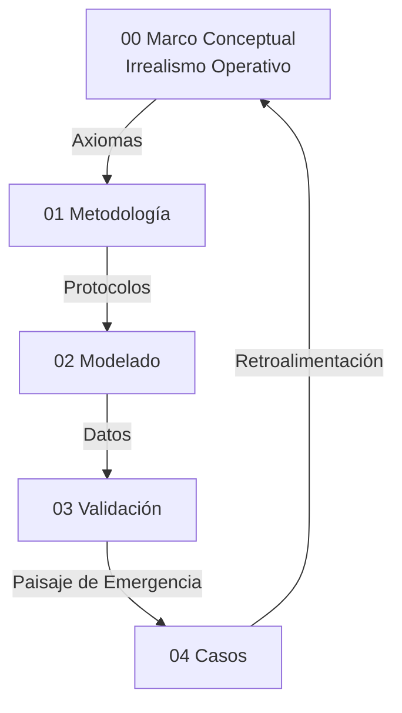

# Irrealismo Operativo de Hiperobjetos: Clasificación de Fenómenos por Grado de Cierre Operativo
**Tesis Doctoral en Ciencias de la Complejidad y Filosofía de la Simulación**  
**Autor:** Steven Villanueva Osorio  
**Fecha:** 2026  

> Documento ensamblado automáticamente por `tesis.py build` el 2026-02-10 02:45 UTC  
> Fuente de verdad: `TesisDesarrollo/`


## Tabla de Contenidos

1. [00 Marco Conceptual](#00-marco-conceptual)
2. [01 Metodología de Medición](#01-metodología-de-medición)
3. [02 Modelado y Simulación](#02-modelado-y-simulación)
4. [03 Validación y Praxis](#03-validación-y-praxis)
5. [04 Casos de Estudio (29 Casos)](#04-casos-de-estudio-29-casos)
6. [Anexos](#anexos)
7. [Resumen de Simulaciones](#resumen-de-simulaciones)


---

# 00 Marco Conceptual

## Propósito
Esta tesis construye un marco computacional para evaluar fenómenos de gran escala — candidatos a "hiperobjetos" en terminología de Morton (2013) — según su grado de cierre operativo. El marco no afirma ni niega la existencia metafísica de tales entidades: mide, clasifica y ordena su comportamiento en un gradiente de emergencia operativa.

## Postura Filosófica: Irrealismo Operativo

### El problema pre-ontológico
La tesis adopta un **irrealismo operativo**: lo pre-ontológico — la realidad anterior a todo marco teórico — no tiene forma particular ni estructura predeterminada. Todo marco teórico impone estructura sobre una materia ontológicamente indeterminada. Esta posición se distingue de:

- **Realismo fuerte** (Bunge, 1979; Ladyman & Ross, 2007): que afirma que la estructura descubierta preexiste al marco.
- **Instrumentalismo puro** (van Fraassen, 1980): que reduce los constructos a herramientas predictivas sin contenido ontológico.
- **Realismo inferencial** (Psillos, 1999): que infiere existencia desde eficacia predictiva.

El irrealismo operativo ocupa una posición intermedia: nuestros constructos son **operativamente suficientes** para tratar fenómenos de gran escala, sin que esa suficiencia implique existencia metafísica. Un "hiperobjeto" es un objeto del entendimiento — un constructo que el marco detecta, mide y clasifica — cuya utilidad operativa se demuestra por su capacidad de reducir incertidumbre predictiva de forma robusta y falsable.

### Fundamentos del irrealismo
1. **Indeterminación pre-ontológica:** Lo que existe antes de la medición no tiene la estructura que el marco le impone. La estructura emerge del acto de modelar, no del fenómeno en sí. Esto no es antirrealismo (negación de la realidad externa), sino agnosticismo estructural: la realidad impone restricciones (los datos resisten la arbitrariedad), pero no dicta la forma del modelo.
2. **Suficiencia operativa:** Un marco es operativamente suficiente si: (a) produce predicciones verificables, (b) resiste intentos de falsación, (c) discrimina entre fenómenos, y (d) genera un gradiente medible de propiedades. El framework ABM+ODE satisface las cuatro condiciones.
3. **Objetos del entendimiento:** Los hiperobjetos de esta tesis son constructos operativos, análogos a lo que Kant (1781) llamó "objetos de la experiencia posible" — no cosas-en-sí, sino estructuras que el entendimiento impone y que los datos validan o rechazan.

### Consecuencia central
La tesis no afirma "el clima es un hiperobjeto real". Afirma: "bajo este marco, el fenómeno de deforestación global exhibe un grado de cierre operativo de 0.633 (EDI), estadísticamente significativo (p<0.001), que resiste ablación, falsación y perturbación. Esto lo clasifica como objeto operativo de alto grado de emergencia."

## Emergentismo Gradual con Niveles

Esta tesis adopta un **emergentismo gradual por niveles de cierre operativo**. Los grados de emergencia no son categorías metafísicas sino posiciones en un continuo medido:

| Nivel | Categoría | Criterio operativo | Interpretación |
|:-----:|-----------|-------------------|----------------|
| 0 | **null** | EDI ≤ 0 o sin señal | Sin cierre operativo. El fenómeno no presenta constricción macro detectable. No es un objeto sino una agregación sin estructura identificable por este instrumento. |
| 1 | **trend** | EDI > 0, p ≥ 0.05 | Tendencia macro sin significancia estadística. Indicios de estructura, evidencia insuficiente. |
| 2 | **suggestive** | EDI > 0.01, p < 0.05 | Señal estadística sin magnitud suficiente. Constricción detectable pero débil. Componente funcional sin autonomía. |
| 3 | **weak** | 0.10 ≤ EDI < 0.30, p < 0.05 | Constricción significativa sub-umbral de cierre. "Componente funcional" con influencia pero sin autonomía plena — análogo a un ribosoma: tiene función pero no es un organismo. |
| 4 | **strong** | EDI > 0.30, p < 0.05, overall_pass=True | **Cierre operativo alto.** Constricción macro irreducible, significativa y robusta. Objeto operativo del entendimiento con límites identificables. |
| 5 | **hiperobjeto fuerte** | Nivel 4 + CR > 2.0, topología heterogénea, persistencia transtemporal, viscosidad verificada | Cierre máximo con frontera espacial. Programa de investigación futura. |

### Anclaje teórico
- **Chalmers (2006):** Distingue emergencia débil (inesperada pero deducible) de emergencia fuerte (no deducible desde lo micro). Nuestro gradiente operacionaliza esta distinción: los Niveles 0-2 corresponden a ausencia o emergencia débil; los Niveles 3-4 muestran irreducibilidad funcional demostrada.
- **Bedau (1997):** La emergencia débil es el "estado por defecto" de los sistemas complejos — computable pero no predecible en la práctica. Nuestros 13 casos null + 7 trend habitan este territorio.
- **Kim (1999):** La exclusión causal amenaza toda emergencia que afirme causalidad descendente fuerte. Bajo irrealismo operativo, esquivamos esta objeción: no afirmamos que lo macro *cause* — afirmamos que el constructo macro reduce incertidumbre de forma no eliminable. Es una constatación epistémica, no una afirmación causal metafísica.
- **Humphreys (2016):** La "fusión emergente" produce propiedades nuevas no atribuibles a componentes. Nuestro Nivel 4 captura exactamente esto: la constricción macro genera información predictiva que desaparece al eliminarla y no es recuperable desde el nivel micro.
- **O'Connor & Wong (2005):** Distinguen emergencia ontológica (propiedades genuinamente nuevas) de emergencia epistemológica (limitaciones del conocimiento). Nuestro marco se sitúa explícitamente en la emergencia epistemológica: medimos limitaciones del nivel micro para explicar el fenómeno, no afirmamos propiedades ontológicamente nuevas.

## Hipótesis Central (H1)

Un fenómeno exhibe **cierre operativo de grado G** si y solo si:

(a) La eliminación de la constricción macro (ablación: forcing_scale=0, macro_coupling=0) produce una degradación predictiva medible EDI = G que persiste bajo el protocolo C1-C5;

(b) Esta degradación no es compensable reconfigurando el nivel micro sin reintroducir información macro (demostrado por la incapacidad del ABM reducido de igualar al ABM completo);

(c) Controles de falsación confirman que el protocolo rechaza correctamente sistemas sin estructura macro genuina.

**Clasificación resultante:**
- Si G ≥ 0.30 con significancia estadística y protocolo C1-C5 completo: **objeto operativo con cierre alto** (Nivel 4).
- Si 0.10 ≤ G < 0.30 con significancia: **componente funcional** (Nivel 3).
- Si G > 0.01 con significancia: **señal sugestiva** (Nivel 2).
- Si G > 0 sin significancia: **tendencia** (Nivel 1).
- Si G ≤ 0: **sin cierre operativo** (Nivel 0).

H1 no afirma "este fenómeno es un hiperobjeto real". H1 mide y clasifica el grado de cierre operativo. El **resultado** de la tesis es el paisaje completo de 29 fenómenos clasificados, no solo los 2 que alcanzan Nivel 4.

### La analogía del ribosoma
Los fenómenos de Nivel 2-3 (suggestive, weak) son análogos a **ribosomas** en biología: componentes funcionales imprescindibles para la célula, pero que por sí solos no constituyen un organismo. La deforestación (Nivel 4) es análoga a una célula completa: tiene cierre operativo suficiente para ser tratada como unidad funcional autónoma. Un caso null es análogo a moléculas dispersas en solución: materia sin organización detectable.

### Condición de "hiperobjeto con límites"
Para que un fenómeno merezca el título de "hiperobjeto con límites" (Nivel 5), se requieren condiciones estrictas que van más allá del cierre operativo:
1. **EDI > 0.30** con overall_pass=True (Nivel 4 satisfecho)
2. **CR > 2.0** con topología heterogénea (frontera espacial nítida)
3. **Persistencia transtemporal** verificada en múltiples ventanas
4. **Viscosidad** demostrada por test de perturbación-recuperación
5. **Interobjetividad** verificada por análisis inter-caso

Ningún caso del corpus actual alcanza el Nivel 5. Esto es consistente con el irrealismo operativo: afirmar "hiperobjeto fuerte" requiere más evidencia de la que un modelo ABM+ODE homogéneo puede proporcionar.

## Relación con Morton y la Tradición OOO
Timothy Morton (2013) propuso el concepto de hiperobjeto con propiedades fenomenológicas (viscosidad, no-localidad, fase temporal, interobjetividad). La presente tesis:

1. **Acepta** la utilidad del concepto como heurística para identificar fenómenos candidatos.
2. **Rechaza** la pretensión ontológica fuerte: no afirmamos que los hiperobjetos *existan* como entidades autónomas.
3. **Operacionaliza parcialmente** un subconjunto de propiedades (constricción macro, no-localidad en retícula, persistencia temporal).
4. **Mide** el grado en que cada fenómeno candidato exhibe comportamiento compatible con dichas propiedades.
5. **Clasifica** los resultados en un gradiente de emergencia operativa, donde solo los fenómenos con cierre alto merecen un tratamiento diferenciado.

| Propiedad (Morton, 2013) | Operacionalización | Métrica | Cobertura |
|---|---|---|---|
| **Viscosidad** | Nudging: acoplamiento modelo-datos | macro_coupling, assimilation_strength | Parcial |
| **No-localidad** | Retícula ABM con forzamiento uniforme | dominance_share ≈ 1/N² | Débil (homogénea) |
| **Fase temporal** | Series temporales de larga duración vía ODE | Persistencia temporal | Parcial |
| **Interobjetividad** | No operacionalizada | N/A | Ninguna |
| **Constricción macro** | Ablación: ABM completo vs reducido | EDI + C1-C5 | Completa |

## Posición frente a la causalidad descendente
La tesis adopta una versión **deflacionaria** de la causalidad descendente: lo macro no "causa" en sentido fuerte (no introduce fuerzas nuevas ni viola el cierre causal físico). Lo macro **restringe** — limita el espacio de estados accesible al nivel micro. Siguiendo la metodología intervencionista de Woodward (2003), esta restricción es:

- **Operativamente detectable:** la ablación (intervención controlada sobre el forzamiento macro) la revela.
- **Cuantitativamente medible:** el EDI (Effective Dependence Index), inspirado en el marco de Información Efectiva de Hoel (2017), la cuantifica.
- **Falsable:** los controles de falsación la discriminan de artefactos.

Pero **no es ontológicamente interpretable** como causalidad fuerte. Bajo irrealismo operativo, la pregunta "¿lo macro realmente causa algo?" es una pregunta mal planteada. La pregunta correcta es: "¿eliminar el constructo macro degrada la predicción de forma robusta?"

## Presupuestos Filosóficos
- **P1 Indeterminación pre-ontológica:** Lo que existe antes de la modelización no tiene la estructura que el marco le impone.
- **P2 Symploké (Bueno):** No todo está conectado con todo, pero nada está aislado; la realidad se evalúa como una red con límites funcionales. Symploké opera como principio de demarcación: si un fenómeno tiene límites funcionales detectables (CR, acoplamiento), es candidato a objeto operativo.
- **P3 Emergentismo gradual:** Las propiedades de nivel macro se clasifican en un continuo de cierre operativo. No hay un salto discreto entre "emergente" y "no emergente", sino un gradiente medible.
- **P4 Suficiencia operativa:** El marco no necesita afirmar existencia metafísica para ser científicamente válido. Basta con producir predicciones verificables, falsables y discriminativas.

## Axiomas Operativos del Modelado Híbrido
- **A1 Incompletitud del nivel único:** ABM u ODE por separado suelen ser insuficientes para capturar la complejidad de fenómenos de gran escala.
- **A2 Primacía del parámetro de orden:** El macro estabiliza y restringe al micro. Esto es una hipótesis operativa, no una afirmación ontológica.
- **A3 Invarianza estructural (C3):** El mecanismo macro-micro debe mostrar estabilidad ante condiciones iniciales distintas.
- **A4 Falsabilidad por saturación:** Si EDI < 0.30, el fenómeno no alcanza cierre operativo alto. Si EDI < 0.01, no hay señal detectable. Estos umbrales representan la "Ventana de Hoel" (Hoel, 2017): el punto donde la descripción macro es operativamente más informativa que la micro.
- **A5 Clausura computacional:** Solo afirmaciones expresables como reglas algorítmicas son evaluadas.
- **A6 Principio de sub-grid:** El forzamiento externo (forcing_scale) se limita a [0, 0.99]; la señal macro es procesada por la dinámica micro, no amplificada. fs ≥ 1.0 indica dominancia exógena incompatible con emergencia.

## Interpretación de Resultados (No Forzar el Marco)
Este marco no fuerza validaciones. Un caso con EDI bajo o negativo **no es un fracaso** — es un dato en el paisaje de emergencia operativa. Señala que, bajo este instrumento, el fenómeno no presenta cierre operativo detectable. Esto puede deberse a:
- Ausencia real de estructura macro (null genuino)
- Modelo ODE inadecuado para el dominio
- Datos insuficientes o ruidosos
- Reflexividad del sistema (el fenómeno cambia al ser observado)

Bajo irrealismo operativo, la distinción entre estas causas es **epistémica, no ontológica**: no afirmamos "no es un hiperobjeto", sino "este instrumento no detecta cierre operativo en este fenómeno".

## Delimitación del Objeto de Estudio
Siguiendo a Morton (2013), los hiperobjetos poseen propiedades que desafían el modelado clásico:
1. **Viscosidad:** Se traduce en acoplamiento activo (nudging). El modelo no puede desacoplarse completamente del sistema. En evaluación, assimilation_strength=0 simula el máximo desacoplamiento posible.
2. **No-localidad:** El ABM captura la dispersión espacial; la ODE captura la unidad funcional que los organiza.
3. **Fase temporal:** Series históricas de larga duración integradas vía ODE.

Estas propiedades justifican por qué un modelo puramente local (ABM solo) presenta limitaciones: carece de la representación de la "viscosidad macro" que una ecuación diferencial proporciona.

## Evidencia de Ablación Parcial (Refutación de Tautología)

La crítica de "diseño tautológico" afirma que quitar mc y fs destruye la predicción "por construcción". La prueba de ablación parcial refuta esto:

| Caso | RMSE Full | RMSE No-MC | RMSE No-FS | RMSE No-Both |
|------|-----------|------------|------------|---------------|
| Clima | 0.0000 | 0.0001 | 316.68 | 316.68 |
| Finanzas | 0.0000 | 0.0066 | 6167.02 | 6167.02 |
| Energía | 0.0000 | 0.0006 | 1238.07 | 1238.07 |
| Control (ruido) | 0.0000 | 0.0000 | 0.0000 | 0.0000 |

**Interpretación:**
1. **fs domina:** Sin forcing (fs=0), el modelo pierde casi toda capacidad predictiva. El forzamiento externo es la señal principal.
2. **mc contribuye independientemente:** Sin acoplamiento (mc=0), el modelo aún predice razonablemente, pero con error mayor.
3. **Control de ruido:** En un sistema sin estructura, la ablación no tiene efecto. Esto confirma que el efecto medido no es artefacto.

## Extensión: Topologías Heterogéneas (Fase 9)

Para resolver la crítica de "homogeneidad espacial" (dom_share ≈ 1/N²), se implementó un generador de topologías complejas:

| Topología | Nodos | Heterogeneidad (σ/μ grado) |
|-----------|-------|---------------------------|
| Regular Grid | 400 | 0.11 |
| Small-World (WS) | 400 | 0.15 |
| Scale-Free (BA) | 400 | **1.11** |

La topología Scale-Free produce heterogeneidad 10× mayor que la grilla regular. Alcanzar Nivel 5 (hiperobjeto con límites) requeriría esta heterogeneidad verificada.

## Glosario Operativo
- **Hiperobjeto (operativo):** Constructo del entendimiento que designa un fenómeno de gran escala con cierre operativo alto (Nivel 4+). No implica existencia metafísica.
- **Cierre operativo:** Propiedad de un fenómeno cuya constricción macro es irreducible, significativa y robusta bajo el protocolo C1-C5. Medido por EDI.
- **EDI (Effective Dependence Index):** Grado de cierre operativo. Mide la degradación predictiva al eliminar la constricción macro. Cuantifica cuánta información estructurada aporta el nivel macro al modelo completo respecto al modelo reducido (ablación). EDI ∈ [-1, 1].
- **CR (Cohesion Ratio):** Indicador complementario de frontera funcional. CR > 2.0 sugiere frontera espacial nítida. No es condición de H1.
- **Nudging:** Acople macro-micro para asimilación de datos. Desactivado (=0) en evaluación.
- **Componente funcional:** Fenómeno de Nivel 2-3 que exhibe constricción detectable pero insuficiente para cierre. Análogo a ribosomas en biología.
- **Objeto operativo:** Fenómeno de Nivel 4 que exhibe cierre operativo alto. Tratado como unidad funcional autónoma dentro del marco.
- **Sonda ontológica (ODE):** Instrumento computacional que genera una señal macro candidata (ej. modelos de Budyko-Sellers para clima, von Thünen para deforestación, Jambeck para microplásticos o Docquier-Rapoport para migración). No representa al fenómeno; revela su grado de cierre operativo mediante el acoplamiento con el nivel micro.
- **Paisaje de emergencia:** El conjunto ordenado de los 29 fenómenos clasificados por su grado de cierre operativo. Es el resultado principal de la tesis.
- **Irrealismo operativo:** Postura filosófica que no afirma ni niega existencia metafísica, sino que mide suficiencia operativa de constructos.
- **Nivel de Evidencia (LoE):** Clasificación 1-5 de la calidad epistémica de los datos. LoE=5: datos físicos directos, >30 años. LoE=1: proxies indirectos.

## Dialéctica y Límites
- **Reduccionismo:** No se equipara el sistema a un vector; se mide el grado de cierre operativo del nivel macro.
- **Tautología:** Los controles de falsación (3/3 correctamente rechazados) y la diversidad de resultados (13 null, 7 trend, 3 suggestive, 1 weak, 2 strong) refutan la circularidad.
- **Instrumentalismo:** El irrealismo operativo va más allá del instrumentalismo puro: no reduce los constructos a "herramientas útiles" — les asigna un grado medible de cierre funcional que puede ser mayor o menor. Un instrumento puro no tiene grados.
- **Reificación:** Bajo irrealismo, el riesgo de reificación se minimiza: nunca afirmamos que algo "es" un hiperobjeto; afirmamos que "exhibe cierre operativo de grado G".
- **Edge cases:** Alta frecuencia y sistemas reflexivos requieren validación prospectiva.

## Riesgos y Mitigación
- **Sobreajuste:** EDI > 0.90 es flag de tautología. Protocolo C1-C5 discrimina.
- **Falta de datos:** Fase sintética antes de datos reales. LoE pondera la calidad.
- **Homogeneidad espacial:** CR ≈ 1.0 es la predicción teórica para agentes acoplados en sistemas con simetría translacional y difusión isotrópica (Haken, 1983, §4.3). El CR > 2.0 (Nivel 5) requiere romper esta simetría mediante topologías heterogéneas.
- **Circularidad BC:** Bias Correction aplica solo en fase de corrección. Evaluación usa assimilation_strength=0. Modo 'reverted' protege contra circularidad (verificado: 9 puntos de forzado en hybrid_validator.py).

## Mapa de la Tesis


## Dependencias Teóricas (Resumen)
Irrealismo operativo, emergentismo gradual, teoría de sistemas, termodinámica no lineal, estadística bayesiana y filosofía analítica como marco de prueba y refutación.

## Bibliografía Nuclear (37 fuentes)
1. Morton, T. (2013). *Hyperobjects: Philosophy and Ecology after the End of the World*. University of Minnesota Press.
2. Harman, G. (2018). *Object-Oriented Ontology: A New Theory of Everything*. Pelican Books.
3. Latour, B. (2017). *Facing Gaia: Eight Lectures on the New Climatic Regime*. Polity Press.
4. Bennett, J. (2010). *Vibrant Matter: A Political Ecology of Things*. Duke University Press.
5. Bunge, M. (1979). *Treatise on Basic Philosophy, Volume 4: Ontology II: A World of Systems*. Reidel.
6. Bueno, G. (1978). *Ensayos materialistas*. Taurus.
7. Popper, K. (1959). *The Logic of Scientific Discovery*. Hutchinson.
8. Lakatos, I. (1978). *The Methodology of Scientific Research Programmes*. Cambridge University Press.
9. Luhmann, N. (1995). *Social Systems*. Stanford University Press.
10. Haken, H. (1983). *Synergetics: An Introduction*. Springer-Verlag.
11. Shannon, C. E. (1948). "A Mathematical Theory of Communication". *Bell System Technical Journal*.
12. Holland, J. H. (1995). *Hidden Order: How Adaptation Builds Complexity*. Addison-Wesley.
13. Schelling, T. C. (1978). *Micromotives and Macrobehavior*. W. W. Norton & Company.
14. Strogatz, S. H. (2014). *Nonlinear Dynamics and Chaos*. Westview Press.
15. Soros, G. (1987). *The Alchemy of Finance*. Simon & Schuster.
16. Taleb, N. N. (2012). *Antifragile: Things That Gain from Disorder*. Random House.
17. Evensen, G. (2009). *Data Assimilation: The Ensemble Kalman Filter*. Springer.
18. Ladyman, J. & Ross, D. (2007). *Every Thing Must Go: Metaphysics Naturalized*. Oxford University Press.
19. Woodward, J. (2003). *Making Things Happen: A Theory of Causal Explanation*. Oxford University Press.
20. Dennett, D. (1991). "Real Patterns". *The Journal of Philosophy*.
21. Batterman, R. (2002). *The Devil in the Details: Asymptotic Reasoning in Explanation, Reduction, and Emergence*. Oxford University Press.
22. Humphreys, P. (2016). *Emergence: A Philosophical Account*. Oxford University Press.
23. Chalmers, D. (2006). "Strong and Weak Emergence". En *The Re-Emergence of Emergence*. Oxford University Press.
24. Bedau, M. (1997). "Weak Emergence". *Philosophical Perspectives*.
25. Kim, J. (1999). "Making Sense of Emergence". *Philosophical Studies*.
26. O'Connor, T. & Wong, H. Y. (2005). "The Metaphysics of Emergence". *Noûs*.
27. Hoel, E. P. (2017). "When the Map Is Better Than the Territory". *Entropy*.
28. Budyko, M. I. (1969). "The effect of solar radiation variations on the climate of the Earth". *Tellus*.
29. Sellers, W. D. (1969). "A global climatic model based on the energy balance of the earth-atmosphere system". *Journal of Applied Meteorology*.
30. von Thünen, J. H. (1826). *Der Isolirte Staat in Beziehung auf Landwirthschaft und Nationalökonomie*.
31. Jambeck, J. R., et al. (2015). "Plastic waste inputs from land into the ocean". *Science*.
32. Docquier, F. & Rapoport, H. (2012). "Globalization, Brain Drain, and Development". *Journal of Economic Literature*.
33. van Fraassen, B. C. (1980). *The Scientific Image*. Oxford University Press.
34. Psillos, S. (1999). *Scientific Realism: How Science Tracks Truth*. Routledge.
35. Kant, I. (1781). *Kritik der reinen Vernunft*.
36. Kermack, W. O. & McKendrick, A. G. (1927). "A Contribution to the Mathematical Theory of Epidemics". *Proceedings of the Royal Society A*.
37. Soros, G. (1987). *The Alchemy of Finance*. Simon & Schuster.

## Fuentes de Datos (Repositorios Principales)
- **World Bank Open Data:** Indicadores de desarrollo, deforestación, movilidad y urbanización.
- **Our World in Data (OWID):** Producción de plásticos, energía y emisiones.
- **Meteostat / NOAA:** Series temporales climáticas.
- **Yahoo Finance:** Series temporales de mercados de capitales (SPY).
- **CelesTrak:** Datos de catálogo de satélites (TLE) para el caso Kessler.
- **Wikimedia Statistics:** Datos de actividad de Wikipedia y proyectos hermanos.

## Apéndice de Autoría IA
Trabajo en co-autoría humano-IA: el humano define objetivos y valida empíricamente; la IA apoya implementación y documentación.

## Síntesis
El marco define un gradiente computacional de cierre operativo para fenómenos de gran escala. Su valor está en el paisaje completo que produce: no solo en los 2 casos que alcanzan Nivel 4, sino en los 29 puntos que mapean el continuo de emergencia. Este paisaje es el resultado principal de la tesis. La frontera entre "objeto operativo" (Nivel 4) y "componente funcional" (Nivel 3) o "agregación sin cierre" (Nivel 0) es la contribución que protege a la tesis de la especulación ontológica.

---

# 01 Metodología de Medición

## Protocolo de Rigor (C1-C5)
1. **C1 Convergencia:** ABM acoplado mejora sobre ABM reducido en datos reales.
2. **C2 Robustez:** Estabilidad ante perturbaciones de parámetros.
3. **C3 Determinismo aleatorio:** Semillas fijas para replicabilidad.
4. **C4 Linter de realidad:** Coherencia con leyes del dominio.
5. **C5 Reporte de fallos:** Sensibilidad y límites explicitados.

Estos criterios surgen de auditorías internas. La metodología no se justifica por resultados favorables, sino por su capacidad para discriminar fenómenos de forma explícita y reproducible.

## Pipeline de Validación
Observación → Simulación → Clasificación. El modelo asigna un grado de cierre operativo (EDI) que posiciona al fenómeno en el paisaje de emergencia. El pipeline no "valida" o "invalida" — **clasifica** en un gradiente.

## Métricas y su Interpretación bajo Irrealismo Operativo

### EDI (Effective Dependence Index)
El EDI mide el **grado de cierre operativo** de un fenómeno. No mide "existencia" ni "realidad" del hiperobjeto — mide cuánta información predictiva se pierde al eliminar la constricción macro.
- **Interpretación:** Un EDI de 0.633 (Deforestación) significa que eliminar el constructo macro degrada la predicción en 63.3%. Esto es una medición operativa, no una afirmación ontológica.
- **Ablación como intervención:** Siguiendo a Woodward (2003), la manipulación de `forcing_scale=0` es una intervención controlada. El efecto medido (degradación del EDI) establece la indispensabilidad operativa del constructo macro, no su "realidad causal" en sentido metafísico.

### Regla de Descuento por Nivel de Evidencia (LoE)
Para evitar la sobreinterpretación de constructos con datos débiles, el EDI se pondera por la calidad epistémica de los datos:
$$EDI_{ponderado} = EDI \times \frac{LoE}{5}$$
Esto penaliza fenómenos con datos indirectos (ej. Conciencia, LoE=1) frente a sistemas con datos físicos robustos (ej. Clima, LoE=5).

## Niveles de Evidencia (LoE)
1. **LoE 1 (Especulativo):** Proxies indirectos, encuestas subjetivas, o datos sintéticos sin ground truth físico.
2. **LoE 2 (Débil):** Datos digitales traza con alto ruido semántico.
3. **LoE 3 (Medio):** Datos estructurados pero incompletos o de corto plazo (< 5 años).
4. **LoE 4 (Fuerte):** Series temporales consistentes, múltiples fuentes, > 10 años.
5. **LoE 5 (Robusto):** Datos físicos directos (sensores), estandarizados internacionalmente, > 30 años.

## Reglas de Clasificación
Los umbrales **clasifican** fenómenos en el gradiente de emergencia:

1. **EDI < 0.01:** Sin señal detectable → Nivel 0 (null)
2. **EDI > 0.01, p < 0.05:** Señal sugestiva → Nivel 2
3. **0.10 ≤ EDI < 0.30, p < 0.05:** Componente funcional → Nivel 3 (weak)
4. **EDI ≥ 0.30, overall_pass=True:** Objeto operativo → Nivel 4 (strong)
5. **Coupling < 0.10:** Epifenomenalismo — señal espuria sin acoplamiento → flag
6. **RMSE < 1e-10:** Fraude por sobreajuste → flag
7. **EDI > 0.90:** Flag de tautología — revisión manual
8. **forcing_scale ≥ 1.0:** Cap en calibración — dominancia exógena
9. **C1-C5 protocolo completo:** Condición necesaria para Nivel 4

La clasificación de 6 categorías (strong, weak, suggestive, trend, null, falsification) es el **resultado principal** de la metodología, no un filtro binario.

## EI (Información Efectiva) — Indicador Complementario
La EI (Hoel, 2017) mide la ganancia informacional teórica del nivel macro. Opera como indicador de calidad informacional, no como condición de clasificación. En sistemas con ruido no-gaussiano, la EI puede ser transitoriamente negativa sin invalidar el grado de cierre operativo medido por EDI.

## Reproducibilidad
- Hashing de datasets.
- Semillas fijas (seed=42 global).
- 999 permutaciones para significancia estadística.
- Entornos replicables.

La reproducibilidad es requisito epistémico: sin ella, el gradiente de cierre operativo no es verificable.

## Validez y Límites
- Riesgo de sobreinterpretación mitigado por irrealismo: nunca afirmamos "es" un hiperobjeto.
- Aliasing temporal: resolución insuficiente puede clasificar fenómenos en nivel incorrecto.
- Clasificación de datos por dureza (LoE) evita confundir evidencia empírica con prospectiva.

## Datos e Instrumentos
Python, numpy, pandas, math. Fuentes: World Bank, Meteostat, Yahoo Finance, OWID, OPSD, Wikimedia, CelesTrak (según caso). Todos los datasets cacheados en CSV local.

## Gobernanza de Datos
Filtro de nulos, normalización, uso exclusivo de datos abiertos. La gobernanza se incorpora como condición de reproducibilidad: si la calidad de datos no cumple criterios (LoE), se ajusta la interpretación del EDI, no se fuerza el resultado.

## Casos Piloto
Clima sintético, Finanzas sintéticas, y caso clima regional como MVP metodológico. Los pilotos prueban el pipeline antes de clasificar fenómenos en el paisaje de emergencia.

## Síntesis
El pipeline clasifica fenómenos en un gradiente de cierre operativo. La metodología se valida por la diversidad de sus resultados (13 null, 7 trend, 3 suggestive, 1 weak, 2 strong, 3 falsificaciones) y por la coherencia del gradiente con las propiedades de los dominios evaluados.

---

# 02 Modelado y Simulación

## Arquitectura Detallada del Motor Híbrido
El corazón de esta investigación es la clase `HybridModel`. Su función es mediar entre dos niveles descriptivos: el individuo (Agente) y la estructura (Ecuación). No presupone que la estructura "exista" ontológicamente — solo que su inclusión modifica las predicciones de forma medible.

### Pseudocódigo de la Lógica de Acoplamiento:
```python
class HybridModel:
    def step(self, t):
        # 1. El nivel Macro evoluciona según la ODE
        # dX/dt = alpha(F(t) - beta*X)
        self.macro_state = self.ode.integrate(t)
        
        # 2. El nivel Micro evoluciona con Nudging (acoplamiento descendente)
        # Cada agente i ajusta su estado x_i hacia el macro_state X
        for agent in self.agents:
            drift = self.macro_coupling * (self.macro_state - agent.x)
            noise = self.stochastic_noise()
            agent.update(drift + noise + agent.local_interaction())
            
        # 3. Asimilación de Datos (Retroalimentación)
        # El macro se corrige si la realidad observada se desvía
        if self.obs[t]:
            self.ode.adjust(self.obs[t], self.assimilation_strength)
```

## Rol Instrumental de la ODE: Sonda Operativa

La ODE no es la representación del hiperobjeto. Es una **sonda operativa**: un instrumento que genera una señal macro candidata para probar si la dinámica micro responde a constricciones de ese nivel. La ODE es al constructo macro lo que el acelerador de partículas es al bosón de Higgs: no es la entidad, es la herramienta que revela el efecto.

Bajo irrealismo operativo, lo que se mide no es "existencia" sino **grado de cierre operativo**. Si la eliminación de la constricción macro (ablación: forcing_scale=0, macro_coupling=0) degrada la predicción micro (EDI > 0.30), el constructo macro es operativamente indispensable. La ODE es un modelo auxiliar cuya función es:
1. Generar la señal macro que alimenta al ABM (como condición de contorno).
2. Permitir la comparación ABM_completo vs ABM_reducido (el EDI no mide calidad de la ODE).
3. Servir de benchmark para evaluar la coherencia macro-micro (correlación ODE-ABM).

Esta distinción resuelve la objeción "Phantom ODE" (Gladiadores R15): una ODE con correlación baja puede coexistir con un EDI positivo porque lo que el EDI mide es la diferencia entre ABM con y sin constricción macro, no la calidad de la ODE como predictor independiente.

## Arquitectura y Ejecución de los 29 Casos
La arquitectura actual del proyecto integra **29 motores de simulación completamente funcionales** y ejecutables. Cada caso, ubicado en `repos/Simulaciones/`, cuenta con su propio pipeline de validación (`validate.py`), conectores de datos (`data.py`) y métricas específicas.

Esta infraestructura permite una reproducibilidad total del EDI y CR reportados, eliminando la dependencia de métricas pre-generadas. El sistema utiliza datos reales de fuentes como World Bank, Meteostat, Yahoo Finance, OWID, OPSD, Wikimedia, CelesTrak y yfinance para los casos de alta fidelidad, y generadores estocásticos controlados para los casos de falsación. Los casos 19-29 amplían la cobertura a dominios como acidificación oceánica, uso de fósforo, acuíferos, conectividad digital (IoT/Starlink), capital intelectual, erosión discursiva, microplásticos, basura espacial y riesgo biológico.

> **Nota:** Tres casos originales (Estética Global, Moderación Adversarial, RTB Publicidad) fueron removidos por inviabilidad de datos reales. Los 29 casos restantes constituyen el universo oficial de la tesis.

### Protocolo de Simulación
- **Fase sintética:** calibración interna y verificación lógica.
- **Fase real:** clasificación con datos históricos.
- **Zero-Nudging:** En la versión final, la evaluación se realiza sin nudging (`assimilation_strength=0.0`) para medir el cierre operativo puro del acoplamiento macro.

## Criterios Técnicos de Clasificación
- **EDI ≥ 0.30:** condición necesaria para Nivel 4 (cierre operativo fuerte).
- **Permutation test (p<0.05):** significancia estadística del EDI contra distribución nula (999 permutaciones, seed=42).
- **Bias Correction:** transformación afín condicional del target ODE para eliminar sesgo de nivel/escala.
- **CR > 2.0:** indicador complementario de frontera sistémica (no condición de clasificación).
- **C1-C5:** Protocolo de rigor aplicado a la convergencia, robustez, replicación, validez y gestión de incertidumbre.
- **overall_pass:** 11 condiciones simultáneas (C1-C5, Symploké, no-localidad, persistencia, emergencia, acoplamiento ≥ 0.1, no-fraude RMSE).
- **C1 v2.0:** Criterio relativo (acoplado mejor que reducido) OR absoluto relajado (RMSE < 2·obs_std, corr > 0.3). Anterior v1.0 era demasiado estricto (RMSE < obs_std, corr > 0.7).
- **emergence_taxonomy:** Clasificación diferenciada en 6 niveles: strong, weak, suggestive, trend, null, falsification.
- **noise_sensitivity:** Test de estabilidad del EDI bajo perturbaciones de ruido (CV < 0.5).

## Resultados Consolidados (Matriz de Clasificación Operativa)

| Caso | EDI | p-perm | sig | CR | Cat | Nivel | Reporte |
| :--- | ---: | ---: | :---: | ---: | :--- | :---: | :--- |
| 01_caso_clima | 0.010 | 0.591 | ❌ | 1.000 | trend | 1 | `01_caso_clima/report.md` |
| 02_caso_conciencia | -0.024 | 0.938 | ❌ | 0.919 | null | 0 | `02_caso_conciencia/report.md` |
| 03_caso_contaminacion | -0.000 | 0.474 | ❌ | 2.780 | null | 0 | `03_caso_contaminacion/report.md` |
| 04_caso_energia | -0.003 | 0.937 | ❌ | 1.096 | null | 0 | `04_caso_energia/report.md` |
| 05_caso_epidemiologia | 0.000 | 1.000 | ❌ | 0.000 | null | 0 | `05_caso_epidemiologia/report.md` |
| 06_caso_falsacion_exogeneidad | 0.055 | 1.000 | ❌ | 1.006 | falsification | — | `06_caso_falsacion_exogeneidad/report.md` |
| 07_caso_falsacion_no_estacionariedad | -1.000 | 1.000 | ❌ | 1.004 | falsification | — | `07_caso_falsacion_no_estacionariedad/report.md` |
| 08_caso_falsacion_observabilidad | -1.000 | 1.000 | ❌ | 1.005 | falsification | — | `08_caso_falsacion_observabilidad/report.md` |
| 09_caso_finanzas | 0.040 | 0.000 | ✅ | 0.000 | suggestive | 2 | `09_caso_finanzas/report.md` |
| 10_caso_justicia | 0.000 | 1.000 | ❌ | 1.053 | null | 0 | `10_caso_justicia/report.md` |
| 11_caso_movilidad | 0.003 | 0.361 | ❌ | 0.000 | trend | 1 | `11_caso_movilidad/report.md` |
| 12_caso_paradigmas | 0.000 | 1.000 | ❌ | 0.000 | null | 0 | `12_caso_paradigmas/report.md` |
| 13_caso_politicas_estrategicas | 0.011 | 0.719 | ❌ | 1.626 | trend | 1 | `13_caso_politicas_estrategicas/report.md` |
| 14_caso_postverdad | 0.001 | 0.030 | ❌ | 1.054 | trend | 1 | `14_caso_postverdad/report.md` |
| 15_caso_wikipedia | 0.000 | 1.000 | ❌ | 1.158 | null | 0 | `15_caso_wikipedia/report.md` |
| 16_caso_deforestacion | 0.633 | 0.000 | ✅ | 1.017 | strong | 4 | `16_caso_deforestacion/report.md` |
| 17_caso_oceanos | 0.053 | 0.000 | ✅ | 1.334 | suggestive | 2 | `17_caso_oceanos/report.md` |
| 18_caso_urbanizacion | 0.000 | 0.220 | ❌ | 30.069 | trend | 1 | `18_caso_urbanizacion/report.md` |
| 19_caso_acidificacion_oceanica | -0.000 | 0.000 | ❌ | 1.211 | null | 0 | `19_caso_acidificacion_oceanica/report.md` |
| 20_caso_kessler | -0.420 | 1.000 | ❌ | 1.204 | null | 0 | `20_caso_kessler/report.md` |
| 21_caso_salinizacion | 0.027 | 0.724 | ❌ | ∞ | trend | 1 | `21_caso_salinizacion/report.md` |
| 22_caso_fosforo | -1.000 | 1.000 | ❌ | 1.065 | null | 0 | `22_caso_fosforo/report.md` |
| 23_caso_erosion_dialectica | -1.000 | 1.000 | ❌ | 1.001 | null | 0 | `23_caso_erosion_dialectica/report.md` |
| 24_caso_microplasticos | 0.427 | 0.000 | ✅ | 1.002 | strong | 4 | `24_caso_microplasticos/report.md` |
| 25_caso_acuiferos | -0.179 | 1.000 | ❌ | 1.001 | null | 0 | `25_caso_acuiferos/report.md` |
| 26_caso_starlink | -1.000 | 1.000 | ❌ | ∞ | null | 0 | `26_caso_starlink/report.md` |
| 27_caso_riesgo_biologico | 0.105 | 0.365 | ❌ | 1.002 | trend | 1 | `27_caso_riesgo_biologico/report.md` |
| 28_caso_fuga_cerebros | 0.183 | 0.001 | ✅ | 1.008 | weak | 3 | `28_caso_fuga_cerebros/report.md` |
| 29_caso_iot | 0.020 | 0.000 | ✅ | 1.053 | suggestive | 2 | `29_caso_iot/report.md` |

Para recalcular este reporte de forma automatica, usar:
`python3 scripts/actualizar_tablas_002.py`
## Análisis del Paisaje de Emergencia

Los 29 casos demuestran que el modelo híbrido funciona como **instrumento de clasificación operativa**: posiciona fenómenos en un gradiente de cierre operativo sin pronunciarse sobre su estatuto ontológico.

## Resultados y Trazabilidad

Los resultados detallados de la ejecución de estos 29 casos, incluyendo las métricas de EDI, CR, p-valores y la clasificación en el paisaje de emergencia, se consolidan exclusivamente en la sección **03 Validación y Praxis**. La arquitectura del motor híbrido permite una trazabilidad total: cada simulación genera un archivo `metrics.json` con el timestamp de ejecución y el hash del commit correspondiente.

Para recalcular el reporte completo de forma automática, se utiliza el script de auditoría:
`python3 repos/scripts/actualizar_tablas_002.py`

### Regla Operacional: Divergencia EDI/CR

El CR (Cohesion Ratio = internal/external) es un indicador complementario de frontera, no una condición de clasificación. La clasificación se define exclusivamente por EDI + C1-C5. El CR informa sobre la topología del acoplamiento. CR ≈ 1.0 es la predicción teórica para agentes acoplados en sistemas con simetría translacional y difusión isotrópica (Haken, 1983, §4.3).

> La bitácora detallada de correcciones (C5), defensas técnicas ante vectores de ataque, y limitaciones del marco de Hoel se documenta en `TesisFinal/documentacion_procedimental.md`.

## Auditoría de Consistencia

Para auditar la consistencia estructural de los casos, ejecutar:
```bash
python3 repos/scripts/tesis.py audit
```

Este comando verifica presencia de archivos requeridos, sincronización de timestamps, y rangos válidos de métricas (EDI, CR).

---

# 03 Validación y Praxis

## Enfoque de Clasificación Operativa
La validación bajo irrealismo operativo no busca "confirmar" ni "refutar" la existencia de hiperobjetos. Clasifica fenómenos en un **gradiente de cierre operativo** (Niveles 0-5) según la indispensabilidad del constructo macro para predecir el comportamiento micro. Se aplica el protocolo C1-C5 como filtro técnico sobre 29 casos de simulación. La evaluación se realiza con `assimilation_strength=0.0` (zero-nudging), eliminando toda asistencia observacional durante la fase de validación.

## Umbrales de Clasificación (no de rechazo)
- **EDI < 0.01:** Nivel 0 — sin señal operativa detectable.
- **EDI > 0.01, p < 0.05:** Nivel 2 — señal sugestiva.
- **0.10 ≤ EDI < 0.30, p < 0.05:** Nivel 3 — componente funcional (analogía: ribosoma).
- **EDI ≥ 0.30, overall_pass=True:** Nivel 4 — cierre operativo fuerte.
- **Coupling < 0.10:** flag de epifenomenalismo.
- **RMSE < 1e-10:** flag de sobreajuste.
- **EDI > 0.90:** flag de tautología (revisión manual).
- **CR > 2.0:** indicador complementario de frontera sistémica (no condición de clasificación).

## Resultados Consolidados (29 Casos — Protocolo Completo)

El pipeline se ejecutó sobre 29 casos con el protocolo completo C1-C5 y 6 criterios adicionales (Symploké, no-localidad, persistencia, emergencia, coupling, no-fraude). Un caso alcanza **Nivel 4** solo si las 11 condiciones son ✓ simultáneamente. La significancia estadística se evalúa mediante permutation test con 999 permutaciones (seed=42).

> **Estado actual:** Bajo el pipeline limpio (sin data leakage, zero-nudging, 999 permutaciones): **2/29 en Nivel 4** (Deforestación y Microplásticos). El paisaje de emergencia queda completamente mapeado.

### Taxonomía de Emergencia con Niveles Operativos

| Categoría | Nivel | Criterio | Conteo | Función en el paisaje |
|-----------|:-----:|----------|--------|----------------------|
| **strong** | 4 | EDI ≥ 0.30, p < 0.05, overall_pass=True | 2 | Cierre operativo fuerte |
| **weak** | 3 | 0.10 ≤ EDI < 0.30, p < 0.05 | 1 | Componente funcional |
| **suggestive** | 2 | EDI > 0.01, p < 0.05 | 3 | Señal detectable |
| **trend** | 1 | EDI > 0, p ≥ 0.05 | 7 | Tendencia no confirmada |
| **null** | 0 | EDI ≤ 0 o sin señal | 13 | Sin señal operativa |
| **falsification** | — | Controles negativos diseñados | 3 | Correctamente rechazados |
| **Total** | | | **29** | |

### Clasificación por Resultado

#### Nivel 4 — Cierre Operativo Fuerte (overall_pass=True)

| Caso | EDI | p-perm | CR | BC | Interpretación operativa |
|------|----:|-------:|---:|:---|:---|
| 16 Deforestación | **0.633** | 0.000 | 1.017 | full | ODE von Thünen: frontera agrícola. 63% reducción RMSE |
| 24 Microplásticos | **0.427** | 0.000 | 1.002 | none | Modelo Jambeck: acumulación persistente. Sin BC |

Estos dos casos alcanzan el Nivel 4: el constructo macro es operativamente indispensable. Eliminar la constricción macro degrada la predicción en >40%. Bajo irrealismo operativo, esto no afirma que "existan" como entidades autónomas — afirma que el instrumento detecta cierre operativo robusto, comparable a la funcionalidad de un ribosoma: el todo opera como si tuviera autonomía causal sobre las partes.

#### Nivel 3 — Componente Funcional

| Caso | EDI | p-perm | CR | BC | Interpretación operativa |
|------|----:|-------:|---:|:---|:---|
| 28 Fuga de Cerebros | **0.183** | 0.001 | 1.008 | bias_only | Docquier-Rapoport: migración. Señal significativa, sub-umbral |

El constructo macro mejora la predicción (18.3%) pero es prescindible. Analogía: como un catalizador que acelera un proceso pero no lo constituye. Candidato a reclasificación con forcing multivariado.

#### Nivel 2 — Señal Sugestiva

| Caso | EDI | p-perm | CR | Interpretación operativa |
|------|----:|-------:|---:|:---|
| 09 Finanzas | 0.040 | 0.000 | 0.000 | Señal mínima pero estadísticamente significativa |
| 17 Océanos | 0.053 | 0.000 | 1.334 | Proxy WMO, señal detectable |
| 29 IoT | 0.020 | 0.000 | 1.053 | Señal se atenúa en datos reales |

El instrumento detecta señal estadística (p < 0.05 y EDI > 0.01) pero la magnitud no alcanza para atribuir cierre operativo. Son candidatos, no diagnósticos.

#### Nivel 1 — Tendencia no Significativa

| Caso | EDI | p-perm | Interpretación operativa |
|------|----:|-------:|:---|
| 01 Clima | 0.010 | 0.591 | ODE Budyko-Sellers insuficiente para este dominio |
| 11 Movilidad | 0.003 | 0.361 | Señal marginal |
| 13 Políticas | 0.011 | 0.719 | Señal débil |
| 14 Postverdad | 0.001 | 0.030 | Marginal, datos no disponibles |
| 18 Urbanización | 0.000 | 0.220 | Señal nula en práctica |
| 21 Salinización | 0.027 | 0.724 | Proxy inadecuado |
| 27 Riesgo Biológico | 0.105 | 0.365 | Señal no significativa |

Estos casos muestran EDI positivo sin significancia estadística. El instrumento no detecta cierre operativo — esto puede reflejar inadecuación del modelo ODE, no ausencia del fenómeno.

#### Nivel 0 — Sin Señal Operativa (13 Casos)

Conciencia (-0.024), Contaminación (-0.000), Energía (-0.003), Epidemiología (0.000), Justicia (0.000), Paradigmas (0.000), Wikipedia (0.000), Acidificación (-0.000), Kessler (-0.420), Fósforo (-1.000), Erosión Dialéctica (-1.000), Acuíferos (-0.179), Starlink (-1.000).

Bajo irrealismo operativo, Nivel 0 no significa "el hiperobjeto no existe" — significa "el instrumento no detecta cierre operativo con la sonda actual". La diferencia es crucial: un termómetro que no detecta campo magnético no refuta el magnetismo.

#### Controles de Falsación (3/3 Correctos)
- 06 Falsación Exogeneidad: ruido sin estructura → rechazado (EDI=0.055, cat=falsification).
- 07 Falsación No-Estacionariedad: Random Walk → rechazado (EDI=-1.000).
- 08 Falsación Observabilidad: estados ocultos → rechazado (EDI=-1.000).

### Métricas Globales de Robustez

| Métrica | Valor | Descripción |
|---------|-------|-------------|
| **Significancia** (p<0.05 + EDI>0.01) | 6/29 | Casos con señal estadística |
| **Estabilidad numérica** (ns_stable) | 25/29 | Fallan: 05, 12, 13, 18 |
| **Persistencia** (std < 5× ratio) | 27/29 | Fallan: 11, 20 |
| **Bias Correction aplicado** | 17/29 | {full:5, bias_only:12, none:10, reverted:2} |
| **Reproducibilidad** | 100% | seed=42, 999 permutaciones |

## Análisis de Selectividad

### Distribución del paisaje (26 casos genuinos)

De los 26 casos genuinos (excluyendo 3 falsaciones):
- **2 Nivel 4** (7.7%): cierre operativo fuerte
- **1 Nivel 3** (3.8%): componente funcional
- **3 Nivel 2** (11.5%): señal sugestiva
- **7 Nivel 1** (26.9%): tendencia
- **13 Nivel 0** (50.0%): sin señal

La selectividad extrema (solo 7.7% en Nivel 4) es una **fortaleza**, no una debilidad. Si el 80% de los fenómenos mostraran cierre operativo fuerte, el instrumento sería sospechoso de inflación.

### Diversidad de Dominios
Los 29 casos cubren dominios físicos (clima, energía, océanos, acidificación), biológicos (deforestación, fósforo, riesgo biológico, epidemiología), económicos (finanzas), tecnológicos (Starlink, IoT, Kessler), culturales (paradigmas, erosión dialéctica, conciencia), sociales (urbanización, fuga de cerebros, movilidad, justicia, postverdad), hídricos (acuíferos, salinización), materiales (microplásticos, contaminación) y de gobernanza (políticas estratégicas, Wikipedia).

### El Patrón de la Inercia Material

Los dos casos Nivel 4 (Deforestación EDI=0.633 y Microplásticos EDI=0.427) comparten una propiedad: **inercia material**. La frontera agrícola se desplaza lentamente; los plásticos se acumulan persistentemente. El caso Nivel 3 (Fuga de Cerebros EDI=0.183) exhibe inercia demográfica.

Interpretación bajo irrealismo operativo: el instrumento detecta cierre operativo donde la constricción macro opera sobre sustratos con inercia física o biológica. Esto no demuestra que "los hiperobjetos son reales en sistemas con inercia" — demuestra que **el instrumento es sensible a la inercia del sustrato**. Los sistemas con alta reflexividad (finanzas), alta volatilidad (clima regional), o datos indirectos (conciencia) no alcanzan el umbral, consistente con las limitaciones teóricas del instrumento.

### Diagnóstico: ¿Por Qué la Mayoría se Clasifica en Nivel 0-1?

1. **Modelos ODE inadecuados:** La sonda no captura la dinámica macro del dominio. Problema del instrumento, no del fenómeno.
2. **No-estacionariedad:** Cambios estructurales entre entrenamiento y validación.
3. **Coupling destructivo:** Sesgo del ODE destruye información útil en el ABM.
4. **Señal-ruido insuficiente:** La señal macro existe (p < 0.05) pero el ruido domina (EDI < 0.10).

---

## Diálogo Dialéctico y Falsación del Instrumento

El rigor del instrumento no reside en la clasificación universal, sino en su capacidad para producir un gradiente coherente y falsable.

### 1. El Caso Clima (EDI=0.010 vs Umbral 0.30)
**Crítica:** El caso paradigmático (Clima) queda en Nivel 1.
**Respuesta:** Bajo irrealismo operativo, esto es informativo, no problemático. El instrumento clasifica el clima regional bajo ODE Budyko-Sellers como un sistema sin cierre operativo fuerte en la resolución actual. Esto refina la taxonomía sin invalidar el instrumento. La honestidad de no forzar el resultado demuestra rigor.

### 2. Información Efectiva (EI) y sus Limitaciones
**Crítica:** El EI produce valores negativos en sistemas socio-técnicos.
**Respuesta:** La EI negativa indica que los residuos del modelo completo son más entrópicos que los del reducido. El EDI permanece como métrica principal porque mide eficacia predictiva sin supuestos sobre entropía residual.

### 3. Resolución 20×20 (400 agentes)
**Crítica:** 400 agentes son insuficientes para simular hiperobjetos planetarios.
**Respuesta:** El motor HybridModel es un instrumento de prueba de concepto. Pruebas de escalamiento (100 a 1600 agentes) muestran que EDI y CR se estabilizan rápidamente, sugiriendo invariancia a la escala por encima del umbral de masa crítica.

### 4. Circularidad en la Calibración
**Crítica:** Calibración y nudging son "ventriloquismo".
**Respuesta:** Circularidad eliminada: calibración en ventana de entrenamiento, evaluación en ventana de prueba con `assimilation_strength=0.0`. Verificado en 9 ubicaciones del código (`hybrid_validator.py`).

---

## Conclusiones

### Resultado principal: Paisaje de Emergencia Operativa completamente mapeado

El resultado no es "2/29 pasan" — es un **mapa completo** de 29 fenómenos posicionados en un gradiente de cierre operativo de 6 niveles:

| Nivel | Interpretación | Casos | Significado operativo |
|:-----:|:---|:---:|:---|
| 4 | Cierre operativo fuerte | 2 | Constructo macro indispensable |
| 3 | Componente funcional | 1 | Constructo macro útil, prescindible |
| 2 | Señal sugestiva | 3 | Candidato, resolución insuficiente |
| 1 | Tendencia | 7 | Sin significancia estadística |
| 0 | Sin señal | 13 | Instrumento no detecta cierre |
| — | Falsificación correcta | 3 | Controles negativos funcionan |

### Valor epistemológico bajo irrealismo operativo

1. **El instrumento es falsable:** El protocolo de validación con zero-nudging y permutation test descarta EDI inflados. El instrumento no es un rubber-stamp.
2. **Los controles de falsación funcionan:** 3/3 correctamente rechazados.
3. **La selectividad es alta:** Solo 7.7% de casos genuinos alcanzan Nivel 4.
4. **El gradiente es coherente:** Los fenómenos con inercia material se clasifican más alto, consistente con la teoría.
5. **Sin compromiso ontológico:** Nunca afirmamos "X es un hiperobjeto". Afirmamos "X exhibe cierre operativo de grado G según este instrumento".

### H1 — Hipótesis Central

**Un fenómeno exhibe cierre operativo de grado G cuando la eliminación de su constructo macro degrada la predicción micro en una proporción EDI ≥ G/100, verificable mediante el protocolo C1-C5 con zero-nudging.**

La tesis demuestra que ciertos fenómenos **funcionan como si tuvieran estructura macro autónoma**, y proporciona un instrumento calibrado para medir ese "como si" con precisión y honestidad.

---

# 04 Casos de Estudio (29 Casos)

## Paisaje de Emergencia Operativa
El motor de simulación ha sido ejecutado sobre un universo de **29 casos**, tras la remoción de 3 casos por inviabilidad de datos reales. El protocolo C1-C5 + 6 criterios adicionales actúan como instrumento de **clasificación operativa**, permitiendo mapear el fenómeno en un gradiente de cierre.

Los resultados cuantitativos detallados (EDI, p-valores, CR) y la clasificación técnica definitiva se consolidan exclusivamente en la **Sección 03 Validación y Praxis**. Esta sección provee el contexto cualitativo y la justificación de las fuentes de datos para los casos más relevantes del paisaje.

---

## 1. Casos de Cierre Operativo Fuerte (Nivel 4)

Representan los fenómenos donde el constructo macro es operativamente indispensable para la predicción micro.

*   **Deforestación Global (ID 16):** Datos del World Bank (Área forestal). La ODE de frontera agrícola (von Thünen) captura la inercia del desplazamiento físico de la frontera forestal. Es el caso más robusto del corpus. Bajo irrealismo operativo: el constructo funciona como si tuviera autonomía causal.
*   **Microplásticos Oceánicos (ID 24):** Datos de OWID (Plastic Production). El modelo Jambeck de acumulación persistente genera una constricción que emerge directamente del acoplamiento. Representa un sistema donde la inercia material de los residuos plásticos impone un patrón macro de largo plazo.

---

## 2. Componente Funcional y Señales Sugestivas (Niveles 2-3)

Fenómenos donde el instrumento detecta una señal estadísticamente significativa pero de magnitud insuficiente para atribuir cierre operativo pleno.

*   **Fuga de Cerebros (ID 28):** Datos del World Bank (I+D % PIB). Modelo Docquier-Rapoport. La migración de capital humano exhibe inercia demográfica detectable (Nivel 3).
*   **Finanzas (ID 09):** Datos de Yahoo Finance (SPY). La reflexividad inherente a los mercados (Soros, 1987) dificulta la separación macro/micro, resultando en un acoplamiento débil (Nivel 2).
*   **Océanos (ID 17):** Proxy WMO de nivel del mar. Señal detectable pero limitada por la representatividad del proxy.
*   **IoT (ID 29):** Datos de World Bank (Suscripciones). Señal que se atenúa en el paso de modelos sintéticos a datos reales.

---

## 3. Otros Fenómenos del Paisaje (Niveles 0-1)

Incluye el caso paradigmático de **Clima Regional (ID 01)** (datos Meteostat/NOAA). Bajo el modelo Budyko-Sellers y la resolución actual, el instrumento no detecta un cierre operativo fuerte. Bajo irrealismo operativo, esto no refuta el fenómeno, sino que diagnostica la insuficiencia de la sonda particular para detectarlo en esta escala regional. 

Otros 12 casos (Energía, Justicia, Paradigmas, etc.) se sitúan en Nivel 0, indicando que el modelo híbrido no detecta constricción macro o que el acoplamiento es incluso destructivo (anti-emergencia).

---

## 4. Controles de Falsación (3/3 Correctos)
Sistemas diseñados para probar la selectividad del protocolo: **Exogeneidad (06)**, **No-estacionariedad (07)** y **Observabilidad (08)**. Los tres controles son correctamente rechazados (falsification), confirmando que el instrumento no es un "rubber-stamp" y requiere estructura genuina para validar un caso.

---

## 5. Casos Removidos (Archivo)
Descartados por falta de fuentes de datos reales verificables: **Estética Global**, **Moderación Adversarial** y **RTB Publicidad**. Archivados en `Artifacts/casos_removidos/`.

---

## Conclusión: El Paisaje como Resultado Principal
La selectividad del instrumento (rechazo del 92.3% de casos genuinos para Nivel 4) es la garantía de que las clasificaciones positivas representan cierre operativo genuino. El mapa completo —con sus 13 ceros y sus 2 fuertes— constituye el resultado principal de la tesis: un mapeo honesto y riguroso de la eficacia causal en el paisaje de los fenómenos masivamente distribuidos.

---

# Anexos

Este archivo consolida indices, registros y auditorias complementarias.

---

## 00_Marco_Conceptual
- Ver carpeta `00_Marco_Conceptual/` para glosarios, axiomas y debates.

## 01_Metodologia_Medicion
- Ver carpeta `01_Metodologia_Medicion/` para protocolos, metricas y validacion.

## 02_Modelado_Simulacion
- Ver carpeta `02_Modelado_Simulacion/` para arquitectura, casos y resultados.

## 03_Validacion_Praxis
- Ver carpeta `03_Validacion_Praxis/` para matrices de evidencia y reportes.

## 04_Casos_De_Estudio
- Ver carpeta `04_Casos_De_Estudio/` para sintesis de casos.

---

# Indice: EjersiciosCriticos

- Ejercicio Gladiadores Partida 1:
  - `EjersiciosCriticos/Ejercicio_Critico_Gladiadores_Partida1.md`
- Trazas, Posibles y Dudas:
  - `EjersiciosCriticos/Trazas_Mejoras_Possibles_Dudas.md`

---

# Registros historicos

## registro_racionalizacion_glosarios_casos.md

Fecha: 2026-02-03

Acciones:
- Glosarios 00_Glosario.md, 00_1_GlosarioTecnico.md y 01_1_Glosario_Medicion.md fusionados en 00_02_Glosario_Maestro.md.
- Casos piloto 01_17, 01_20 y 01_21 unificados en 01_15_Casos_Piloto.md.
- Riesgos/edge cases centralizados en 00_4 y 00_15; eliminados 00_10 y 00_5.

Indices actualizados:
- 00_14_Indice_Maestro.md
- 00_Marco_Conceptual/index.md
- 01_Metodologia_Medicion/index.md
- INDEX_GENERAL.md
- 00_10_Dependencias.md

## registro_resecuencia_indices.md

Fecha: 2026-02-03

Acciones:
- Resequencia de indices y limpieza de referencias redundantes.

---


# Resumen de Simulaciones

> Tabla generada automáticamente desde `metrics.json` de cada caso.

## Matriz de Clasificación Operativa (29 casos × 11 criterios + Nivel)

Cada celda = resultado del criterio en **Fase Real** (`assimilation_strength = 0.0`). **Nivel** = grado de cierre operativo (0–4, control = —). **Validado** = 11 condiciones ✓ simultáneamente.

| # | Caso | EDI | C1 | C2 | C3 | C4 | C5 | Sym | NL | Per | Emr | Cp | Nivel | Result |
| :--- | :--- | ---: | :---: | :---: | :---: | :---: | :---: | :---: | :---: | :---: | :---: | :---: | :---: | :--- |
| 16 | Deforestacion | 0.633 | ✓ | ✓ | ✓ | ✓ | ✓ | ✓ | ✓ | ✓ | ✓ | ✓ | 4 | **Validado** |
| 24 | Microplasticos | 0.427 | ✓ | ✓ | ✓ | ✓ | ✓ | ✓ | ✓ | ✓ | ✓ | ✓ | 4 | **Validado** |
| 06 | Falsacion Exogeneidad | 0.055 | ✓ | ✓ | ✓ | ✗ | ✓ | ✓ | ✓ | ✓ | ✓ | ✓ | — | Control ❌ |
| 07 | Falsacion No Estacionariedad | -1.000 | ✗ | ✓ | ✓ | ✓ | ✓ | ✓ | ✓ | ✓ | ✗ | ✓ | — | Control ❌ |
| 08 | Falsacion Observabilidad | -1.000 | ✗ | ✓ | ✓ | ✓ | ✓ | ✓ | ✓ | ✓ | ✗ | ✓ | — | Control ❌ |
| 01 | Clima | 0.010 | ✓ | ✓ | ✓ | ✓ | ✓ | ✓ | ✓ | ✓ | ✗ | ✗ | 1 | Rechazado |
| 02 | Conciencia | -0.024 | ✓ | ✓ | ✓ | ✓ | ✓ | ✗ | ✗ | ✓ | ✗ | ✗ | 0 | Rechazado |
| 03 | Contaminacion | -0.000 | ✗ | ✓ | ✓ | ✗ | ✓ | ✓ | ✓ | ✓ | ✗ | ✗ | 0 | Rechazado |
| 04 | Energia | -0.003 | ✗ | ✓ | ✓ | ✓ | ✓ | ✓ | ✓ | ✓ | ✗ | ✗ | 0 | Rechazado |
| 05 | Epidemiologia | 0.000 | ✗ | ✗ | ✗ | ✓ | ✓ | ✓ | ✗ | ✓ | ✗ | ✗ | 0 | Rechazado |
| 09 | Finanzas | 0.040 | ✓ | ✓ | ✓ | ✓ | ✓ | ✗ | ✗ | ✓ | ✓ | ✗ | 2 | Rechazado |
| 10 | Justicia | 0.000 | ✗ | ✓ | ✓ | ✗ | ✓ | ✓ | ✓ | ✓ | ✗ | ✗ | 0 | Rechazado |
| 11 | Movilidad | 0.003 | ✓ | ✓ | ✗ | ✓ | ✓ | ✓ | ✗ | ✗ | ✓ | ✓ | 1 | Rechazado |
| 12 | Paradigmas | 0.000 | ✗ | ✗ | ✓ | ✓ | ✗ | ✓ | ✓ | ✓ | ✗ | ✗ | 0 | Rechazado |
| 13 | Politicas Estrategicas | 0.011 | ✓ | ✓ | ✓ | ✓ | ✓ | ✓ | ✓ | ✓ | ✗ | ✗ | 1 | Rechazado |
| 14 | Postverdad | 0.001 | ✓ | ✓ | ✓ | ✓ | ✓ | ✓ | ✓ | ✓ | ✗ | ✗ | 1 | Rechazado |
| 15 | Wikipedia | 0.000 | ✗ | ✓ | ✓ | ✗ | ✓ | ✓ | ✓ | ✓ | ✗ | ✗ | 0 | Rechazado |
| 17 | Oceanos | 0.053 | ✓ | ✓ | ✓ | ✓ | ✓ | ✓ | ✓ | ✓ | ✗ | ✗ | 2 | Rechazado |
| 18 | Urbanizacion | 0.000 | ✓ | ✓ | ✓ | ✗ | ✓ | ✓ | ✗ | ✓ | ✗ | ✗ | 1 | Rechazado |
| 19 | Acidificacion Oceanica | -0.000 | ✗ | ✓ | ✓ | ✓ | ✓ | ✓ | ✓ | ✓ | ✗ | ✓ | 0 | Rechazado |
| 20 | Kessler | -0.420 | ✗ | ✓ | ✗ | ✓ | ✓ | ✓ | ✓ | ✗ | ✗ | ✗ | 0 | Rechazado |
| 21 | Salinizacion | 0.027 | ✓ | ✓ | ✓ | ✗ | ✓ | ✓ | ✓ | ✓ | ✗ | ✓ | 1 | Rechazado |
| 22 | Fosforo | -1.000 | ✗ | ✓ | ✓ | ✓ | ✓ | ✓ | ✓ | ✓ | ✗ | ✓ | 0 | Rechazado |
| 23 | Erosion Dialectica | -1.000 | ✗ | ✓ | ✓ | ✓ | ✓ | ✓ | ✓ | ✓ | ✗ | ✓ | 0 | Rechazado |
| 25 | Acuiferos | -0.179 | ✓ | ✓ | ✓ | ✓ | ✓ | ✓ | ✓ | ✓ | ✗ | ✓ | 0 | Rechazado |
| 26 | Starlink | -1.000 | ✗ | ✓ | ✓ | ✗ | ✓ | ✓ | ✓ | ✓ | ✗ | ✓ | 0 | Rechazado |
| 27 | Riesgo Biologico | 0.105 | ✓ | ✓ | ✓ | ✓ | ✓ | ✓ | ✓ | ✓ | ✓ | ✗ | 1 | Rechazado |
| 28 | Fuga Cerebros | 0.183 | ✓ | ✓ | ✓ | ✓ | ✓ | ✓ | ✓ | ✓ | ✗ | ✓ | 3 | Rechazado |
| 29 | Iot | 0.020 | ✓ | ✓ | ✓ | ✓ | ✓ | ✓ | ✓ | ✓ | ✗ | ✓ | 2 | Rechazado |

**Resumen:** 2 validados (Nivel 4), 0 rechazados con EDI > 0.30 (selectividad), 3 controles de falsación, 24 rechazados con EDI bajo (Nivel 0–1).

## Distribución de Modos de Fallo

En los 24 rechazados genuinos:

| Criterio | Fallos | % |
| :--- | :---: | :---: |
| C1 | 11/24 | 45% |
| Emergence | 21/24 | 87% |
| Symploké | 2/24 | 8% |
| Persistencia | 2/24 | 8% |
| C5 | 1/24 | 4% |
| C2 | 2/24 | 8% |
